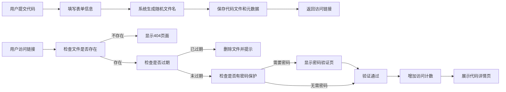

## 1. 产品概述

代码片段分享服务是一个基于Flask的轻量级代码托管平台，用户可以快速分享、查看和管理代码片段。系统采用文件存储方式，无需数据库，支持语法高亮、密码保护、过期自动删除等高级功能。

- 解决开发者快速分享代码示例的需求，提供简洁高效的代码托管和分享体验
- 目标用户：开发者、技术写作者、学生等需要快速分享代码的人群

## 2. 核心功能

### 2.1 用户角色
| 角色 | 注册方式 | 核心权限 |
|------|----------|----------|
| 普通用户 | 无需注册 | 提交、查看、搜索代码片段 |
| 管理员 | 预设密码 | 删除被举报的代码片段 |

### 2.2 功能模块
1. **首页**：提交表单、最近片段列表、搜索筛选
2. **代码详情页**：语法高亮、行号显示、复制下载、访问统计、嵌入代码
3. **密码验证页**：访问受保护片段时的密码输入
4. **管理员页**：举报列表、片段删除功能
5. **API接口**：RESTful API支持程序化提交

### 2.3 页面详情
| 页面名称 | 模块名称 | 功能描述 |
|-----------|-------------|---------------------|
| 首页 | 提交表单 | 标题、作者、编程语言、代码内容、过期时间、密码设置 |
| 首页 | 最近片段 | 展示最近10个提交的片段链接 |
| 首页 | 搜索筛选 | 按标题搜索、按编程语言筛选 |
| 详情页 | 代码展示 | 语法高亮、行号显示、语言标识 |
| 详情页 | 操作按钮 | 一键复制、原始下载、嵌入代码、举报 |
| 详情页 | 访问统计 | 显示访问次数 |
| 密码页 | 验证表单 | 密码输入、错误提示 |
| 管理员页 | 举报管理 | 被举报片段列表、删除功能 |

## 3. 核心流程

用户提交代码片段：填写表单 → 系统生成随机短链接 → 保存元数据和代码文件 → 返回访问链接

用户查看代码片段：访问链接 → 检查是否过期 → 检查是否需要密码 → 展示代码 → 统计访问次数

## 4. 用户界面设计

### 4.1 设计风格
- **主色调**：深蓝色系（#1e3a5f），代表专业和技术感
- **辅助色**：代码高亮主题色（Monokai风格）、绿色成功提示、红色警告
- **按钮风格**：圆角设计，悬浮时轻微上浮和阴影变化
- **字体**：使用JetBrains Mono作为代码字体，Inter作为界面字体
- **布局风格**：卡片式布局，代码区域使用深色主题区分
- **图标**：使用Font Awesome图标，简洁统一

### 4.2 页面设计概述
| 页面名称 | 模块名称 | UI元素 |
|-----------|-------------|-------------|
| 首页 | 提交表单 | 双列布局，左侧表单右侧预览，深色代码编辑器 |
| 首页 | 最近片段 | 网格卡片布局，显示标题、语言、时间 |
| 详情页 | 代码展示 | 全屏宽度代码块，左侧行号，语法高亮 |
| 详情页 | 操作栏 | 固定顶部工具栏，图标按钮组 |
| 密码页 | 验证表单 | 居中卡片，毛玻璃效果，简洁输入框 |

### 4.3 响应式设计
- 桌面端优先，支持1200px以上大屏优化
- 平板端（768px-1199px）：调整为单列布局
- 移动端（767px以下）：简化导航，优化表单输入体验

### 4.4 交互与动画
- 代码复制成功提示：右上角滑入通知，3秒后自动消失
- 表单提交：按钮loading状态，成功后跳转动画
- 页面切换：淡入淡出过渡效果
- 悬浮效果：卡片和按钮的微动画反馈
