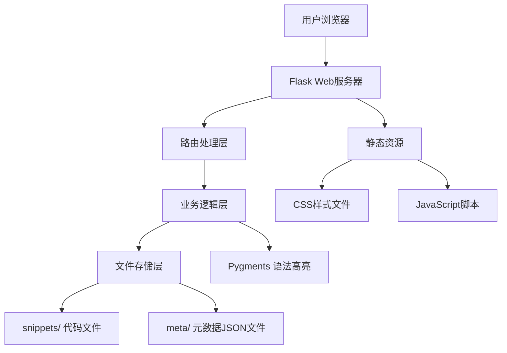

## 1. 架构设计



## 2. 技术描述

- **后端框架**: Flask@2.3 - 轻量级Python Web框架
- **语法高亮**: Pygments@2.17 - 支持500+编程语言的语法高亮库
- **模板引擎**: Jinja2 - Flask内置模板引擎
- **前端样式**: 自定义CSS + Font Awesome图标库
- **数据存储**: 文件系统（无需数据库）
  - 代码内容：纯文本文件存储
  - 元数据：JSON文件存储（标题、作者、密码哈希、过期时间、访问计数等）
- **密码哈希**: Werkzeug.security - Flask内置的安全工具

## 3. 目录结构

```
project/
├── app.py                 # Flask主应用
├── requirements.txt       # Python依赖
├── snippets/              # 代码片段存储目录
│   ├── abc123.txt         # 代码内容文件
│   └── abc123.json        # 对应的元数据文件
├── templates/             # Jinja2模板
│   ├── base.html          # 基础模板
│   ├── index.html         # 首页
│   ├── snippet.html       # 代码详情页
│   ├── password.html      # 密码验证页
│   └── admin.html         # 管理员页面
└── static/                # 静态资源
    ├── css/
    │   └── style.css      # 主样式文件
    └── js/
        └── main.js        # 前端交互脚本
```

## 4. 路由定义

| 路由 | 方法 | 用途 |
|------|------|------|
| `/` | GET | 首页，提交表单和最近片段列表 |
| `/` | POST | 提交新代码片段 |
| `/s/<id>` | GET | 查看代码片段详情 |
| `/s/<id>/raw` | GET | 下载原始代码文件 |
| `/s/<id>/embed` | GET | 嵌入模式页面 |
| `/s/<id>/report` | POST | 举报代码片段 |
| `/password/<id>` | GET/POST | 密码验证页面 |
| `/api/snippets` | POST | REST API提交代码片段 |
| `/admin` | GET/POST | 管理员页面（举报管理） |
| `/admin/delete/<id>` | POST | 删除被举报的片段 |

## 5. API定义

### 5.1 POST /api/snippets

**请求体**:
```json
{
  "title": "string",
  "author": "string",
  "language": "string",
  "content": "string",
  "expires": "1h|1d|7d|never",
  "password": "string (optional)"
}
```

**响应**:
```json
{
  "success": true,
  "id": "abc123",
  "url": "https://domain.com/s/abc123",
  "expires_at": "2024-01-01T00:00:00Z"
}
```

**错误响应**:
```json
{
  "success": false,
  "error": "错误信息"
}
```

## 6. 数据模型

### 6.1 元数据JSON结构

```json
{
  "id": "abc123",
  "title": "示例代码",
  "author": "用户名",
  "language": "python",
  "created_at": "2024-01-01T00:00:00Z",
  "expires_at": "2024-01-02T00:00:00Z",
  "password_hash": "pbkdf2:sha256:...",
  "views": 42,
  "reported": false,
  "report_reason": ""
}
```

### 6.2 数据字段说明

| 字段 | 类型 | 说明 |
|------|------|------|
| id | string | 6字符随机唯一标识 |
| title | string | 代码片段标题 |
| author | string | 作者名称 |
| language | string | 编程语言标识 |
| created_at | ISO8601 | 创建时间 |
| expires_at | ISO8601/null | 过期时间，null表示永不过期 |
| password_hash | string/null | 密码哈希，null表示无密码 |
| views | integer | 访问次数统计 |
| reported | boolean | 是否被举报 |
| report_reason | string | 举报原因 |

## 7. 核心功能实现

### 7.1 过期清理机制
- 每次访问时检查文件是否过期
- 使用装饰器或中间件实现自动清理
- 也可配置定时任务（如cron）定期清理

### 7.2 密码保护实现
- 使用Werkzeug的generate_password_hash和check_password_hash
- 验证通过后设置session标记
- Session有效期默认为浏览器会话

### 7.3 语法高亮
- 使用Pygments的HtmlFormatter
- 支持行号显示（linenos='table'）
- 支持500+编程语言自动识别
