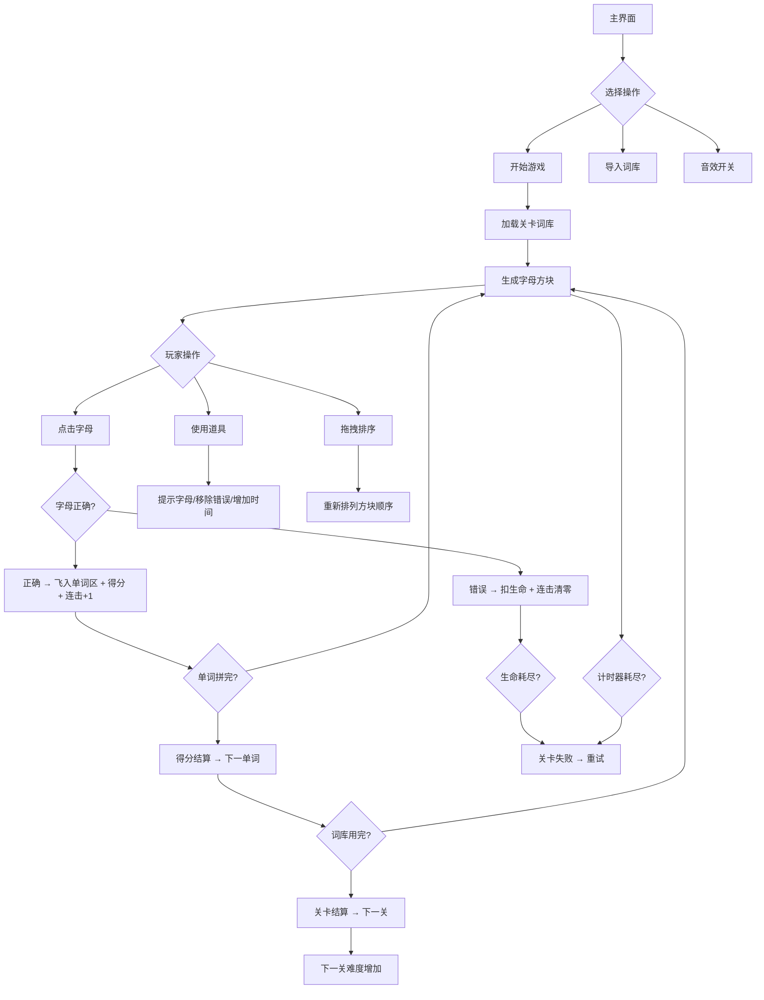

## 1. 产品概述

彩色拼字游戏是一款基于HTML/CSS/原生JavaScript的益智拼字游戏。画布上方随机散落彩色字母方块，下方显示目标单词提示，玩家按顺序点击字母拼出目标单词，正确字母飞入单词区域。支持多关卡递进、计时器、生命值、道具系统、拖拽排序、连击特效和自定义词库。

- 目标用户：英语学习者、益智游戏爱好者、休闲玩家
- 核心价值：寓教于乐的拼字体验，渐进式难度与丰富道具提升可玩性

## 2. 核心功能

### 2.1 功能模块

1. **游戏主界面**：开始游戏、导入词库、音效开关、最高分展示
2. **游戏界面**：字母方块区、目标单词区、HUD信息栏、道具栏
3. **关卡结算界面**：关卡得分、连击统计、进入下一关/重试
4. **游戏结束界面**：最终得分、最高分记录、重新开始

### 2.2 页面详情

| 页面名称 | 模块名称 | 功能描述 |
|----------|----------|----------|
| 游戏主界面 | 标题动画 | 彩色字母方块组成的标题，带弹跳动画 |
| 游戏主界面 | 开始按钮 | 点击进入第1关 |
| 游戏主界面 | 导入词库 | 上传JSON文件替换默认词库 |
| 游戏主界面 | 音效开关 | 切换音效开启/关闭 |
| 游戏主界面 | 最高分 | 显示localStorage中的最高分 |
| 游戏界面 | 字母方块区 | 随机散落的彩色字母方块，支持拖拽排序 |
| 游戏界面 | 目标单词区 | 显示目标单词的空位槽，正确字母飞入填充 |
| 游戏界面 | HUD | 当前关卡、总得分、计时器（60秒）、生命值（3颗心） |
| 游戏界面 | 道具栏 | 提示字母、移除错误字母、增加时间三个道具按钮 |
| 游戏界面 | 连击特效 | 连续正确时显示连击数和得分加倍动画 |
| 关卡结算 | 得分面板 | 本关得分明细、连击统计、按钮进入下一关 |
| 游戏结束 | 最终面板 | 总得分、最高分更新提示、重新开始按钮 |

## 3. 核心流程

玩家从主界面点击开始游戏，进入第1关。每关从该关卡词库中依次抽取单词，上方随机生成包含目标字母和干扰字母的彩色方块。玩家按顺序点击字母拼出目标单词，正确字母飞入下方空位，错误点击消耗一条生命。拼完整个单词得分（含连击加成），自动刷新下一个单词。60秒倒计时耗尽或3条命用完则关卡失败，可重试。通关后进入下一关，单词更长、干扰更多。

## 4. 用户界面设计

### 4.1 设计风格

- 主色调：明快活泼的糖果色系，背景为柔和渐变（淡蓝→淡紫），字母方块为高饱和彩色（红、橙、黄、绿、蓝、紫循环）
- 按钮风格：圆角胶囊按钮，带微妙阴影和悬浮放大效果
- 字体：圆润可爱的显示字体（如 Baloo 2 / Fredoka One），UI文字使用清晰的无衬线字体
- 布局：居中游戏区域，上方方块散落区、中间目标单词区、底部道具栏和HUD
- 动效：字母飞入动画（贝塞尔曲线+旋转）、连击数字弹跳、道具使用闪光、错误震动

### 4.2 页面设计概览

| 页面名称 | 模块名称 | UI元素 |
|----------|----------|--------|
| 游戏主界面 | 标题 | 大号彩色渐变文字，字母逐个弹跳入场 |
| 游戏主界面 | 按钮 | 胶囊形按钮，悬浮阴影加深+微放大 |
| 游戏界面 | 字母方块区 | 60px圆角方块，彩色背景+白色字母，随机旋转±5°散落 |
| 游戏界面 | 目标单词区 | 灰色虚线空位槽，已填字母显示彩色方块 |
| 游戏界面 | HUD | 顶部固定栏：关卡数、得分、倒计时圆环、心形生命 |
| 游戏界面 | 道具栏 | 底部三个圆形道具按钮，带使用次数标记 |
| 游戏界面 | 连击特效 | 屏幕中央弹出"×2""×3"倍数，渐隐上飘 |
| 关卡结算 | 得分面板 | 居中卡片，星星评级，按钮带脉冲动画 |

### 4.3 响应式设计

- 桌面端：居中显示，字母方块区宽度最大800px，鼠标点击和拖拽操作
- 移动端：方块和按钮自适应缩小，触摸优化（增大点击区域），保持可玩性
- 方块数量根据屏幕宽度自动调整排列

## 5. 游戏规则细节

### 5.1 关卡设计

| 关卡 | 单词长度 | 干扰字母数 | 每关单词数 |
|------|----------|-----------|-----------|
| 1-3 | 3-4字母 | 2-3个 | 5个 |
| 4-6 | 4-5字母 | 3-4个 | 6个 |
| 7-9 | 5-6字母 | 4-5个 | 7个 |
| 10+ | 6-7字母 | 5-6个 | 8个 |

### 5.2 得分规则

- 基础得分：每正确拼入1个字母 = 10分
- 连击加成：连续正确2次 = ×2，3次 = ×3，4次及以上 = ×4（上限×4）
- 通关奖励：每关完成额外 +50分
- 时间奖励：剩余时间 × 2分

### 5.3 道具系统

| 道具 | 效果 | 每关次数 |
|------|------|----------|
| 提示字母 | 自动揭示下一个正确字母位置 | 2次 |
| 移除错误字母 | 从方块区移除2个干扰字母 | 1次 |
| 增加时间 | 倒计时增加15秒 | 1次 |

### 5.4 生命值与计时

- 每关3条命（心形显示）
- 错误点击扣1条命，命用完关卡失败
- 每关限时60秒，超时关卡失败
- 关卡失败可重试，从该关第一个单词重新开始

### 5.5 拖拽排序

- 字母方块支持拖拽重新排列位置
- 拖拽时方块半透明+放大，放置位置高亮提示
- 排列后方块保持新位置，方便玩家按顺序点击

### 5.6 自定义词库

- 支持导入JSON格式词库文件
- JSON格式：`{"levels": [{"words": ["cat", "dog", ...]}, {"words": ["apple", "brave", ...]}]}`
- 导入后替换默认词库，关卡数按导入数据决定
