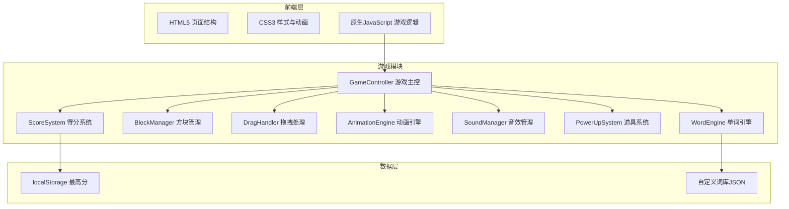
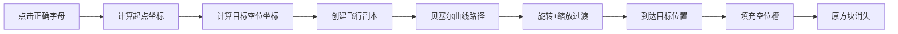
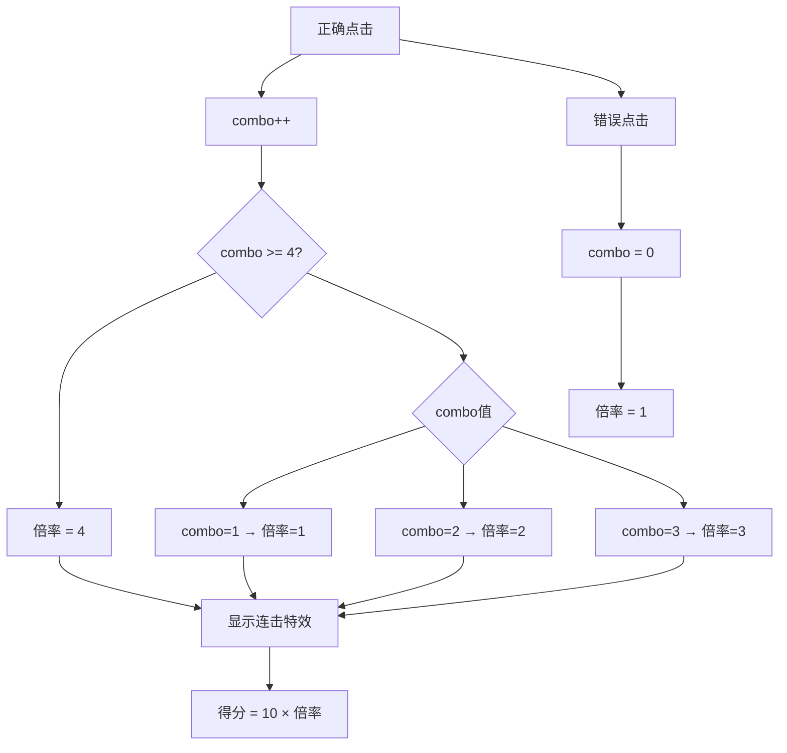

## 1. 架构设计



## 2. 技术说明

- 前端：HTML5 + CSS3 + 原生JavaScript（ES6+），无框架依赖
- 渲染：DOM元素渲染（CSS动画驱动，非Canvas）
- 音效：Web Audio API（程序化生成音效，无需外部音频文件）
- 动画：CSS transitions + CSS animations + JavaScript Web Animations API
- 拖拽：HTML5 Drag and Drop API + 触摸事件兼容
- 数据存储：localStorage
- 构建工具：无（纯静态文件，直接浏览器运行）

## 3. 文件结构

| 文件 | 用途 |
|------|------|
| index.html | 游戏入口，包含所有页面结构 |
| css/style.css | 游戏样式、动画关键帧、响应式布局 |
| js/game.js | 游戏主控制器、状态管理、关卡流程 |
| js/words.js | 默认词库数据、词库加载逻辑 |
| js/blocks.js | 字母方块生成、渲染、拖拽排序 |
| js/animate.js | 飞入动画、连击特效、界面过渡动画 |
| js/sound.js | Web Audio API音效生成与播放 |
| js/score.js | 得分计算、连击追踪、最高分存储 |
| js/powerups.js | 道具系统（提示、移除、加时） |
| js/ui.js | UI管理（主界面、HUD、结算面板、导入词库） |

## 4. 核心数据结构

### 4.1 游戏状态

```javascript
const gameState = {
    screen: 'menu',
    level: 1,
    score: 0,
    combo: 0,
    maxCombo: 0,
    lives: 3,
    timeLeft: 60,
    currentWordIndex: 0,
    currentLetterIndex: 0,
    currentWord: '',
    wordsInLevel: [],
    powerUps: { hint: 2, remove: 1, addTime: 1 },
    soundEnabled: true,
    customWordBank: null
};
```

### 4.2 方块数据

```javascript
const blockData = {
    letter: 'A',
    isTarget: true,
    isUsed: false,
    colorIndex: 0,
    element: HTMLElement,
    originalX: 0,
    originalY: 0
};
```

### 4.3 词库格式

```javascript
const defaultWordBank = {
    levels: [
        { words: ['cat', 'dog', 'sun', 'hat', 'run'] },
        { words: ['fish', 'bird', 'tree', 'rain', 'star'] },
        { words: ['apple', 'house', 'music', 'happy', 'light'] },
        { words: ['garden', 'bridge', 'forest', 'planet', 'silver'] },
        { words: ['rainbow', 'harmony', 'journey', 'crystal', 'diamond'] }
    ]
};
```

### 4.4 localStorage 数据格式

```javascript
'spellgame_highscore': number
'spellgame_custom_words': { levels: [{ words: [string] }] }
'spellgame_sound_enabled': boolean
```

## 5. 字母方块飞入动画设计



### 5.1 动画实现方案

使用CSS `transition` 配合JavaScript动态设置`transform`实现：
1. 点击正确字母后，获取方块和目标空位的屏幕坐标
2. 创建方块副本作为飞行元素，设为`position: fixed`
3. 使用`requestAnimationFrame`驱动贝塞尔曲线运动
4. 飞行过程中添加旋转（360°）和缩放（1→0.8→1）效果
5. 到达目标后，移除飞行元素，填充空位槽

## 6. 拖拽排序设计

- 桌面端：`dragstart`/`dragover`/`drop`/`dragend`事件
- 移动端：`touchstart`/`touchmove`/`touchend`事件
- 拖拽开始：方块半透明(opacity:0.6) + 放大(scale:1.1)
- 拖拽中：实时计算放置位置，目标位置高亮
- 放下后：DOM重新排列，更新方块数据数组

## 7. 音效方案

使用Web Audio API程序化生成音效：

| 音效 | 生成方式 |
|------|----------|
| 正确点击 | 上升音调 "叮"（440Hz→880Hz，0.15秒） |
| 错误点击 | 低沉 "嗡"（200Hz，0.3秒，带失真） |
| 单词完成 | 欢快三连音（C5-E5-G5，0.3秒） |
| 关卡通过 | 上行音阶（C5-D5-E5-G5，0.6秒） |
| 连击提示 | 高频短促 "叮叮"（1000Hz，0.1秒×2） |
| 道具使用 | 闪烁音（快速振荡，0.2秒） |
| 游戏结束 | 下行音阶（G5-E5-C5，0.8秒） |

## 8. 连击系统设计



## 9. 响应式断点

| 断点 | 方块大小 | 布局调整 |
|------|----------|----------|
| ≥1024px | 64px | 横向排列，最大800px宽度 |
| 768-1023px | 56px | 自适应宽度 |
| <768px | 48px | 方块区自适应，按钮增大触摸区域 |
