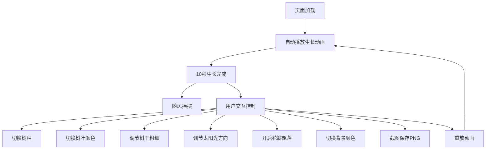

## 1. 产品概述

基于Three.js的3D树形生长动画网页，展示从地面生长出3D树木的沉浸式动画体验。用户可交互控制树种、颜色、光影等参数，支持旋转缩放观察、截图保存等功能。

- 目标用户：3D可视化爱好者、教育演示、艺术创作
- 核心价值：提供沉浸式的3D树木生长动画体验，丰富的交互控制

## 2. 核心功能

### 2.1 功能模块

1. **3D场景页面**：3D树形生长动画、场景效果、交互控制面板

### 2.2 页面详情

| 页面名称 | 模块名称 | 功能描述 |
|----------|----------|----------|
| 3D场景页面 | 树形生长动画 | 从小苗开始10秒内逐渐长高长大，树干圆柱体+树冠圆锥体逐层展开 |
| 3D场景页面 | 随风摇摆 | 生长完成后树木轻微随风摇摆动画 |
| 3D场景页面 | 相机控制 | OrbitControls支持旋转缩放观察 |
| 3D场景页面 | 重放按钮 | 重新播放生长动画 |
| 3D场景页面 | 树叶颜色切换 | 绿色/红色秋季/黄色三种颜色切换 |
| 3D场景页面 | 树干粗细滑块 | 生长完成后手动调节树干半径 |
| 3D场景页面 | 地面草地 | 绿色平面带网格线效果 |
| 3D场景页面 | 光影效果 | 太阳光方向可调 |
| 3D场景页面 | 截图保存 | 一键保存为PNG图片 |
| 3D场景页面 | 生长进度 | 显示生长进度百分比 |
| 3D场景页面 | 树种切换 | 松树、橡树、椰子树三种 |
| 3D场景页面 | 花瓣飘落 | 围绕树木飘落小粒子效果 |
| 3D场景页面 | 背景切换 | 天空蓝/日落橙色 |

## 3. 核心流程

用户打开页面 → 自动播放树木生长动画（10秒）→ 生长完成显示进度100% → 树木随风摇摆 → 用户可通过控制面板切换树种、颜色、调节参数 → 用户可截图保存

## 4. 用户界面设计

### 4.1 设计风格

- 主色调：自然绿色系 + 大地棕色
- 辅助色：天空蓝、日落橙
- 按钮风格：圆角、半透明毛玻璃效果
- 字体：简洁无衬线字体
- 布局风格：3D场景全屏 + 右侧浮动控制面板

### 4.2 页面设计概览

| 页面名称 | 模块名称 | UI元素 |
|----------|----------|--------|
| 3D场景页面 | 3D画布 | 全屏Three.js画布，占据整个视口 |
| 3D场景页面 | 进度条 | 顶部居中，显示生长进度百分比 |
| 3D场景页面 | 控制面板 | 右侧浮动毛玻璃面板，包含所有交互控件 |
| 3D场景页面 | 重放按钮 | 控制面板内醒目按钮 |

### 4.3 响应式设计

- 桌面端：全屏3D场景 + 右侧浮动控制面板
- 移动端：全屏3D场景 + 底部可收起控制面板

### 4.4 3D场景指导

- 环境：自然场景，天空背景 + 绿色地面
- 灯光：方向光（太阳光）+ 环境光，方向光角度可调
- 相机：透视相机，OrbitControls，初始位置斜上方45度
- 焦点：树木居中，生长动画为核心视觉焦点
- 交互：旋转缩放，控制面板参数实时响应
- 后处理：可选阴影效果
