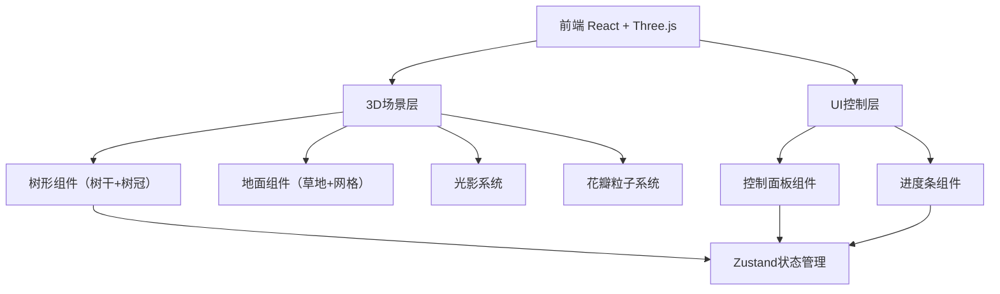

## 1. 架构设计



## 2. 技术说明

- 前端框架：React@18 + TypeScript + Vite
- 3D渲染：three + @react-three/fiber + @react-three/drei
- 样式：Tailwind CSS
- 状态管理：Zustand
- 初始化工具：vite-init
- 后端：无

## 3. 路由定义

| 路由 | 用途 |
|------|------|
| / | 3D树形生长动画主页面 |

## 4. 组件架构

### 4.1 核心组件

| 组件 | 职责 |
|------|------|
| TreeScene | 3D场景容器，管理Canvas和灯光 |
| Tree | 树木3D模型，处理生长动画和随风摇摆 |
| Ground | 地面草地+网格效果 |
| PetalParticles | 花瓣飘落粒子系统 |
| ControlPanel | UI控制面板，包含所有交互控件 |
| ProgressBar | 生长进度百分比显示 |

### 4.2 状态管理（Zustand Store）

```typescript
interface TreeStore {
  treeType: 'pine' | 'oak' | 'coconut'
  leafColor: 'green' | 'red' | 'yellow'
  trunkRadius: number
  sunAngle: number
  showPetals: boolean
  background: 'sky' | 'sunset'
  growthProgress: number
  isGrowing: boolean
  isComplete: boolean
  replay: () => void
  setTreeType: (type: TreeType) => void
  setLeafColor: (color: LeafColor) => void
  setTrunkRadius: (radius: number) => void
  setSunAngle: (angle: number) => void
  setShowPetals: (show: boolean) => void
  setBackground: (bg: Background) => void
}
```

### 4.3 树种差异化参数

| 参数 | 松树 | 橡树 | 椰子树 |
|------|------|------|--------|
| 树干高度 | 3.0 | 2.5 | 4.0 |
| 树干半径 | 0.15 | 0.25 | 0.12 |
| 树冠形状 | 多层小圆锥 | 大球形 | 顶部叶状 |
| 树冠数量 | 3-4层 | 1个大球 | 3-5片叶子 |
| 树冠尺寸 | 小 | 大 | 中等扁平 |

## 5. 动画系统设计

### 5.1 生长动画

- 持续时间：10秒
- 使用 useFrame 钩子每帧更新
- 生长曲线：easeOutCubic缓动函数
- 树干：从0逐渐长到目标高度，半径同步增长
- 树冠：在树干达到对应高度后逐层展开
- 进度：基于时间计算0%-100%

### 5.2 随风摇摆

- 生长完成后激活
- 使用sin函数实现轻柔摇摆
- 树干微微弯曲，树冠摇摆幅度稍大

## 6. 性能优化

- 使用 instancedMesh 优化花瓣粒子
- 阴影仅在必要时开启
- 使用 useMemo 缓存几何体和材质
- 控制面板使用 React.memo 避免不必要重渲染
