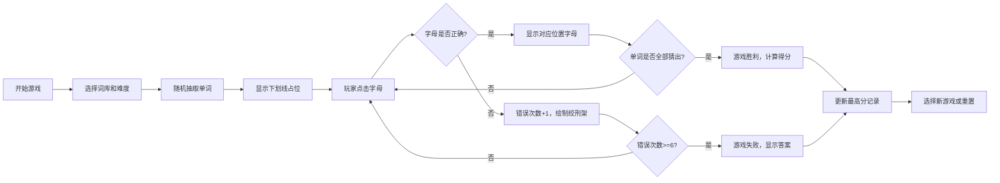
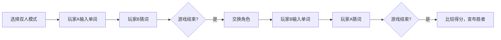

# 猜词游戏产品需求文档 (PRD)

## 1. 产品概述
经典绞刑架猜词游戏的Web实现版本，玩家通过虚拟键盘猜测隐藏单词，支持单人挑战、双人对战、多词库切换等丰富功能。
- 核心目的：提供休闲益智的单词猜谜娱乐体验
- 目标用户：英语学习者、休闲游戏玩家、朋友聚会互动
- 产品价值：寓教于乐，通过游戏方式提升英语词汇量

## 2. 核心功能

### 2.1 用户角色
| 角色 | 注册方式 | 核心权限 |
|------|----------|----------|
| 玩家 | 无需注册 | 进行游戏、设置难度、自定义词库、查看最高分 |

### 2.2 功能模块
1. **游戏主界面**：绞刑架画布、单词显示区、虚拟键盘、状态信息
2. **词库管理**：内置分类词库、难度筛选、自定义词库导入
3. **游戏模式**：单人模式、双人对战模式
4. **辅助功能**：提示系统、音效开关、已猜字母记录
5. **数据存储**：本地最高分记录、用户设置持久化

### 2.3 页面详情
| 页面名称 | 模块名称 | 功能描述 |
|----------|----------|----------|
| 游戏主界面 | 绞刑架画布 | SVG绘制，随错误次数逐步显示完整图形 |
| 游戏主界面 | 单词显示区 | 下划线占位，猜对字母实时显示 |
| 游戏主界面 | 虚拟键盘 | 26字母按键，点击/触摸响应，已猜字母禁用 |
| 游戏主界面 | 状态栏 | 显示剩余机会、当前得分、已猜字母列表 |
| 设置面板 | 词库选择 | 动物/水果/国家等分类切换 |
| 设置面板 | 难度选择 | 简单(4-5字母)/困难(8-10字母) |
| 设置面板 | 游戏模式 | 单人模式/双人对战切换 |
| 设置面板 | 音效开关 | 猜对/猜错/结束音效控制 |
| 自定义词库 | 导入功能 | 支持JSON格式词库文件上传 |
| 双人对战 | 出词界面 | 玩家输入单词和提示信息 |

## 3. 核心流程

### 单人游戏流程

### 双人对战流程

## 4. 用户界面设计

### 4.1 设计风格
- **主色调**：深蓝渐变 (#1a365d → #2d3748)，营造沉稳游戏氛围
- **辅助色**：珊瑚红 (#e53e3e) 表示错误/危险，薄荷绿 (#38a169) 表示成功
- **按钮风格**：圆角立体按钮，带hover悬浮和active按压动效
- **字体**：标题用 'Fredoka One' 可爱圆润字体，正文用 'Roboto Mono' 等宽字体
- **布局风格**：卡片式布局，居中对称设计，清晰的视觉层次
- **装饰元素**：细线边框、微妙阴影、SVG绞刑架动画

### 4.2 页面设计概述
| 页面名称 | 模块名称 | UI元素 |
|----------|----------|--------|
| 游戏主界面 | 头部 | 游戏标题、最高分显示、设置按钮 |
| 游戏主界面 | 绞刑架区 | SVG画布，居中显示，动画绘制效果 |
| 游戏主界面 | 单词区 | 大号下划线字母，等宽排列，正确字母弹跳动画 |
| 游戏主界面 | 键盘区 | 三行字母按键，移动端自适应大小 |
| 游戏主界面 | 状态区 | 剩余生命值(心形图标)、得分、已猜字母标签 |
| 设置面板 | 侧边弹窗 | 半透明背景，滑动入场动画 |
| 设置面板 | 选项列表 | 开关控件、下拉选择、按钮组 |

### 4.3 响应式
- **桌面优先**：1280px以上为标准布局
- **平板适配**：768px-1279px，调整键盘大小和间距
- **手机适配**：375px-767px，垂直紧凑布局，增大触摸目标
- **触摸优化**：按键最小44x44px，支持点击反馈震动

### 4.4 动画效果
- 页面加载：元素依次淡入，绞刑架轮廓线描动画
- 猜对字母：字母从下划线弹出，带缩放和颜色渐变
- 猜错：绞刑架部件SVG路径绘制动画，红色闪烁提示
- 游戏结束：结果卡片缩放入场，彩屑/落雨粒子效果
- 按键交互：hover放大，active缩小，已猜字母淡出变灰
