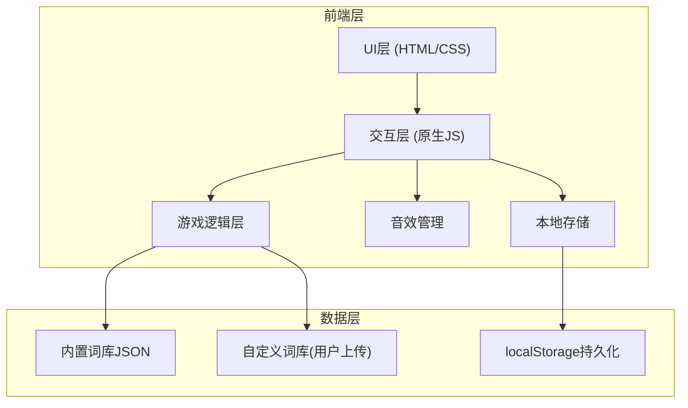

# 猜词游戏技术架构文档

## 1. 架构设计



## 2. 技术描述

- **前端技术栈**：原生 HTML5 + CSS3 + JavaScript ES6+
- **构建工具**：无，纯静态页面，直接浏览器运行
- **图标方案**：纯CSS实现 + SVG矢量图形
- **字体方案**：Google Fonts (Fredoka One, Roboto Mono)
- **音效方案**：Web Audio API 合成音效，无需外部音频文件
- **数据存储**：localStorage 存储最高分和用户设置
- **响应式**：CSS Media Queries + Flexbox 布局

## 3. 文件结构

```
/
├── index.html              # 主页面
├── css/
│   └── style.css           # 样式文件
├── js/
│   ├── game.js             # 游戏核心逻辑
│   ├── ui.js               # UI交互控制
│   ├── sound.js            # 音效管理
│   ├── storage.js          # 本地存储管理
│   └── wordlists.js        # 内置词库数据
└── assets/
    └── (可选资源目录)
```

## 4. 核心数据结构

### 4.1 词库数据格式
```javascript
// 内置词库
const wordLists = {
  animals: {
    name: "动物",
    words: [
      { word: "tiger", hint: "百兽之王" },
      { word: "elephant", hint: "长鼻子的动物" }
    ]
  },
  fruits: { /* ... */ },
  countries: { /* ... */ }
};

// 自定义词库导入格式 (JSON)
{
  "categoryName": {
    "name": "自定义分类",
    "words": [
      { "word": "example", "hint": "示例提示" }
    ]
  }
}
```

### 4.2 游戏状态对象
```javascript
const gameState = {
  currentWord: "",           // 当前单词
  currentHint: "",           // 单词提示
  guessedLetters: [],        // 已猜字母数组
  wrongGuesses: 0,           // 错误次数
  maxWrongGuesses: 6,        // 最大错误次数
  score: 0,                  // 当前得分
  isGameOver: false,         // 游戏结束标志
  isWin: false,              // 胜利标志
  mode: "single",            // 游戏模式: single/dual
  difficulty: "easy",        // 难度: easy/hard
  category: "animals",       // 当前词库分类
  soundEnabled: true,        // 音效开关
  // 双人模式
  currentPlayer: 1,
  player1Score: 0,
  player2Score: 0
};
```

### 4.3 localStorage 存储结构
```javascript
// 最高分记录
{
  highScores: {
    animals: { easy: 100, hard: 200 },
    fruits: { easy: 80, hard: 150 }
  },
  settings: {
    soundEnabled: true,
    difficulty: "easy",
    category: "animals"
  }
}
```

## 5. 核心模块设计

### 5.1 游戏核心模块 (game.js)
- `initGame()` - 初始化游戏
- `startNewGame()` - 开始新游戏
- `guessLetter(letter)` - 处理字母猜测
- `checkWin()` - 检查胜利条件
- `checkLose()` - 检查失败条件
- `calculateScore()` - 计算得分
- `getRandomWord()` - 随机获取单词
- `filterByDifficulty()` - 按难度筛选单词

### 5.2 UI交互模块 (ui.js)
- `renderWordDisplay()` - 渲染单词显示区
- `renderKeyboard()` - 渲染虚拟键盘
- `renderHangman()` - 渲染绞刑架SVG
- `updateStatusDisplay()` - 更新状态显示
- `showGameResult()` - 显示游戏结果
- `toggleSettingsPanel()` - 切换设置面板
- `handleFileUpload()` - 处理自定义词库上传

### 5.3 音效模块 (sound.js)
- `initAudio()` - 初始化音频上下文
- `playCorrectSound()` - 播放猜对音效
- `playWrongSound()` - 播放猜错音效
- `playWinSound()` - 播放胜利音效
- `playLoseSound()` - 播放失败音效
- `toggleSound(enabled)` - 开关音效

### 5.4 存储模块 (storage.js)
- `saveHighScore(category, difficulty, score)` - 保存最高分
- `getHighScore(category, difficulty)` - 获取最高分
- `saveSettings(settings)` - 保存用户设置
- `loadSettings()` - 加载用户设置

## 6. 关键交互事件

| 事件类型 | 触发源 | 处理函数 |
|----------|--------|----------|
| click | 虚拟键盘字母 | `handleLetterClick()` |
| click | 提示按钮 | `showHint()` |
| click | 新游戏按钮 | `startNewGame()` |
| click | 重置按钮 | `resetGame()` |
| click | 设置按钮 | `toggleSettingsPanel()` |
| change | 难度选择下拉 | `changeDifficulty()` |
| change | 词库选择下拉 | `changeCategory()` |
| change | 音效开关 | `toggleSoundSetting()` |
| change | 模式切换 | `changeGameMode()` |
| change | 文件上传 | `importCustomWordList()` |
| keydown | 物理键盘 | `handleKeyboardInput()` |
| touchstart | 虚拟键盘 | `handleTouchInput()` |

## 7. SVG 绞刑架组件结构

```svg
<svg id="hangman-svg" viewBox="0 0 200 250">
  <!-- 支架 -->
  <line class="part-0" x1="40" y1="230" x2="160" y2="230" />
  <line class="part-1" x1="60" y1="230" x2="60" y2="20" />
  <line class="part-2" x1="60" y1="20" x2="140" y2="20" />
  <line class="part-3" x1="140" y1="20" x2="140" y2="50" />
  <!-- 人形 -->
  <circle class="part-4" cx="140" cy="70" r="20" />
  <line class="part-5" x1="140" y1="90" x2="140" y2="150" />
  <line class="part-6" x1="140" y1="110" x2="110" y2="130" />
  <line class="part-7" x1="140" y1="110" x2="170" y2="130" />
  <line class="part-8" x1="140" y1="150" x2="115" y2="190" />
  <line class="part-9" x1="140" y1="150" x2="165" y2="190" />
</svg>
```
通过CSS控制各部分的stroke-dasharray动画实现逐步绘制效果。
