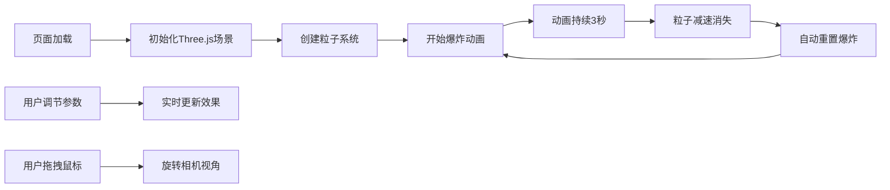

## 1. 产品概述

基于Three.js的3D星星爆炸粒子效果网页应用，提供沉浸式的宇宙爆炸视觉体验。用户可以通过多种参数控制粒子效果，从不同角度观赏壮观的3D爆炸动画。

- 主要用途：视觉展示、教育演示、创意娱乐
- 目标用户：对3D图形、粒子效果感兴趣的开发者和普通用户
- 产品价值：展示WebGL技术的强大表现力，提供可交互的视觉艺术体验

## 2. 核心功能

### 2.1 功能模块

1. **3D爆炸场景**：粒子爆炸动画、运动拖尾、发光效果
2. **参数控制面板**：粒子数量、爆炸力度、粒子大小、颜色模式、重力开关
3. **交互控制**：鼠标拖拽旋转视角、自动旋转模式、慢动作回放
4. **辅助功能**：一键截图、重复播放、背景切换、粒子数量显示

### 2.2 页面详情

| 页面名称 | 模块名称 | 功能描述 |
|---------|---------|----------|
| 主页面 | 3D画布区域 | Three.js渲染的爆炸粒子场景，支持鼠标交互 |
| 主页面 | 控制面板 | 各种滑块、开关、按钮，用于调节效果参数 |
| 主页面 | 信息显示区 | 实时显示当前粒子数量、FPS等信息 |

## 3. 核心流程

## 4. 用户界面设计

### 4.1 设计风格

- **主色调**：深空黑 (#0a0a1a) 搭配霓虹色彩粒子
- **辅助色**：控制面板使用半透明玻璃态设计 (backdrop-filter: blur)
- **按钮风格**：圆角矩形，带有发光悬停效果
- **字体**：使用现代无衬线字体，科技感十足
- **布局风格**：全屏3D画布 + 右侧悬浮控制面板
- **整体风格**：赛博朋克/科幻宇宙风，深色主题，霓虹点缀

### 4.2 页面设计概述

| 页面名称 | 模块名称 | UI元素 |
|---------|---------|--------|
| 主页面 | 3D画布 | 全屏显示，黑色/星空背景，彩色粒子爆炸效果 |
| 主页面 | 控制面板 | 右侧悬浮玻璃态面板，包含滑块、开关、按钮，分组布局 |
| 主页面 | 信息显示 | 左上角半透明状态条，显示粒子数量 |

### 4.3 响应性

- Desktop-first设计，控制面板在大屏幕上固定右侧
- 平板/移动端：控制面板转为底部抽屉或可折叠面板
- 触摸优化：支持触摸拖拽旋转视角

### 4.4 3D场景指导

- **环境**：深空黑色背景或星空纹理，营造宇宙氛围
- **光照**：使用粒子自身发光 (Additive Blending)，不需要额外光源
- **相机设置**：PerspectiveCamera，初始距离适中，支持OrbitControls拖拽
- **动画**：粒子从中心向外扩散，速度逐渐衰减，3秒后重置
- **后处理**：Bloom发光效果，增强粒子光晕
- **性能优化**：使用BufferGeometry批量渲染，支持10000+粒子流畅运行
