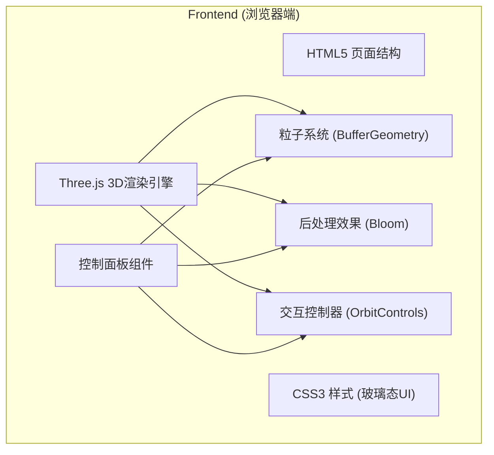

## 1. 架构设计



## 2. 技术描述

- **前端框架**: 原生HTML5 + CSS3 + JavaScript (ES6+)
- **3D引擎**: Three.js (最新版本)
- **粒子系统**: Three.js Points + BufferGeometry
- **后处理**: Three.js EffectComposer + UnrealBloomPass
- **控制器**: Three.js OrbitControls
- **构建工具**: 无 (纯静态页面，直接运行)
- **后端**: 无 (纯前端应用)
- **数据库**: 无

## 3. 文件结构

| 文件路径 | 用途 |
|---------|------|
| `/index.html` | 主页面，包含画布和控制面板结构 |
| `/css/style.css` | 样式文件，玻璃态UI设计 |
| `/js/app.js` | 主应用逻辑，场景初始化和动画循环 |
| `/js/particleSystem.js` | 粒子系统类，管理粒子创建和更新 |
| `/js/controls.js` | 控制面板事件处理 |
| `/assets/starfield.jpg` | 星空背景图片 (可选) |

## 4. 核心类定义

### ParticleSystem 粒子系统类

```javascript
class ParticleSystem {
  constructor(scene, options = {})
  init(count)           // 初始化粒子
  explode()             // 触发爆炸
  update(deltaTime)     // 更新粒子状态
  reset()               // 重置粒子
  setCount(count)       // 设置粒子数量
  setForce(force)       // 设置爆炸力度
  setSize(size)         // 设置粒子大小
  setColorMode(mode)    // 设置颜色模式
  setGravity(enabled)   // 设置重力开关
  setSlowMotion(enabled)// 设置慢动作模式
}
```

### App 主应用类

```javascript
class App {
  constructor()
  init()                // 初始化场景、相机、渲染器
  createPanel()         // 创建控制面板
  animate()             // 动画循环
  takeScreenshot()      // 截图功能
  toggleAutoRotate()    // 切换自动旋转
  toggleBackground()    // 切换背景
}
```

## 5. 性能优化策略

1. **BufferGeometry**: 使用BufferGeometry替代Geometry，减少内存占用和Draw Call
2. **粒子复用**: 爆炸循环时复用粒子对象，避免频繁创建销毁
3. **材质优化**: 使用AdditiveBlending减少overdraw
4. **帧率控制**: 自适应帧率，在低性能设备上自动降级
5. **纹理优化**: 使用圆形粒子纹理，提升视觉效果同时保持高性能

## 6. 兼容性

- **浏览器支持**: Chrome 60+, Firefox 55+, Safari 12+, Edge 79+
- **WebGL支持**: 要求支持WebGL 1.0或更高
- **移动端**: 支持iOS Safari和Chrome Android，性能可能受限
