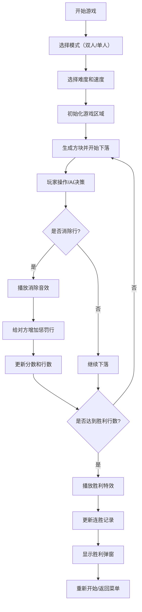

## 1. 产品概述

俄罗斯方块双人对战游戏是一款基于HTML、CSS和原生JavaScript的经典游戏重制版，支持双人本地对战和单人对战AI模式。游戏通过分屏设计让两名玩家在同一设备上同时进行游戏，通过消除行数给对方增加惩罚行来增加竞技性。目标用户是怀旧游戏爱好者和喜欢休闲竞技的玩家。

## 2. 核心功能

### 2.1 游戏模式
| 模式 | 描述 | 核心玩法 |
|------|------|----------|
| 双人对战 | 两名玩家在同一设备对战 | 左侧WASD控制，右侧方向键控制 |
| 单人对战AI | 玩家与电脑AI对战 | AI自动进行最优放置决策 |

### 2.2 功能模块
1. **游戏主界面**：双游戏区域、分数显示、行数统计、下一个方块预览
2. **控制系统**：键盘控制（WASD/方向键）、移动端虚拟按键
3. **AI系统**：自动下落、最优放置决策、难度调节
4. **音效系统**：旋转音效、消除音效、惩罚行音效
5. **存储系统**：最高连胜记录保存到localStorage
6. **主题系统**：玩家1蓝色主题、玩家2红色主题
7. **游戏状态**：暂停、重置、胜利判定、特效动画

### 2.3 页面详情
| 页面名称 | 模块名称 | 功能描述 |
|---------|----------|---------|
| 游戏主页面 | 开始菜单 | 选择游戏模式（双人/单人）、难度、速度模式 |
| 游戏主页面 | 游戏区域 | 左右分屏显示两个游戏区，各10x20格子 |
| 游戏主页面 | 信息面板 | 显示分数、消除行数、下一个方块预览 |
| 游戏主页面 | 控制面板 | 暂停按钮、重置按钮、音效开关、主题切换 |
| 游戏主页面 | 虚拟按键 | 移动端显示虚拟方向键和操作键 |
| 胜利弹窗 | 胜利特效 | 显示胜者信息、播放庆祝动画、展示连胜记录 |

## 3. 核心流程

## 4. 用户界面设计

### 4.1 设计风格
- **主色调**：玩家1区域深蓝色(#1e3a5f) + 亮蓝色(#00d4ff)，玩家2区域深红色(#5c1a1a) + 亮红色(#ff4757)
- **背景**：深色渐变背景，带有网格纹理和科技感光晕
- **按钮风格**：圆角矩形按钮，带有发光效果和悬停动画
- **字体**：使用Orbitron作为标题字体（科技感），Rajdhani作为正文字体
- **布局风格**：对称分屏布局，中间分隔线带有发光效果
- **视觉元素**：方块带有3D立体效果和阴影，消除时有粒子爆炸动画

### 4.2 页面设计概述
| 页面名称 | 模块名称 | UI元素 |
|---------|----------|--------|
| 游戏主页面 | 开始菜单 | 居中卡片式设计，渐变按钮，霓虹灯效果 |
| 游戏主页面 | 游戏区域 | 网格背景，活动方块带发光效果，已落下方块带渐变填充 |
| 游戏主页面 | 信息面板 | 半透明玻璃态设计，数字动态变化动画 |
| 游戏主页面 | 虚拟按键 | 圆形半透明按钮，触摸反馈效果，布局在屏幕两侧 |
| 胜利弹窗 | 胜利特效 | 全屏粒子动画，胜者名称放大显示，彩带飘落效果 |

### 4.3 响应式设计
- **桌面端**：横向分屏布局，两侧各显示完整游戏区域和信息面板
- **平板端**：保持横向布局，适当缩小元素尺寸
- **移动端**：纵向堆叠布局（上玩家1，下玩家2），显示虚拟按键
- **触摸优化**：虚拟按键足够大（最小48x48px），支持多指触控

### 4.4 动画效果
- **方块下落**：平滑过渡动画
- **行消除**：闪光效果 + 粒子爆炸 + 屏幕震动
- **惩罚行**：红色警告闪烁 + 方块上移动画
- **胜利效果**：彩色粒子爆炸 + 文字缩放动画 + 背景闪烁
- **按钮交互**：悬停发光、点击缩放反馈
