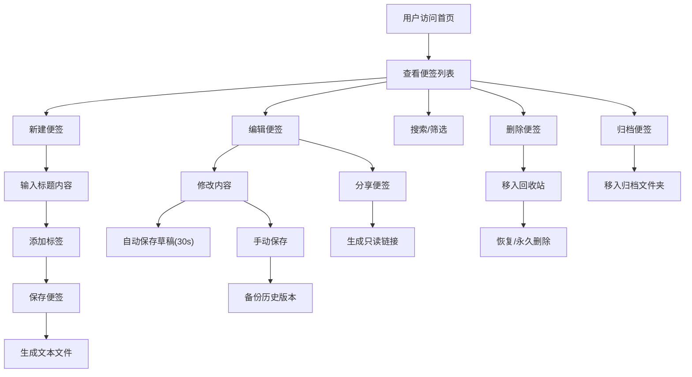

## 1. 产品概述

基于Flask的简易笔记便签Web应用，采用文件系统存储而非数据库，提供轻量级、可移植的个人笔记管理解决方案。

- 主要用途：个人知识管理、日常记录、灵感捕捉
- 解决问题：无需复杂数据库部署，数据以纯文本形式存储便于迁移和备份
- 目标用户：需要简洁高效笔记工具的个人用户、开发者

---

## 2. 核心功能

### 2.1 用户角色

| 角色 | 注册方式 | 核心权限 |
|------|----------|----------|
| 普通用户 | 无需注册（本地使用） | 创建、编辑、删除、归档、分享便签，管理标签和历史版本 |

### 2.2 功能模块

1. **便签列表页**：展示所有便签，支持排序、搜索、置顶
2. **便签编辑页**：创建/编辑便签，支持Markdown、标签、自动保存
3. **便签详情页**：查看便签内容，Markdown渲染
4. **归档页面**：查看已归档的便签
5. **回收站页面**：查看和恢复已删除的便签
6. **历史版本页面**：查看和恢复便签历史版本
7. **分享页面**：只读访问分享的便签

### 2.3 页面详情

| 页面名称 | 模块名称 | 功能描述 |
|---------|----------|----------|
| 便签列表页 | 便签卡片列表 | 展示标题、创建时间、修改时间、标签，置顶便签优先 |
| 便签列表页 | 搜索栏 | 按标题关键词模糊搜索 |
| 便签列表页 | 排序下拉 | 按更新时间、创建时间、标题排序 |
| 便签列表页 | 标签筛选 | 点击标签筛选相关便签 |
| 便签编辑页 | 标题输入 | 编辑便签标题 |
| 便签编辑页 | 内容编辑器 | Markdown语法编辑，实时预览 |
| 便签编辑页 | 标签管理 | 添加/删除多个标签 |
| 便签编辑页 | 操作按钮 | 保存、置顶、归档、删除、导出PDF |
| 便签编辑页 | 自动保存提示 | 30秒自动保存草稿，显示保存状态 |
| 便签详情页 | Markdown渲染 | 优雅展示渲染后的内容 |
| 便签详情页 | 历史版本入口 | 查看和恢复历史版本 |
| 归档页面 | 归档便签列表 | 展示已归档便签，支持恢复 |
| 回收站页面 | 回收站列表 | 展示删除的便签，支持恢复或永久删除 |
| 历史版本页面 | 版本列表 | 展示所有历史版本，可预览和恢复 |
| 分享页面 | 只读展示 | 分享链接访问，禁止编辑 |

---

## 3. 核心流程

### 3.1 创建便签流程
用户进入首页 → 点击"新建便签" → 进入编辑页 → 输入标题和内容 → 添加标签（可选）→ 点击保存 → 返回列表页

### 3.2 编辑便签流程
用户在列表页点击便签 → 进入编辑页 → 修改内容 → 系统每30秒自动保存草稿 → 用户点击保存 → 创建历史版本备份 → 返回列表

### 3.3 删除便签流程
用户在列表/编辑页点击删除 → 便签移动到回收站 → 用户可在回收站恢复或永久删除

### 3.4 分享便签流程
用户在编辑页点击分享 → 生成唯一分享链接 → 复制链接分享 → 他人通过链接只读访问

---

## 4. 用户界面设计

### 4.1 设计风格
- **设计方向**：极简精致主义，柔和温暖的色调，营造舒适的写作氛围
- **主色调**：柔和米色 (#F5F1E8) 作为背景，暖橙色 (#E8A87C) 作为强调色
- **辅助色**：深灰蓝 (#4A5568) 用于文字，薄荷绿 (#81B29A) 用于成功状态
- **字体**：标题使用 "Noto Serif SC" 衬线字体，正文使用 "Noto Sans SC" 无衬线字体
- **布局风格**：卡片式布局，柔和阴影，圆角设计，充足留白
- **按钮风格**：微立体按钮，悬停时有轻微上浮效果，点击有按压反馈
- **暗色主题**：深灰背景 (#1A1A2E)，文字使用米白色 (#EAEAEA)，保持色调一致性

### 4.2 页面设计概述

| 页面名称 | 模块名称 | UI元素 |
|---------|----------|--------|
| 便签列表页 | 顶部导航 | Logo、搜索框、排序下拉、新建按钮、主题切换、归档/回收站入口 |
| 便签列表页 | 标签云 | 横向滚动的标签列表，点击筛选 |
| 便签列表页 | 便签卡片 | 网格布局，卡片展示标题摘要、时间、标签，置顶卡片有特殊标识 |
| 便签编辑页 | 双栏布局 | 左侧Markdown编辑器，右侧实时预览 |
| 便签编辑页 | 工具栏 | 格式化按钮、标签输入、操作按钮组 |
| 便签编辑页 | 状态栏 | 显示自动保存状态、字数统计 |
| 便签详情页 | 内容区 | 优雅的排版，代码高亮，数学公式支持 |
| 回收站/归档页 | 列表 | 与主列表类似，但有恢复/永久删除按钮 |
| 历史版本页 | 时间线 | 垂直时间线展示版本，点击对比预览 |

### 4.3 响应式设计
- **桌面优先**：1200px以上为双栏编辑布局
- **平板适配**：768-1200px切换为单栏，编辑预览上下布局
- **手机适配**：768px以下简化导航，卡片单列布局，编辑器全屏模式
- **触摸优化**：增大按钮点击区域，支持滑动删除/归档手势

### 4.4 动画与交互
- 页面加载时卡片依次淡入（staggered animation）
- 悬停卡片轻微上浮并增强阴影
- 保存按钮点击有波纹效果
- 自动保存时有微妙的状态提示动画
- 主题切换有平滑过渡效果
- Markdown预览区内容更新时流畅过渡
