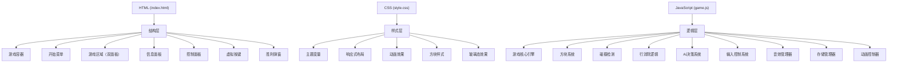

## 1. 架构设计



## 2. 技术描述

- **前端技术栈**：原生HTML5 + CSS3 + Vanilla JavaScript (ES6+)
- **构建工具**：无构建工具，纯静态文件，直接在浏览器运行
- **CSS特性**：CSS变量、Flexbox/Grid布局、CSS Animations、CSS Transitions、backdrop-filter
- **JavaScript特性**：Canvas API（游戏渲染）、Web Audio API（音效）、localStorage（数据持久化）、requestAnimationFrame（游戏循环）
- **字体**：Google Fonts - Orbitron（标题）、Rajdhani（正文）
- **图标**：纯CSS绘制图标，不依赖外部图标库

## 3. 文件结构

| 文件路径 | 用途 |
|---------|------|
| /index.html | 游戏主页面，包含所有DOM结构 |
| /style.css | 所有样式定义、主题变量、动画 |
| /game.js | 游戏核心逻辑、AI、控制、渲染 |

## 4. 核心数据结构

### 4.1 游戏状态
```javascript
const GameState = {
    MENU: 'menu',
    PLAYING: 'playing',
    PAUSED: 'paused',
    GAME_OVER: 'game_over'
};
```

### 4.2 方块定义
```javascript
const TETROMINOES = {
    I: { shape: [[1,1,1,1]], color: '#00f5ff' },
    O: { shape: [[1,1],[1,1]], color: '#ffd700' },
    T: { shape: [[0,1,0],[1,1,1]], color: '#a855f7' },
    S: { shape: [[0,1,1],[1,1,0]], color: '#22c55e' },
    Z: { shape: [[1,1,0],[0,1,1]], color: '#ef4444' },
    J: { shape: [[1,0,0],[1,1,1]], color: '#3b82f6' },
    L: { shape: [[0,0,1],[1,1,1]], color: '#f97316' }
};
```

### 4.3 玩家对象
```javascript
class Player {
    constructor(id, controls, theme) {
        this.id = id;                    // 玩家ID (1 or 2)
        this.board = Array(20).fill().map(() => Array(10).fill(0));
        this.currentPiece = null;        // 当前方块
        this.nextPiece = null;           // 下一个方块
        this.score = 0;                  // 当前分数
        this.linesCleared = 0;           // 消除总行数
        this.controls = controls;        // 按键映射
        this.theme = theme;              // 主题颜色
        this.isAI = false;               // 是否为AI
        this.gameOver = false;           // 游戏结束标志
    }
}
```

## 5. 核心算法

### 5.1 AI决策算法
- **评估指标**：行高度、空洞数、平整度、已消除行数
- **决策流程**：
  1. 遍历所有可能的旋转位置（0-3次）
  2. 遍历所有可能的横向位置（0-9列）
  3. 模拟下落并计算评估分数
  4. 选择评估分数最高的位置
  5. 执行移动和旋转操作

### 5.2 碰撞检测
```
isValidPosition(piece, offsetX, offsetY):
    for each cell in piece.shape:
        if cell is filled:
            newX = piece.x + offsetX + cell.x
            newY = piece.y + offsetY + cell.y
            if newX < 0 or newX >= BOARD_WIDTH or newY >= BOARD_HEIGHT:
                return false
            if newY >= 0 and board[newY][newX] is filled:
                return false
    return true
```

### 5.3 行消除与惩罚
- 检测满行并移除
- 每消除1行给对方增加1个惩罚行（底部随机空缺1格）
- 消除4行（Tetris）给对方增加4个惩罚行
- 惩罚行从底部插入，将所有方块上移

## 6. 事件绑定

| 事件 | 元素 | 处理函数 |
|------|------|---------|
| keydown | document | handleKeyDown() - 处理键盘输入 |
| keyup | document | handleKeyUp() - 处理按键释放 |
| touchstart | virtual-buttons | handleTouchStart() - 虚拟按键按下 |
| touchend | virtual-buttons | handleTouchEnd() - 虚拟按键释放 |
| click | start-btn | startGame() - 开始游戏 |
| click | pause-btn | togglePause() - 暂停/继续 |
| click | reset-btn | resetGame() - 重置游戏 |
| click | sound-btn | toggleSound() - 音效开关 |
| click | restart-btn | restartGame() - 胜利后重新开始 |

## 7. 性能优化

- **渲染优化**：使用Canvas API进行游戏渲染，仅在状态变化时重绘
- **游戏循环**：使用requestAnimationFrame实现60fps流畅动画
- **事件防抖**：对快速连续按键进行防抖处理
- **内存管理**：及时清理粒子动画对象，避免内存泄漏
- **音效池**：预创建AudioContext和音效节点，避免重复创建
