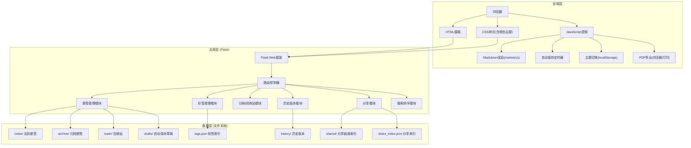
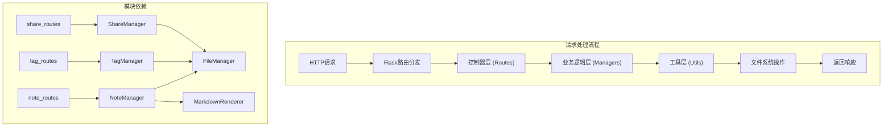
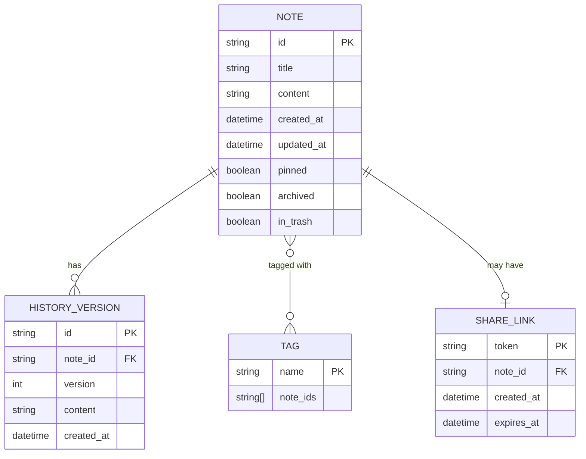

## 1. 架构设计



---

## 2. 技术描述

- **后端框架**: Flask@3.0.0 - 轻量级Python Web框架，适合小型应用快速开发
- **前端模板引擎**: Jinja2@3.1.2 - Flask内置模板引擎，支持模板继承
- **前端样式**: Tailwind CSS@3.4.0 - 原子化CSS框架，快速构建响应式界面
- **Markdown渲染**: 
  - 后端: Python-Markdown@3.5 - 服务端Markdown转HTML
  - 前端: marked.js@11.0.0 - 客户端实时预览
- **代码高亮**: Pygments@2.17 - Markdown代码块语法高亮
- **PDF导出**: 浏览器打印功能(window.print()) + 打印样式优化
- **前端交互**: 原生JavaScript (ES6+)，不引入重型框架
- **图标**: Font Awesome@6.5 - 图标库
- **字体**: Google Fonts - Noto Serif SC / Noto Sans SC

---

## 3. 目录结构

```
notes-app/
├── app.py                      # Flask应用主入口
├── requirements.txt            # Python依赖
├── config.py                   # 配置文件
├── utils/
│   ├── __init__.py
│   ├── file_manager.py         # 文件操作工具类
│   ├── note_manager.py         # 便签管理逻辑
│   ├── tag_manager.py          # 标签管理逻辑
│   └── markdown_renderer.py    # Markdown渲染工具
├── templates/                  # Jinja2模板
│   ├── base.html               # 基础模板
│   ├── index.html              # 便签列表页
│   ├── edit.html               # 编辑页
│   ├── view.html               # 详情页
│   ├── archive.html            # 归档页
│   ├── trash.html              # 回收站页
│   ├── history.html            # 历史版本页
│   └── share.html              # 分享只读页
├── static/
│   ├── css/
│   │   └── style.css           # 主样式(含暗色主题)
│   └── js/
│       └── app.js              # 前端交互逻辑
└── data/                       # 数据存储目录
    ├── notes/                  # 活跃便签
    ├── archive/                # 归档便签
    ├── trash/                  # 回收站
    ├── history/                # 历史版本
    │   └── {note_id}/          # 每个便签的历史版本
    ├── drafts/                 # 自动保存草稿
    ├── shared/                 # 分享的便签副本
    ├── tags.json               # 标签索引
    └── share_index.json        # 分享链接索引
```

---

## 4. 路由定义

| 路由方法 | 路由路径 | 用途 |
|---------|----------|------|
| GET | `/` | 便签列表主页 |
| GET | `/new` | 新建便签（跳转到编辑页） |
| GET | `/edit/<note_id>` | 编辑便签页 |
| POST | `/save` | 保存便签（新建或更新） |
| GET | `/view/<note_id>` | 查看便签详情页 |
| POST | `/delete/<note_id>` | 删除便签（移入回收站） |
| POST | `/archive/<note_id>` | 归档/取消归档便签 |
| POST | `/pin/<note_id>` | 置顶/取消置顶便签 |
| GET | `/archive` | 归档列表页 |
| GET | `/trash` | 回收站列表页 |
| POST | `/trash/restore/<note_id>` | 从回收站恢复便签 |
| POST | `/trash/delete/<note_id>` | 永久删除便签 |
| POST | `/trash/empty` | 清空回收站 |
| GET | `/history/<note_id>` | 查看便签历史版本 |
| POST | `/history/restore/<note_id>/<version>` | 恢复到指定历史版本 |
| POST | `/share/<note_id>` | 生成分享链接 |
| GET | `/share/<share_token>` | 访问分享的便签（只读） |
| POST | `/share/revoke/<note_id>` | 撤销分享链接 |
| POST | `/autosave` | 自动保存草稿接口 |
| GET | `/search` | 搜索便签 |
| GET | `/tag/<tag_name>` | 按标签筛选便签 |
| POST | `/export/pdf/<note_id>` | 导出PDF |

---

## 5. API定义

### 5.1 便签数据结构

```javascript
// 便签元数据 (存储在JSON头部)
interface NoteMeta {
    id: string;           // UUID格式唯一标识
    title: string;        // 便签标题
    created_at: string;   // ISO格式创建时间
    updated_at: string;   // ISO格式更新时间
    tags: string[];       // 标签数组
    pinned: boolean;      // 是否置顶
    archived: boolean;    // 是否归档
    in_trash: boolean;    // 是否在回收站
}

// 便签文件格式 (.md)
/*
---
{
    "id": "uuid",
    "title": "标题",
    "created_at": "2024-01-01T00:00:00Z",
    "updated_at": "2024-01-01T00:00:00Z",
    "tags": ["标签1", "标签2"],
    "pinned": false,
    "archived": false,
    "in_trash": false
}
---

# 便签内容

Markdown格式的内容...
*/
```

### 5.2 标签索引文件 (tags.json)

```json
{
    "标签名1": ["note_id_1", "note_id_2"],
    "标签名2": ["note_id_1", "note_id_3"]
}
```

### 5.3 分享索引文件 (share_index.json)

```json
{
    "share_token_1": {
        "note_id": "note_id_1",
        "created_at": "2024-01-01T00:00:00Z",
        "expires_at": null
    }
}
```

### 5.4 请求/响应格式

```typescript
// 保存便签请求
interface SaveNoteRequest {
    note_id?: string;      // 新建时为空
    title: string;
    content: string;
    tags: string[];
    pinned?: boolean;
}

// 保存便签响应
interface SaveNoteResponse {
    success: boolean;
    note_id: string;
    message: string;
}

// 自动保存请求
interface AutosaveRequest {
    note_id: string;
    title: string;
    content: string;
    tags: string[];
}

// 搜索响应
interface SearchResponse {
    notes: NoteMeta[];
    query: string;
    count: number;
}
```

---

## 6. 服务器架构图



---

## 7. 数据模型

### 7.1 数据实体关系



### 7.2 文件命名规范

- 活跃便签: `data/notes/{note_id}.md`
- 归档便签: `data/archive/{note_id}.md`
- 回收站: `data/trash/{note_id}.md`
- 历史版本: `data/history/{note_id}/{timestamp}.md`
- 草稿: `data/drafts/{note_id}.md`
- 分享副本: `data/shared/{share_token}.md`

---

## 8. 关键技术决策

### 8.1 存储方案
- **不使用数据库**: 符合用户需求，数据完全以文本文件存储，便于迁移、备份和人工编辑
- **Front Matter格式**: 使用YAML/JSON Front Matter在Markdown文件头部存储元数据，保持文件可读性

### 8.2 Markdown渲染策略
- **服务端渲染**: 详情页使用Python-Markdown在服务端渲染，SEO友好
- **客户端预览**: 编辑页使用marked.js在客户端实时预览，减少服务器请求

### 8.3 PDF导出方案
- 使用浏览器原生打印功能配合专门的打印CSS样式
- 无需安装额外工具（如wkhtmltopdf），降低部署复杂度
- 用户可选择"另存为PDF"实现导出

### 8.4 自动保存机制
- 前端JavaScript定时器每30秒发送一次保存请求
- 草稿保存到独立的drafts目录，不影响主文件
- 进入编辑页时先检查是否有未保存的草稿

### 8.5 暗色主题实现
- 使用CSS变量定义主题色
- JavaScript检测localStorage中的theme偏好
- 切换主题时动态修改body的class
