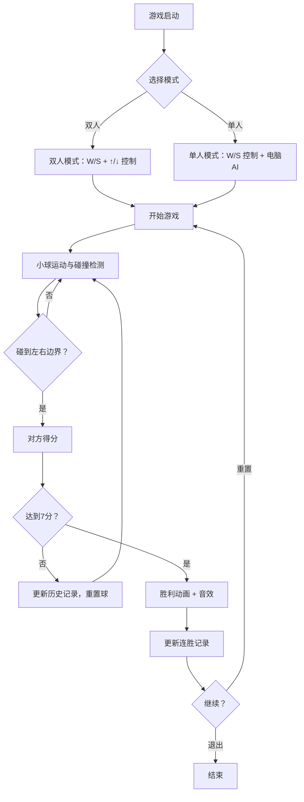

## 1. 产品概述
一款基于Canvas的乒乓球双人对抗游戏，支持双人本地对战和单人对抗电脑模式。玩家控制挡板击打小球，先达到7分者获胜。提供丰富的自定义选项（球速、挡板大小、场地主题）和竞技功能（连胜记录、回合历史），打造兼具趣味性和竞技性的经典游戏体验。

- 目标用户：休闲游戏玩家、怀旧经典游戏爱好者
- 核心价值：简洁易上手、功能丰富的本地多人对战体验

## 2. 核心功能

### 2.1 用户角色
不适用（本地双人游戏，无需注册）

### 2.2 功能模块
1. **游戏页面**：游戏画布、挡板、小球、中线、计分板、控制面板
2. **设置面板**：球速调节、挡板大小调节、音效开关、轨迹线开关、场地主题切换、模式切换
3. **历史面板**：回合历史记录、最高连胜记录

### 2.3 页面详情
| 页面名称 | 模块名称 | 功能描述 |
|---------|---------|---------|
| 游戏页面 | 游戏画布 | Canvas绘制游戏场景，包含中线、挡板、小球，支持三种场地主题背景（室内、草地、沙滩） |
| 游戏页面 | 计分板 | 显示双方比分，先达7分者获胜，获胜后显示胜利动画（屏幕闪烁） |
| 游戏页面 | 控制面板 | 暂停/重置按钮、球速滑块、挡板大小滑块、音效开关、轨迹线开关、模式切换、主题切换 |
| 游戏页面 | 回合历史 | 显示最近5次得分的双方分数变化记录 |
| 游戏页面 | 连胜记录 | 显示并持久化最高连胜记录（localStorage） |

## 3. 核心流程

游戏启动 → 选择模式（双人/单人） → 开始游戏 → 小球运动与碰撞 → 得分判定 → 更新计分与历史 → 达到7分 → 胜利动画 → 可重置重新开始

## 4. 用户界面设计

### 4.1 设计风格
- 主色调：深色霓虹风格（暗色背景 + 霓虹绿/橙双色）
- 辅助色：白色中线与文字
- 按钮风格：圆角霓虹边框按钮，hover发光效果
- 字体：Orbitron（数字/标题）+ Source Sans 3（正文），尺寸梯度24px/18px/14px/12px
- 布局风格：居中画布 + 左右侧边控制面板
- 图标风格：简约线性图标（Lucide React）
- 主题差异：
  - 室内：深色木纹感背景，暖色调
  - 草地：绿色纹理背景，自然色调
  - 沙滩：沙色暖色背景，热带色调

### 4.2 页面设计概览
| 页面名称 | 模块名称 | UI元素 |
|---------|---------|---------|
| 游戏页面 | 游戏画布 | 居中大画布，Canvas绘制，霓虹风格元素，主题背景渐变 |
| 游戏页面 | 计分板 | 画布上方，Orbitron大字体，左右对称显示分数 |
| 游戏页面 | 控制面板 | 画布下方/右侧，滑块+开关+按钮组合，暗色半透明卡片 |
| 游戏页面 | 回合历史 | 右侧面板，列表展示最近5次得分变化，带时间线样式 |
| 游戏页面 | 胜利动画 | 全屏半透明遮罩，获胜方颜色闪烁，大字体显示获胜者 |

### 4.3 响应式
- 桌面优先设计
- 画布尺寸自适应窗口，保持4:3比例
- 控制面板在大屏侧边展示，小屏下方折叠

### 4.4 3D场景指导
不适用
