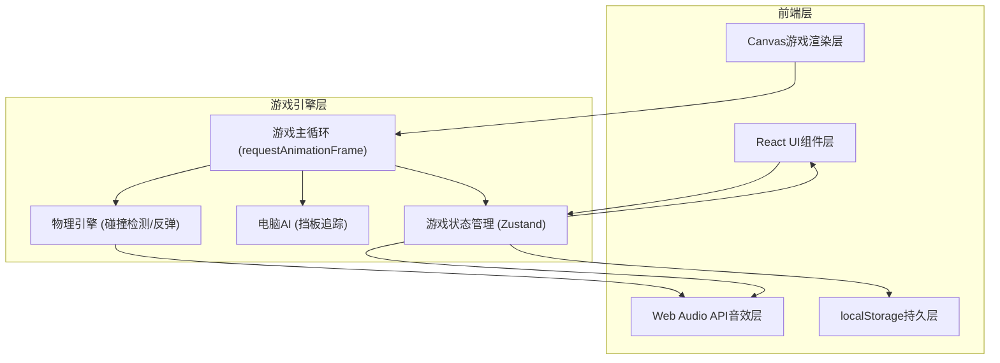
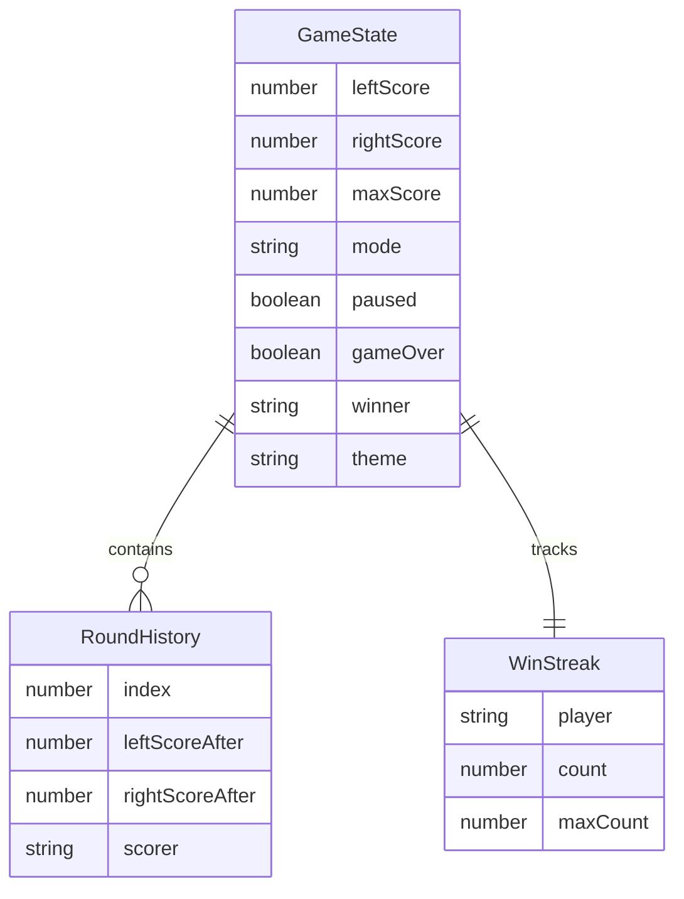

## 1. 架构设计



## 2. 技术说明
- 前端：React@18 + TypeScript + Tailwind CSS@3 + Vite
- 初始化工具：vite-init
- 后端：无
- 数据库：无（使用localStorage持久化连胜记录）
- 状态管理：Zustand
- 音效：Web Audio API（程序化生成，无需外部音频文件）
- 渲染：Canvas 2D API

## 3. 路由定义
| 路由 | 用途 |
|------|------|
| / | 游戏主页面（唯一页面，所有功能集成） |

## 4. API定义
不适用（纯前端项目，无后端API）

## 5. 服务器架构图
不适用

## 6. 数据模型

### 6.1 数据模型定义



### 6.2 数据定义语言

```javascript
// localStorage 键定义
const STORAGE_KEYS = {
  MAX_WIN_STREAK_LEFT: 'pong_max_win_streak_left',
  MAX_WIN_STREAK_RIGHT: 'pong_max_win_streak_right',
};

// 游戏状态结构
interface GameState {
  leftScore: number;
  rightScore: number;
  maxScore: number;           // 默认7
  mode: 'pvp' | 'pve';       // 双人/单人
  paused: boolean;
  gameOver: boolean;
  winner: 'left' | 'right' | null;
  theme: 'indoor' | 'grass' | 'beach';
  ballSpeed: number;          // 1-10
  paddleHeight: number;       // 60-200
  soundEnabled: boolean;
  trailEnabled: boolean;
  roundHistory: RoundHistory[];
}

interface RoundHistory {
  leftScoreAfter: number;
  rightScoreAfter: number;
  scorer: 'left' | 'right';
}
```
