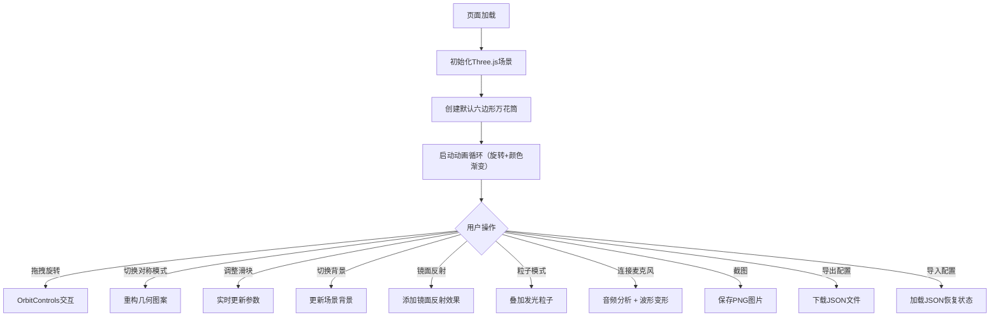

## 1. 产品概述

基于Three.js的沉浸式3D万花筒交互网页，通过几何对称原理生成变幻莫测的彩色艺术图案，支持丰富的自定义参数和实时交互，为用户带来视觉艺术创作和欣赏体验。

- **主要用途**：视觉艺术欣赏、创意设计灵感、放松冥想、音乐可视化
- **目标用户**：设计师、艺术爱好者、音乐爱好者、普通用户

## 2. 核心功能

### 2.1 功能模块

1. **3D万花筒场景**：Three.js实时渲染，几何对称图案自动变幻，颜色渐变，持续旋转动画
2. **对称模式选择**：三角形(3)、正方形(4)、六边形(6)、八边形(8)四种对称模式
3. **参数控制面板**：旋转速度、颜色变化速度、形状复杂度三个核心滑块
4. **视觉效果开关**：镜面反射效果、粒子叠加模式、背景切换（黑/白/彩虹渐变）
5. **交互工具栏**：一键截图、重置视角、全屏切换、配置导入导出
6. **状态显示面板**：实时显示当前对称模式、颜色参数值
7. **音乐可视化**：连接麦克风，图案随音频频率波动变形

### 2.3 页面详情

| 页面名称 | 模块名称 | 功能描述 |
|----------|----------|----------|
| 主页面 | 3D场景区域 | 全屏Canvas渲染万花筒，鼠标拖拽旋转视角 |
| 主页面 | 右侧控制面板 | 对称模式选择、三个参数滑块、视觉效果开关 |
| 主页面 | 顶部工具栏 | 截图、重置视角、全屏、导入/导出JSON按钮 |
| 主页面 | 底部状态栏 | 显示当前对称模式、颜色参数值 |
| 主页面 | 音频控制 | 麦克风连接按钮，音频可视化开关 |

## 3. 核心流程

1. 页面加载 → 初始化Three.js场景 → 默认六边形万花筒开始自动旋转和颜色渐变
2. 用户交互 → 鼠标拖拽旋转视角 → 滚轮缩放画面
3. 调整参数 → 拖动滑块 → 万花筒实时响应变化
4. 切换模式 → 选择对称形状 → 图案立即重构为新的对称模式
5. 开启特效 → 镜面反射/粒子模式 → 视觉效果叠加
6. 音乐可视化 → 点击连接麦克风 → 授权后图案随声音波动
7. 导出保存 → 截图保存PNG 或 导出配置JSON文件

## 4. 用户界面设计

### 4.1 设计风格

- **主色调**：深色赛博朋克风格，主色 #00FFFF（青色霓虹），辅助色 #FF00FF（品红霓虹）、#FFFF00（黄色霓虹）
- **背景色**：#000000（纯黑）、#FFFFFF（纯白）、动态彩虹渐变
- **字体**：展示字体 Orbitron（科幻感），UI字体 JetBrains Mono（等宽现代）
- **按钮风格**：霓虹发光边框按钮，悬停时亮度增强，玻璃态半透明
- **布局风格**：全屏3D场景 + 右侧固定控制面板 + 顶部悬浮工具栏
- **图标风格**：线性霓虹图标（lucide-react）

### 4.2 页面设计概览

| 页面名称 | 模块名称 | UI元素 |
|----------|----------|--------|
| 主页面 | 3D场景区域 | 全屏Canvas，居中万花筒图案，动态光影效果 |
| 主页面 | 右侧控制面板 | 半透明玻璃态面板，滑块带发光轨道，开关按钮带状态指示 |
| 主页面 | 顶部工具栏 | 悬浮图标按钮组，hover时霓虹发光 |
| 主页面 | 底部状态栏 | 半透明条，显示参数数值和模式名称 |
| 主页面 | 音频控制 | 麦克风按钮带连接状态指示，音频波形动画 |

### 4.3 响应式设计

- 桌面端全屏体验，控制面板固定在右侧
- 平板端控制面板可折叠收起
- 移动端触摸旋转缩放，控制面板改为底部抽屉式
- 触屏设备优化触摸交互

### 4.4 3D场景指引

- **环境**：深色科技感，可选纯黑、纯白或动态彩虹渐变背景
- **光照**：多点彩色点光源，营造霓虹发光效果
- **相机**：透视相机，初始距离适合观看完整万花筒，OrbitControls控制
- **构图**：万花筒图案居中，占据视觉中心区域
- **交互**：图案持续自转，颜色循环渐变，鼠标拖拽旋转视角
- **后处理**：Bloom泛光效果增强发光感，可选镜面反射效果
- **性能预算**：几何体面数控制在合理范围，粒子数量上限500
