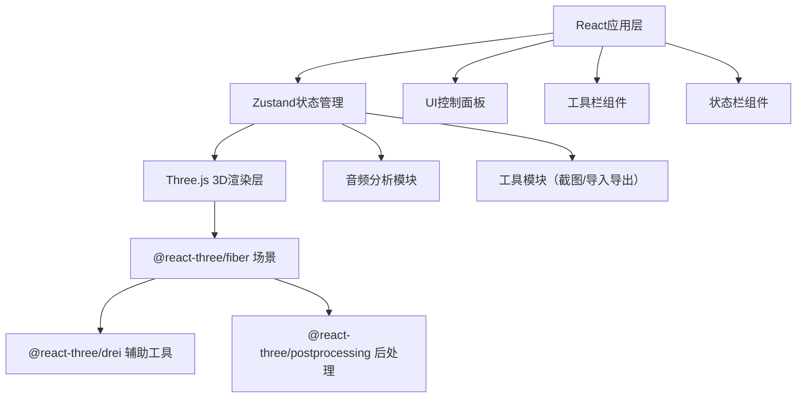
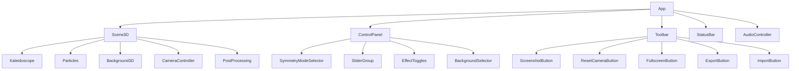

## 1. 架构设计



纯前端架构，无后端服务。React管理UI和状态，Three.js负责3D渲染，通过Zustand统一状态管理，Web Audio API处理音频可视化。

## 2. 技术说明

- **前端框架**：React@18 + TypeScript + Vite
- **3D渲染**：Three.js + @react-three/fiber + @react-three/drei + @react-three/postprocessing
- **样式方案**：Tailwind CSS@3
- **状态管理**：Zustand
- **图标库**：lucide-react
- **音频处理**：Web Audio API (原生)
- **初始化工具**：vite-init（react-ts模板）
- **后端**：无

## 3. 路由定义

| 路由 | 用途 |
|------|------|
| / | 主页面，3D万花筒场景与控制面板 |

## 4. 数据模型

### 4.1 核心数据结构

```typescript
type SymmetryMode = 'triangle' | 'square' | 'hexagon' | 'octagon'
type BackgroundMode = 'black' | 'white' | 'rainbow'

interface KaleidoscopeConfig {
  symmetryMode: SymmetryMode
  rotationSpeed: number
  colorSpeed: number
  complexity: number
  backgroundMode: BackgroundMode
  mirrorEffect: boolean
  particleMode: boolean
  audioVisualization: boolean
}

interface AppState {
  config: KaleidoscopeConfig
  isFullscreen: boolean
  isMicConnected: boolean
  audioData: number[]
  
  setSymmetryMode: (mode: SymmetryMode) => void
  setRotationSpeed: (speed: number) => void
  setColorSpeed: (speed: number) => void
  setComplexity: (complexity: number) => void
  setBackgroundMode: (mode: BackgroundMode) => void
  setMirrorEffect: (enabled: boolean) => void
  setParticleMode: (enabled: boolean) => void
  setAudioVisualization: (enabled: boolean) => void
  setMicConnected: (connected: boolean) => void
  setAudioData: (data: number[]) => void
  toggleFullscreen: () => void
  resetCamera: () => void
  exportConfig: () => KaleidoscopeConfig
  importConfig: (config: KaleidoscopeConfig) => void
}
```

### 4.2 默认配置

```typescript
const DEFAULT_CONFIG: KaleidoscopeConfig = {
  symmetryMode: 'hexagon',
  rotationSpeed: 0.5,
  colorSpeed: 0.5,
  complexity: 5,
  backgroundMode: 'black',
  mirrorEffect: false,
  particleMode: false,
  audioVisualization: false
}
```

## 5. 组件架构



## 6. 关键实现细节

### 6.1 万花筒几何生成

- 根据对称模式（3/4/6/8边）计算对称分割角度
- 使用极坐标系统生成基础几何形状
- 应用旋转变换复制多个对称副本
- 复杂度参数控制几何细分层数和形状数量
- 使用BufferGeometry优化性能

### 6.2 颜色渐变系统

- HSL颜色空间实现平滑渐变
- 色相随时间和颜色速度参数循环
- 每个对称扇区应用色相偏移
- 支持音频数据调制色相和饱和度

### 6.3 镜面反射效果

- 使用反射材质或RenderTarget实现
- 创建虚拟镜像平面复制场景
- 多重反射创建深度层次感
- 可选半透明叠加模式

### 6.4 粒子系统

- 生成200-500个发光粒子
- 粒子围绕万花筒做布朗运动
- 使用PointsMaterial实现发光效果
- 粒子颜色跟随万花筒主色调

### 6.5 音频可视化

- Web Audio API的AnalyserNode获取频率数据
- 低频控制万花筒整体缩放
- 中频控制几何形状变形
- 高频影响粒子运动速度
- 使用requestAnimationFrame实时更新

### 6.6 后处理效果

- EffectComposer管理后处理通道
- BloomPass实现发光泛光效果
- 可选FilmPass添加胶片颗粒
- ShaderPass实现自定义镜面效果

### 6.7 截图功能

- Three.js renderer的domElement.toDataURL()
- 确保在渲染帧完成后调用
- 添加时间戳文件名

### 6.8 导入导出

- 将Zustand store中的config序列化为JSON
- Blob + URL.createObjectURL触发下载
- FileReader读取上传的JSON文件
- 导入时验证配置数据格式
