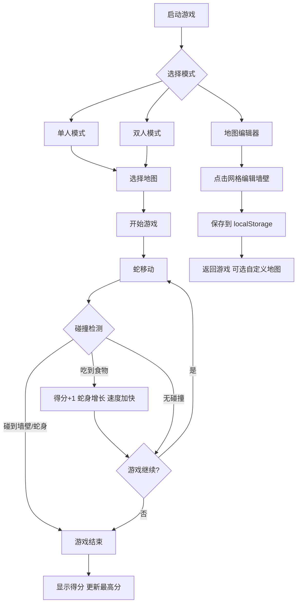

## 1. 产品概述

一款基于 HTML、CSS 和原生 JavaScript 的经典贪吃蛇游戏，融入迷宫障碍物玩法。玩家在 20×20 网格画布中操控蛇移动，躲避墙壁和自身，吃食物得分。支持多张预设地图切换、地图编辑器、双人模式、音效、暂停、移动端触控等丰富功能。

- 目标用户：休闲游戏玩家、怀旧游戏爱好者
- 核心价值：经典玩法 + 迷宫创新 + 多模式支持，提供丰富可定制的游戏体验

## 2. 核心功能

### 2.1 功能模块

1. **游戏主界面**：游戏画布、分数显示、最高分显示、地图选择、模式切换、控制按钮
2. **地图编辑器**：可点击网格放置/移除墙壁、保存自定义地图到 localStorage
3. **双人模式**：两条蛇各自控制、碰撞检测、存活判定

### 2.2 页面详情

| 页面名称 | 模块名称 | 功能描述 |
|----------|----------|----------|
| 游戏主界面 | 游戏画布 | 20×20 网格，渲染蛇身、食物、墙壁障碍物 |
| 游戏主界面 | 分数面板 | 显示当前得分、最高分（localStorage 持久化） |
| 游戏主界面 | 地图选择 | 按钮切换预设迷宫布局（至少 3 张预设地图） |
| 游戏主界面 | 模式切换 | 单人/双人模式切换、地图编辑器入口 |
| 游戏主界面 | 控制面板 | 开始/暂停/恢复按钮、音效开关、速度显示 |
| 游戏主界面 | 触控方向键 | 移动端虚拟方向按钮 |
| 地图编辑器 | 编辑网格 | 点击网格放置或移除墙壁 |
| 地图编辑器 | 保存/加载 | 保存自定义地图到 localStorage，可加载已保存地图 |
| 游戏主界面 | 食物提示 | 显示下一个食物出现位置的提示标记 |

## 3. 核心流程

### 3.1 单人模式流程

1. 玩家选择地图（预设或自定义）→ 点击开始 → 蛇初始长度 3 从起点出发
2. 方向键/WASD/触控控制蛇的移动方向
3. 蛇头碰到墙壁障碍物或自身 → 游戏结束 → 显示得分 → 更新最高分
4. 吃到食物 → 得分 +1 → 蛇身增长一节 → 速度随得分增加
5. 按空格键暂停/恢复

### 3.2 双人模式流程

1. 两名玩家各控制一条蛇，使用不同按键组
2. 蛇头碰到墙壁/自身/对方蛇身 → 该蛇死亡
3. 最后存活的蛇所属玩家获胜；同时死亡则平局

### 3.3 地图编辑器流程

1. 进入编辑器模式 → 显示空白 20×20 网格
2. 点击网格切换墙壁/空地状态
3. 点击保存 → 地图数据存入 localStorage
4. 可在游戏中选择自定义地图进行游玩

## 4. 用户界面设计

### 4.1 设计风格

- **主色调**：深色赛博朋克风格 — 深蓝黑底色 (#0a0e1a)，霓虹绿蛇身 (#00ff88)，霓虹粉食物 (#ff3366)，墙壁用冷灰色 (#3a3f5c)
- **按钮风格**：圆角微光按钮，hover 时霓虹发光效果
- **字体**：像素风/复古风显示字体，搭配清晰的正文字体
- **布局风格**：居中游戏画布，左右/上下信息面板，顶部控制栏
- **图标风格**：简约线条图标，配合霓虹色系

### 4.2 页面设计概览

| 页面名称 | 模块名称 | UI 元素 |
|----------|----------|---------|
| 游戏主界面 | 游戏画布 | 深色背景网格、霓虹色蛇身渐变、发光食物、灰色墙壁、提示标记 |
| 游戏主界面 | 分数面板 | 当前分数大字显示、最高分小字显示、霓虹边框卡片 |
| 游戏主界面 | 控制栏 | 圆角按钮组（开始/暂停/音效开关）、地图选择下拉/按钮组 |
| 游戏主界面 | 触控区 | 半透明圆形方向按钮，仅在移动端显示 |
| 地图编辑器 | 编辑网格 | 网格高亮 hover 效果，墙壁格子填充色，空格半透明 |
| 地图编辑器 | 工具栏 | 保存/清空/返回按钮 |

### 4.3 响应式设计

- 桌面优先设计，游戏画布为核心，固定 20×20 网格
- 移动端自适应：画布缩放、显示虚拟方向键
- 触摸优化：方向按钮足够大，支持滑动手势

### 4.4 蛇身颜色渐变

- 蛇头使用最深的霓虹绿色 (#00ff88)
- 蛇身从头到尾颜色逐渐变浅，尾部为淡绿色
- 双人模式中第二条蛇使用霓虹蓝色 (#00aaff)，同样渐变

### 4.5 音效设计

- 吃食物：轻快上升音调
- 死亡：低沉下降音调
- 使用 Web Audio API 生成音效，无需外部音频文件
