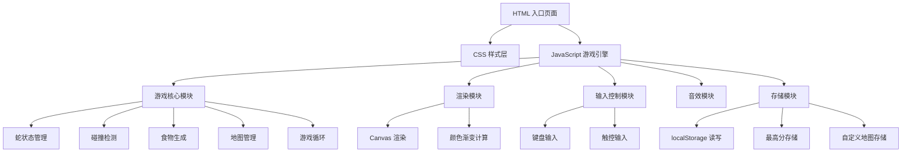

## 1. 架构设计

纯前端单页应用，无后端服务。所有数据持久化通过 localStorage 实现。



## 2. 技术选型

- **前端**：原生 HTML5 + CSS3 + JavaScript (ES6+)
- **渲染**：HTML5 Canvas 2D API
- **音效**：Web Audio API（程序化生成音效，无需外部音频文件）
- **存储**：localStorage（最高分、自定义地图）
- **构建工具**：无，纯静态文件，直接浏览器打开

## 3. 文件结构

| 文件 | 用途 |
|------|------|
| index.html | 游戏入口页面，包含所有 UI 结构 |
| style.css | 游戏样式，响应式布局，霓虹赛博朋克主题 |
| game.js | 游戏核心逻辑（蛇、食物、碰撞、地图、游戏循环） |
| renderer.js | Canvas 渲染模块（网格、蛇身渐变、食物、墙壁） |
| audio.js | 音效模块（Web Audio API 程序化音效生成） |
| storage.js | localStorage 存储模块（最高分、自定义地图） |
| editor.js | 地图编辑器模块 |

## 4. 数据结构定义

### 4.1 地图数据

```javascript
// 地图数据：20x20 二维数组，0=空地，1=墙壁
const mapData = [
  [0,0,0,...], // 20 个元素，共 20 行
  ...
];
```

### 4.2 蛇数据

```javascript
const snake = {
  body: [{x: 10, y: 10}, {x: 9, y: 10}, {x: 8, y: 10}], // 头在前
  direction: {x: 1, y: 0}, // 当前方向
  nextDirection: {x: 1, y: 0}, // 下一帧方向（防止反向）
  alive: true,
  score: 0
};
```

### 4.3 食物数据

```javascript
const food = {
  x: 15,
  y: 5,
  nextX: 12, // 下一个食物位置提示
  nextY: 8
};
```

### 4.4 localStorage 数据结构

```javascript
// 最高分
localStorage.setItem('snake_highscore', JSON.stringify({single: 0, dual: 0}));

// 自定义地图
localStorage.setItem('snake_custom_maps', JSON.stringify([
  {name: '自定义地图1', data: [[0,0,...],...]},
]));
```

## 5. 游戏核心逻辑

### 5.1 游戏循环

- 使用 `requestAnimationFrame` + 时间累加器控制帧率
- 初始速度：150ms/步，随得分增加逐渐降低间隔（最快 60ms/步）
- 速度公式：`interval = Math.max(60, 150 - score * 3)`

### 5.2 碰撞检测

- 墙壁碰撞：蛇头坐标对应地图数组值为 1
- 边界碰撞：蛇头坐标超出 0-19 范围
- 自身碰撞：蛇头坐标与蛇身任一节重合
- 双人碰撞：蛇头坐标与对方蛇身任一节重合

### 5.3 食物生成

- 随机选择空地（非墙壁、非蛇身、非对方蛇身）
- 同时生成下一个食物位置作为提示
- 食物位置用闪烁动画标识，下一个食物位置用半透明标记

### 5.4 预设地图

- 地图 1：经典模式（无墙壁障碍）
- 地图 2：十字迷宫（中心十字墙壁）
- 地图 3：框中框（双层框形墙壁）
- 地图 4：散落障碍（随机散布的墙壁块）

### 5.5 双人模式按键

- 玩家 1：W/A/S/D
- 玩家 2：方向键 ↑/←/↓/→

## 6. 渲染设计

### 6.1 Canvas 渲染

- 画布尺寸：根据容器自适应，保持 1:1 比例
- 每个网格单元格大小：画布宽度 / 20
- 蛇身渐变：头部 #00ff88 → 尾部 rgba(0,255,136,0.3)，线性插值
- 双人蛇 2：头部 #00aaff → 尾部 rgba(0,170,255,0.3)
- 食物：#ff3366 圆形，带脉冲动画
- 墙壁：#3a3f5c 圆角矩形
- 下一个食物提示：半透明 #ff3366 圆形

### 6.2 帧率

- 渲染帧率：60fps（requestAnimationFrame）
- 游戏逻辑帧率：根据速度动态调整
