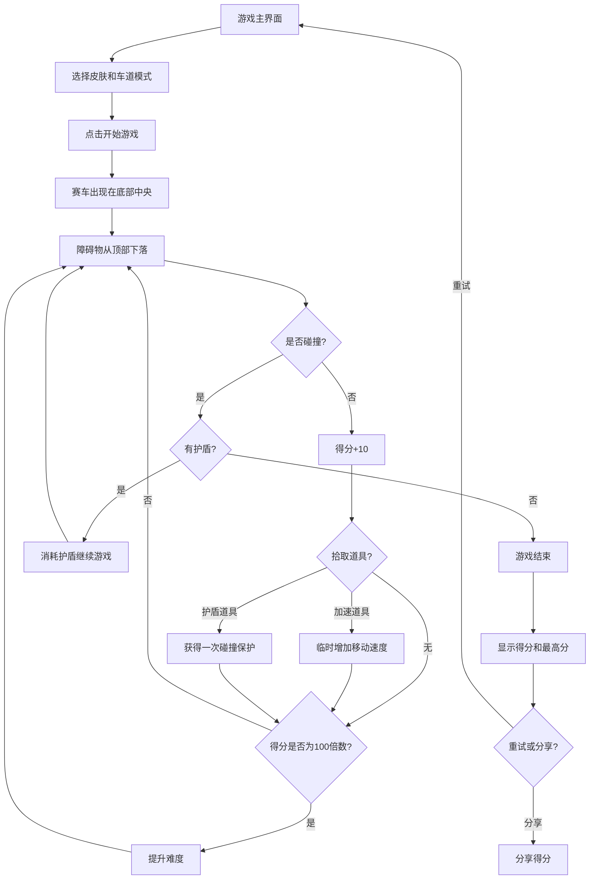

## 1. 产品概述
赛车躲避障碍物游戏——一款基于HTML5 Canvas的街机风格赛车游戏，玩家操控赛车在车道上躲避下落的障碍物，通过道具系统和难度渐进机制提供丰富的游戏体验。
- 核心目的：提供快节奏、易上手但有挑战性的休闲赛车游戏体验
- 目标用户：休闲游戏玩家、移动端用户

## 2. 核心功能

### 2.1 功能模块
1. **游戏主界面**: 赛车皮肤选择、车道模式切换、最高分显示、开始按钮
2. **游戏画面**: 赛道画布、得分显示、道具状态、音效开关
3. **游戏结束界面**: 最终得分、最高分、重试按钮、分享得分按钮

### 2.2 页面详情
| 页面名称 | 模块名称 | 功能描述 |
|----------|----------|----------|
| 游戏主界面 | 皮肤选择 | 红色/蓝色/绿色赛车皮肤切换 |
| 游戏主界面 | 车道模式 | 双车道/三车道模式切换 |
| 游戏主界面 | 最高分显示 | 从localStorage读取并展示历史最高分 |
| 游戏画面 | 赛道滚动 | 道路线条向下滚动动画，增强速度感 |
| 游戏画面 | 玩家赛车 | 底部中央的玩家赛车，支持左右移动 |
| 游戏画面 | 障碍物系统 | 普通轿车/卡车/摩托车三种类型，不同宽度和速度 |
| 游戏画面 | 道具系统 | 加速道具（临时增加移动速度）和护盾道具（抵挡一次碰撞） |
| 游戏画面 | 得分系统 | 躲避障碍物+10分，实时显示当前得分 |
| 游戏画面 | 难度渐进 | 每100分加快障碍物生成速度 |
| 游戏画面 | 音效系统 | 躲避/碰撞/获得道具音效，支持开关 |
| 游戏画面 | 触摸控制 | 手指滑动控制赛车位置，适配移动端 |
| 游戏结束界面 | 得分展示 | 显示最终得分和历史最高分 |
| 游戏结束界面 | 重试按钮 | 重新开始游戏 |
| 游戏结束界面 | 分享按钮 | 分享得分到社交平台 |

## 3. 核心流程

玩家打开游戏 → 选择赛车皮肤和车道模式 → 点击开始 → 赛车出现在底部中央 → 障碍物从顶部下落 → 玩家左右移动躲避 → 躲避成功+10分 → 碰撞障碍物（有护盾则抵消一次，无护盾则游戏结束）→ 道具随机出现，拾取获得效果 → 得分每增加100分难度提升 → 游戏结束显示得分和最高分 → 重试或分享

## 4. 用户界面设计

### 4.1 设计风格
- 主色调：深灰色道路背景 + 霓虹色调（青色、品红、黄色）作为强调色
- 按钮风格：圆角按钮，带霓虹发光效果
- 字体：Google Fonts - Orbitron（科技感显示字体）+ Rajdhani（UI字体）
- 布局风格：居中画布 + 浮动HUD覆盖层
- 图标风格：像素风/赛博朋克风简约图标

### 4.2 页面设计概览
| 页面名称 | 模块名称 | UI元素 |
|----------|----------|--------|
| 游戏主界面 | 标题区 | Orbitron大标题，霓虹发光文字效果 |
| 游戏主界面 | 皮肤选择 | 三个赛车预览色块，选中状态带发光边框 |
| 游戏主界面 | 车道模式 | 双车道/三车道切换按钮，高亮当前选择 |
| 游戏主界面 | 开始按钮 | 大号圆角按钮，霓虹发光，脉冲动画 |
| 游戏画面 | 赛道 | 灰色道路 + 白色虚线车道标记 + 绿色路肩 |
| 游戏画面 | HUD | 左上角得分、右上角道具状态、音效开关按钮 |
| 游戏画面 | 玩家赛车 | 根据皮肤选择着色的赛车图形 |
| 游戏画面 | 障碍物 | 不同颜色/尺寸的车辆图形（轿车/卡车/摩托车） |
| 游戏画面 | 道具 | 发光的加速/护盾图标 |
| 游戏结束界面 | 得分区 | 大号得分数字，最高分对比 |
| 游戏结束界面 | 按钮 | 重试按钮（霓虹青色）+ 分享按钮（霓虹品红色） |

### 4.3 响应式设计
- 桌面优先设计，Canvas画布自适应屏幕
- 移动端全屏适配，触摸控制替代键盘
- 底部触摸滑动区域，防止误触
