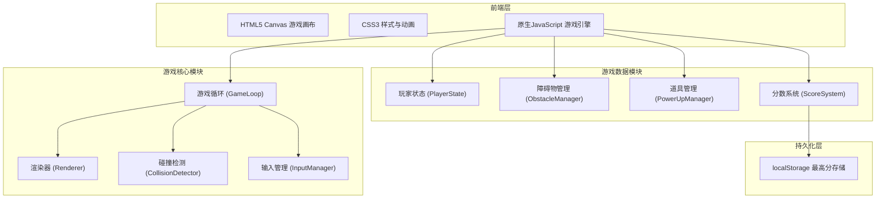

## 1. 架构设计

## 2. 技术说明
- 前端：HTML5 + CSS3 + 原生JavaScript（ES6+），无框架依赖
- 画布渲染：HTML5 Canvas 2D API
- 音效：Web Audio API（AudioContext生成合成音效，无需外部音频文件）
- 数据持久化：localStorage
- 构建工具：无，纯静态文件直接运行
- 部署：静态文件托管即可

## 3. 文件结构

| 文件 | 用途 |
|------|------|
| index.html | 游戏主页面，包含Canvas和UI覆盖层 |
| css/style.css | 全局样式、动画、响应式布局 |
| js/game.js | 游戏核心引擎和主循环 |
| js/player.js | 玩家赛车类 |
| js/obstacle.js | 障碍物类和管理器 |
| js/powerup.js | 道具类和管理器 |
| js/renderer.js | 渲染器（道路、车辆、特效） |
| js/input.js | 输入管理（键盘+触摸） |
| js/audio.js | 音效管理（Web Audio API合成音效） |
| js/score.js | 分数和最高分管理 |
| js/ui.js | UI管理（菜单、HUD、游戏结束界面） |

## 4. 核心类设计

### 4.1 Game（游戏主控）
- 管理游戏状态：menu / playing / gameover
- 游戏主循环 requestAnimationFrame
- 协调各模块更新和渲染

### 4.2 Player（玩家赛车）
- 属性：位置x/y、宽度/高度、速度、皮肤颜色、护盾状态、加速状态
- 方法：moveLeft()、moveRight()、activateShield()、activateBoost()

### 4.3 Obstacle（障碍物）
- 类型：car（普通轿车）、truck（卡车）、motorcycle（摩托车）
- 不同属性：宽度（truck>car>motorcycle）、速度（motorcycle>car>truck）
- 从顶部生成，向下移动

### 4.4 PowerUp（道具）
- 类型：boost（加速）、shield（护盾）
- 随机位置生成，向下移动
- 拾取后触发对应效果，有持续时间

### 4.5 Renderer（渲染器）
- 绘制滚动道路背景（车道线动画）
- 绘制玩家赛车（根据皮肤颜色）
- 绘制障碍物和道具
- 绘制特效（护盾光环、加速尾焰）

### 4.6 InputManager（输入管理）
- 键盘事件：左右方向键
- 触摸事件：touchstart/touchmove/touchend
- 将输入统一转换为移动指令

### 4.7 AudioManager（音效管理）
- 使用Web Audio API生成合成音效
- 音效类型：dodge（躲避成功）、crash（碰撞）、powerup（获得道具）
- 音效开关状态管理

### 4.8 ScoreManager（分数管理）
- 当前得分追踪
- 最高分读取/保存到localStorage
- 难度等级计算（每100分提升）

## 5. 游戏参数设计

| 参数 | 双车道模式 | 三车道模式 |
|------|-----------|-----------|
| 车道数量 | 2 | 3 |
| 画布宽度 | 400px | 500px |
| 玩家赛车宽度 | 40px | 40px |
| 障碍物初始速度 | 3px/帧 | 3px/帧 |
| 障碍物生成间隔 | 1500ms | 1200ms |
| 加速道具持续时间 | 5000ms | 5000ms |

## 6. 碰撞检测
- 使用AABB（轴对齐包围盒）矩形碰撞检测
- 玩家赛车与障碍物的矩形重叠判断
- 玩家赛车与道具的矩形重叠判断
- 碰撞后有护盾则消耗护盾并闪烁反馈，无护盾则游戏结束
