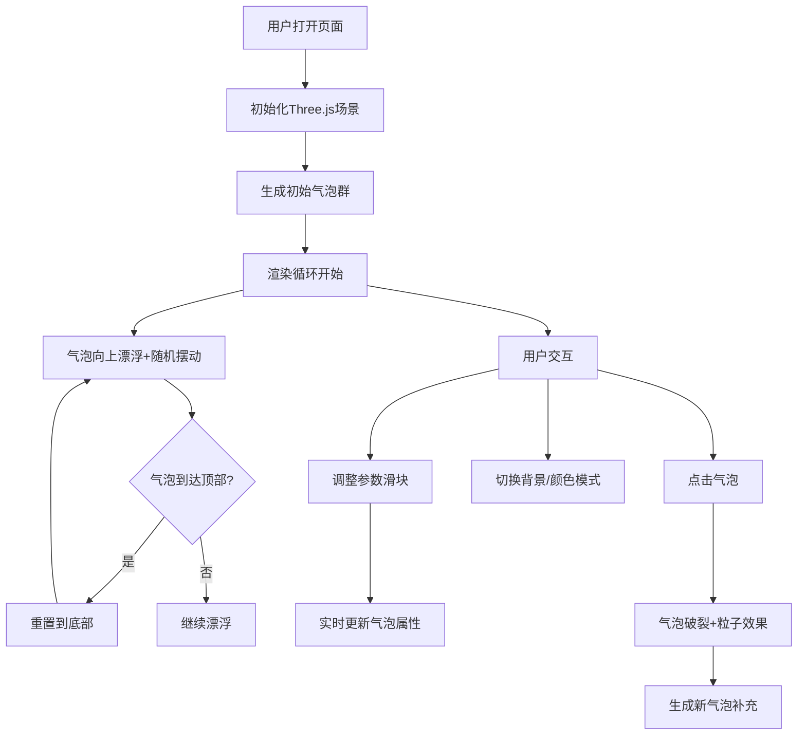

## 1. 产品概述

基于Three.js的3D彩色气泡漂浮交互式网页应用，提供沉浸式的视觉体验和丰富的交互控制功能。

- 主要用途：提供视觉放松、交互娱乐的3D气泡漂浮体验
- 目标用户：对3D视觉效果感兴趣的普通用户、设计师、创意工作者
- 产品价值：通过精美的3D气泡效果和丰富的自定义选项，带来愉悦的视觉体验

## 2. 核心功能

### 2.1 用户角色
无用户角色区分，所有用户均可使用全部功能

### 2.2 功能模块
1. **3D气泡场景**: 气泡漂浮系统
2. **控制面板**: 参数调节面板
3. **交互系统**: 点击破裂、相机控制
4. **视觉效果**: 光晕、连线、背景
5. **辅助功能**: 截图、音乐、统计

### 2.3 页面详情

| 页面名称 | 模块名称 | 功能描述 |
|-----------|-------------|---------------------|
| 主页面 | 3D气泡场景 | 数百个半透明彩色气泡，缓慢向上漂浮并随机左右摆动，到达顶部后重置到底部无限循环，气泡表面有高光反射效果 |
| 主页面 | 相机控制 | OrbitControls支持旋转、缩放、平移视角，支持自动旋转模式 |
| 主页面 | 气泡数量控制 | 滑块控制气泡数量，范围50-500 |
| 主页面 | 气泡大小控制 | 滑块控制气泡大小随机化范围 |
| 主页面 | 漂浮速度控制 | 滑块控制气泡上升快慢 |
| 主页面 | 背景切换 | 支持浅蓝色天空色、深海蓝色、黑色三种背景 |
| 主页面 | 气泡破裂效果 | 点击气泡时气泡破裂并播放粒子爆破效果，破裂后底部生成新气泡补充 |
| 主页面 | 颜色模式切换 | 支持随机彩色、粉色系、蓝色系三种颜色模式 |
| 主页面 | 截图功能 | 一键保存当前画面为PNG图片 |
| 主页面 | 光晕效果 | 光线反射光晕效果开关 |
| 主页面 | 数量统计 | 实时显示当前气泡数量 |
| 主页面 | 连线效果 | 相邻距离较近的气泡用半透明细线连接形成网状结构 |
| 主页面 | 背景音乐 | 背景音乐播放，可开关 |

## 3. 核心流程

## 4. 用户界面设计

### 4.1 设计风格
- 主色调：根据用户可切换（浅蓝天空、深海蓝、黑色
- 控件风格：半透明玻璃态控制面板，圆角设计，柔和阴影
- 字体：现代无衬线字体，清晰易读
- 布局：全屏3D画布，右上角控制面板悬浮于画布之上
- 整体风格：简约现代，科技感与梦幻感结合

### 4.2 页面设计概述

| 页面名称 | 模块名称 | UI元素 |
|-----------|-------------|-------------|
| 主页面 | 3D画布 | 全屏Three.js渲染区域 |
| 主页面 | 控制面板 | 右上角半透明面板，包含多个滑块和按钮 |
| 主页面 | 统计信息 | 左下角显示气泡数量 |
| 主页面 | 控制面板 | 玻璃态设计，柔和阴影，圆角边框 |

### 4.3 响应性
- 桌面端优先，移动端自适应
- 控制面板在移动端可折叠
- 触摸操作优化

### 4.4 3D场景指导
- 环境：根据背景色切换，配合适当的雾效
- 光照：环境光+点光源，模拟真实气泡高光
- 相机：PerspectiveCamera，初始位置(0, 0, 50)
- 后期处理：Bloom光晕效果
- 动画：气泡缓慢漂浮动画，粒子爆破动画
