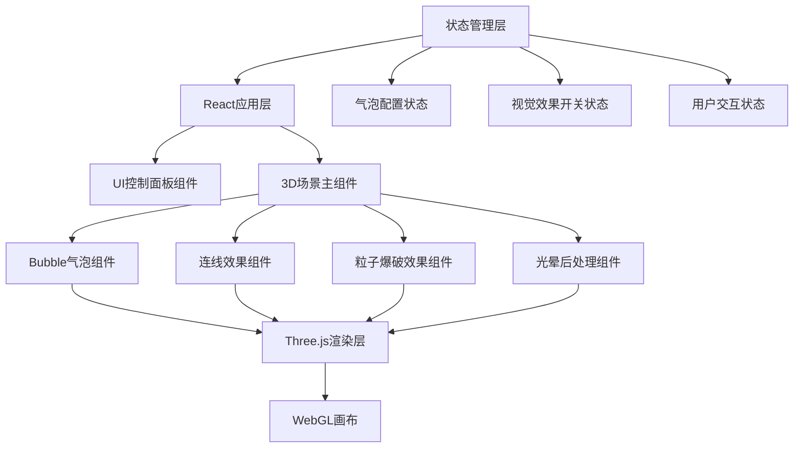

## 1. 架构设计



## 2. 技术描述

- **前端框架**: React@18
- **构建工具**: Vite@5
- **样式方案**: TailwindCSS@3
- **3D渲染**: three@0.160
- **React 3D绑定**: @react-three/fiber@8
- **3D辅助组件**: @react-three/drei@9
- **后处理效果**: @react-three/postprocessing@2
- **状态管理**: React useState/useRef (轻量级)

## 3. 目录结构

```
src/
├── components/
│   ├── ControlPanel/      # 控制面板组件
│   │   ├── Slider.jsx     # 滑块控件
│   │   ├── Button.jsx     # 按钮控件
│   │   └── index.jsx      # 控制面板主组件
│   ├── BubbleScene/       # 3D气泡场景
│   │   ├── Bubble.jsx     # 单个气泡组件
│   │   ├── Connections.jsx # 气泡连线组件
│   │   ├── Particles.jsx  # 粒子爆破效果
│   │   └── index.jsx      # 场景主组件
│   └── StatsDisplay.jsx   # 统计信息显示
├── hooks/
│   ├── useBubbles.js      # 气泡逻辑hook
│   └── useAudio.js        # 背景音乐hook
├── utils/
│   ├── colors.js          # 颜色配置
│   └── constants.js       # 常量配置
├── App.jsx                # 主应用组件
├── main.jsx               # 入口文件
└── index.css              # 全局样式
```

## 4. 核心数据结构

### 气泡数据结构
```javascript
interface Bubble {
  id: number;
  position: [x, y, z];
  velocity: [vx, vy, vz];
  size: number;
  color: string;
  wobbleOffset: number;
  wobbleSpeed: number;
}
```

### 配置状态
```javascript
interface Config {
  bubbleCount: number;      // 50-500
  minSize: number;          // 最小气泡大小
  maxSize: number;          // 最大气泡大小
  floatSpeed: number;       // 漂浮速度
  backgroundColor: 'sky' | 'ocean' | 'black';
  colorMode: 'random' | 'pink' | 'blue';
  bloomEnabled: boolean;
  autoRotate: boolean;
  connectionsEnabled: boolean;
  musicEnabled: boolean;
}
```

## 5. 核心算法

### 5.1 气泡运动算法
- 垂直方向：匀速向上运动，到达顶部边界后重置到底部
- 水平方向：使用正弦函数实现随机摆动
- 公式：`x = baseX + sin(time * wobbleSpeed + wobbleOffset) * amplitude`

### 5.2 气泡连线算法
- 距离阈值：小于设定阈值的气泡对建立连线
- 优化：使用空间网格划分减少计算量，避免O(n²)复杂度
- 透明度：根据距离动态调整，距离越近透明度越高

### 5.3 颜色生成算法
- 随机彩色：HSV模式，色相0-360°随机，饱和度80-100%，明度60-80%
- 粉色系：色相300-350°，饱和度70-90%，明度70-90%
- 蓝色系：色相180-240°，饱和度60-90%，明度50-80%

### 5.4 粒子爆破算法
- 爆破位置：气泡中心位置
- 粒子数量：15-25个粒子
- 运动方向：球面随机方向
- 生命周期：1.5秒，随时间淡出
- 大小衰减：初始大小逐渐缩小至0

## 6. 性能优化策略

1. **InstancedMesh**：使用实例化网格渲染大量气泡，减少draw call
2. **距离剔除**：视锥外的气泡跳过渲染计算
3. **按需更新**：参数变化时才重建气泡，避免频繁重建
4. **帧率自适应**：根据设备性能动态调整粒子效果数量
5. **内存管理**：及时释放爆破粒子的几何体和材质
