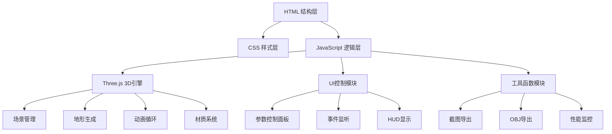

## 1. 架构设计



## 2. 技术描述
- **前端**：原生HTML5 + CSS3 + JavaScript (ES6+)
- **3D引擎**：Three.js r158 + OrbitControls
- **构建工具**：无，纯静态文件，直接引用CDN
- **性能监控**：Stats.js

## 3. 文件结构

```
/
├── index.html              # 主入口文件
├── css/
│   └── style.css           # 样式文件
└── js/
    ├── app.js              # 应用主逻辑
    ├── terrain.js          # 地形生成和动画
    ├── controls.js         # UI控制面板
    └── utils.js            # 工具函数（截图、导出等）
```

## 4. 核心类和模块

### 4.1 TerrainGenerator 类
- 属性：网格大小、分段数、波速、振幅
- 方法：生成网格、更新顶点、计算高度

### 4.2 MaterialManager 类
- 属性：当前材质类型
- 方法：创建渐变材质、线框材质、热力图材质

### 4.3 UIController 类
- 属性：所有UI元素引用
- 方法：绑定事件、更新参数、显示状态

### 4.4 地形高度函数
```javascript
function getHeight(x, z, time) {
  return sin(x * freq1 + time * speed) * amp1 +
         cos(z * freq2 + time * speed * 0.7) * amp2 +
         sin((x + z) * freq3 + time * speed * 0.5) * amp3;
}
```

## 5. 性能优化
- 使用BufferGeometry替代Geometry
- 顶点更新时仅更新position属性
- 合理设置网格分段数上限（200x200）
- 使用requestAnimationFrame进行动画循环
