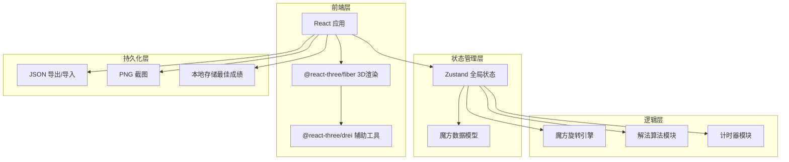

## 1. 架构设计



## 2. 技术说明
- 前端：React@18 + TypeScript + Tailwind CSS@3 + Vite
- 初始化工具：Vite (npm create vite@latest)
- 3D 渲染：Three.js + @react-three/fiber + @react-three/drei
- 状态管理：Zustand
- 后端：无
- 数据库：无（纯前端应用，状态保存在内存和本地文件）

## 3. 路由定义
单页应用，无路由切换。

| 路由 | 用途 |
|------|------|
| / | 主页面，包含所有功能模块 |

## 4. API 定义
无后端 API。所有逻辑在前端完成。

## 5. 核心数据模型

### 5.1 魔方状态模型

```typescript
type FaceColor = 'white' | 'yellow' | 'red' | 'orange' | 'blue' | 'green'
type FluorescentColor = 'fluorescent_pink' | 'fluorescent_yellow' | 'fluorescent_green' | 'fluorescent_orange' | 'fluorescent_cyan' | 'fluorescent_purple'
type BWColor = 'black' | 'dark_gray' | 'light_gray' | 'white_gray' | 'mid_gray' | 'near_black'
type StickerColor = FaceColor | FluorescentColor | BWColor

type MaterialTheme = 'classic' | 'fluorescent' | 'grayscale'

interface CubieFace {
  color: StickerColor
  normal: [number, number, number]
}

interface Cubie {
  id: string
  position: [number, number, number]
  faces: CubieFace[]
  meshRef?: THREE.Mesh
}

interface CubeState {
  cubies: Cubie[]
  moveHistory: Move[]
  isAnimating: boolean
  isSolved: boolean
}

interface Move {
  axis: 'x' | 'y' | 'z'
  layer: number
  direction: 1 | -1
  notation: string
}

interface TimerState {
  isRunning: boolean
  startTime: number | null
  elapsed: number
  bestTime: number | null
}

interface AppState {
  cubeState: CubeState
  timerState: TimerState
  animationSpeed: number
  materialTheme: MaterialTheme
  showGrid: boolean
  moveList: Move[]
  currentMoveIndex: number
}
```

### 5.2 旋转操作映射

| 魔方记号 | axis | layer | direction |
|----------|------|-------|-----------|
| U | y | 1 | -1 |
| U' | y | 1 | 1 |
| D | y | -1 | 1 |
| D' | y | -1 | -1 |
| R | x | 1 | -1 |
| R' | x | 1 | 1 |
| L | x | -1 | 1 |
| L' | x | -1 | -1 |
| F | z | 1 | -1 |
| F' | z | 1 | 1 |
| B | z | -1 | 1 |
| B' | z | -1 | -1 |

## 6. 关键技术实现

### 6.1 魔方渲染
- 27 个小方块（Cubie），每个方块由 BoxGeometry + 6面材质组成
- 方块间留 0.05 间隙，方块尺寸 0.95（总尺寸 3×3×3）
- 贴纸效果：每面使用圆角矩形贴纸（通过 Canvas 纹理生成）
- 黑色底色方块 + 彩色贴纸

### 6.2 层旋转交互
- Raycaster 检测鼠标/触摸点击的方块和面
- 根据点击面法线和拖拽方向确定旋转轴和层
- 拖拽时实时预览旋转角度
- 释放时吸附到最近 90° 倍数

### 6.3 自动复原算法
- 采用逆向打乱法：记录打乱序列，复原时执行逆序列
- 复原动画：逐步执行逆操作，每步动画时长由速度滑块控制
- 动画使用 requestAnimationFrame + 缓动函数

### 6.4 状态检测
- 每次旋转后检查每面颜色是否一致
- 六面均一致即为复原完成，触发计时器停止
