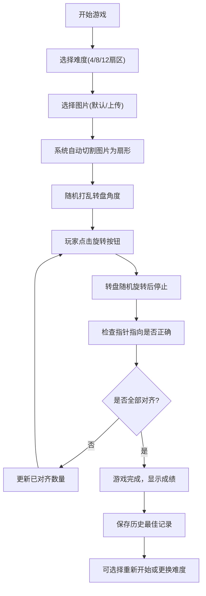

## 1. 产品概述

旋转拼图游戏是一款基于HTML、CSS和原生JavaScript的休闲益智游戏。玩家通过旋转圆形转盘，将被分割成多个扇形的图片碎片重新排列，最终拼成完整的图片。游戏支持多种难度模式、图片上传、历史记录等丰富功能，适合各年龄段玩家休闲娱乐。

- 主要目的：提供有趣的拼图体验，锻炼玩家的空间想象力和逻辑思维能力
- 目标用户：休闲游戏爱好者、益智游戏玩家
- 市场价值：轻量级、无需安装、可玩性高的网页游戏

## 2. 核心功能

### 2.1 用户角色

| 角色 | 注册方式 | 核心权限 |
|------|----------|----------|
| 普通玩家 | 无需注册 | 完整游戏体验、设置保存、历史记录 |

### 2.2 功能模块

1. **游戏主界面**：圆形转盘、指针、控制面板、信息显示区
2. **图片管理**：默认图片展示、本地上传、自动切割
3. **难度系统**：4扇区、8扇区、12扇区三种模式
4. **游戏控制**：旋转按钮、重置、提示、自动演示
5. **记录系统**：旋转次数、计时、历史最佳记录（localStorage）
6. **设置系统**：音效开关、背景颜色切换、缩略图显示
7. **交互系统**：鼠标点击、移动端触摸旋转

### 2.3 页面详情

| 页面名称 | 模块名称 | 功能描述 |
|----------|----------|----------|
| 游戏主页面 | 转盘区域 | 显示可旋转的圆形转盘，分割成N个扇形，每个扇形显示图片的一部分 |
| 游戏主页面 | 指针区域 | 顶部固定指针，转盘停止时指向的扇形高亮显示 |
| 游戏主页面 | 控制区域 | 旋转按钮、难度选择、上传图片、提示、自动演示、重置 |
| 游戏主页面 | 信息区域 | 显示旋转次数、用时、已对齐扇区数、历史最佳记录 |
| 游戏主页面 | 设置区域 | 音效开关、背景颜色选择、缩略图开关 |
| 游戏主页面 | 缩略图区域 | 显示完整图片作为参考 |

## 3. 核心流程

## 4. 用户界面设计

### 4.1 设计风格

- **主色调**：深蓝紫色渐变背景 (#1a1a2e → #16213e)，搭配金色/黄色作为强调色 (#ffd700)
- **辅助色**：青色 (#00d4ff) 用于高亮和指针，珊瑚色 (#ff6b6b) 用于错误提示
- **按钮风格**：圆角胶囊形状，带有微妙的渐变和阴影，hover时有缩放和发光效果
- **字体**：标题使用 'Orbitron' 或 'Russo One' 等现代科技感字体，正文使用 'Inter' 或系统无衬线字体
- **布局风格**：以游戏转盘为中心的对称布局，控制按钮环绕四周，信息卡片式展示
- **图标风格**：使用 lucide-react 图标库，统一线性风格

### 4.2 页面设计概述

| 页面名称 | 模块名称 | UI元素 |
|----------|----------|--------|
| 游戏主页面 | 转盘区域 | 大型圆形转盘，使用 conic-gradient 或 canvas 绘制扇形，CSS transform 实现旋转动画，带有发光边框效果 |
| 游戏主页面 | 指针区域 | 顶部三角形指针，带有脉冲动画，正确时变为绿色，错误时闪烁红色 |
| 游戏主页面 | 控制区域 | 大型旋转按钮居中，其他功能按钮环绕排列，带有图标和文字说明 |
| 游戏主页面 | 信息区域 | 半透明玻璃态卡片，显示各项数据，数值变化时有动画过渡 |
| 游戏主页面 | 缩略图区域 | 右下角可折叠的小图预览，点击可放大查看 |

### 4.3 响应性

- 桌面端：转盘直径约400-500px，控制按钮较大，信息区域左右分布
- 平板端：转盘直径适配屏幕宽度，控制区域重新排列
- 移动端：转盘占满屏幕宽度，控制按钮垂直排列，支持触摸滑动旋转
- 触摸优化：增大按钮点击区域，支持触摸手势旋转转盘

### 4.4 动画效果

- 转盘旋转：使用 CSS transition 实现缓动旋转效果 (cubic-bezier(0.17, 0.67, 0.12, 0.99))
- 扇形高亮：正确对齐时有绿色发光效果，错误时有红色闪烁
- 按钮交互：hover 时缩放 1.05 倍，active 时缩放 0.95 倍
- 完成庆祝：彩带动画、星星粒子效果
- 数字变化：滚动数字动画
