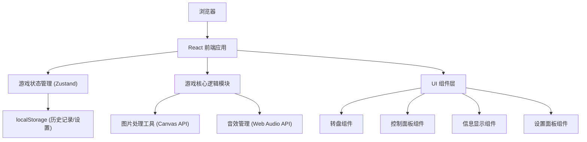

## 1. 架构设计



## 2. 技术描述

- **前端框架**: React@18 + TypeScript
- **构建工具**: Vite@5
- **样式方案**: TailwindCSS@3 + CSS Variables
- **状态管理**: Zustand
- **图标库**: lucide-react
- **图片处理**: HTML5 Canvas API
- **音效**: Web Audio API (生成简单音效，无需外部音频文件)
- **数据存储**: localStorage
- **动画**: CSS Transitions + requestAnimationFrame

## 3. 目录结构

```
src/
├── components/
│   ├── GameWheel.tsx        # 转盘组件
│   ├── ControlPanel.tsx     # 控制面板
│   ├── InfoPanel.tsx        # 信息显示
│   ├── SettingsPanel.tsx    # 设置面板
│   ├── Thumbnail.tsx        # 缩略图预览
│   └── Pointer.tsx          # 指针组件
├── hooks/
│   ├── useGameLogic.ts      # 游戏核心逻辑hook
│   ├── useImageProcessor.ts # 图片处理hook
│   ├── useSound.ts          # 音效hook
│   └── useTouchRotate.ts    # 触摸旋转hook
├── store/
│   └── useGameStore.ts      # Zustand状态管理
├── utils/
│   ├── math.ts              # 数学计算工具
│   └── storage.ts           # 本地存储工具
├── types/
│   └── game.ts              # 类型定义
├── App.tsx
├── main.tsx
└── index.css
```

## 4. 核心数据类型定义

```typescript
// 游戏难度
type Difficulty = 4 | 8 | 12;

// 扇形数据
interface Sector {
  id: number;
  originalIndex: number;  // 原始正确位置
  currentAngle: number;   // 当前角度
  imageData: string;      // 该扇形的图片数据
  isAligned: boolean;     // 是否已正确对齐
}

// 游戏状态
interface GameState {
  difficulty: Difficulty;
  sectors: Sector[];
  currentRotation: number;     // 转盘当前总旋转角度
  targetRotation: number;      // 目标旋转角度
  isSpinning: boolean;         // 是否正在旋转
  spinCount: number;           // 旋转次数
  startTime: number | null;    // 开始时间
  elapsedTime: number;         // 已用时间(秒)
  alignedCount: number;        // 已对齐扇区数
  isCompleted: boolean;        // 是否已完成
  showHint: boolean;           // 是否显示提示
  soundEnabled: boolean;       // 音效开关
  backgroundColor: string;     // 背景颜色
  showThumbnail: boolean;      // 是否显示缩略图
  autoPlayMode: boolean;       // 自动演示模式
  bestRecords: BestRecord[];   // 历史最佳记录
}

// 最佳记录
interface BestRecord {
  difficulty: Difficulty;
  minSpins: number;
  bestTime: number;
  date: string;
}

// 游戏设置
interface GameSettings {
  soundEnabled: boolean;
  backgroundColor: string;
  showThumbnail: boolean;
}
```

## 5. 核心算法

### 5.1 图片扇形切割算法

```typescript
function sliceImageIntoSectors(
  image: HTMLImageElement,
  sectorCount: number,
  size: number
): string[] {
  const sectorAngle = 360 / sectorCount;
  const results: string[] = [];
  
  for (let i = 0; i < sectorCount; i++) {
    const canvas = document.createElement('canvas');
    canvas.width = size;
    canvas.height = size;
    const ctx = canvas.getContext('2d')!;
    
    // 创建扇形裁剪路径
    ctx.beginPath();
    ctx.moveTo(size / 2, size / 2);
    const startAngle = (i * sectorAngle - 90) * Math.PI / 180;
    const endAngle = ((i + 1) * sectorAngle - 90) * Math.PI / 180;
    ctx.arc(size / 2, size / 2, size / 2, startAngle, endAngle);
    ctx.closePath();
    ctx.clip();
    
    // 绘制图片
    ctx.drawImage(image, 0, 0, size, size);
    
    results.push(canvas.toDataURL());
  }
  
  return results;
}
```

### 5.2 对齐检测算法

```typescript
function checkAlignment(
  sector: Sector,
  currentRotation: number,
  sectorCount: number
): boolean {
  const sectorAngle = 360 / sectorCount;
  const pointerAngle = 270; // 指针在正上方(270度)
  
  // 计算该扇形当前的中心角度
  const sectorCenter = (sector.originalIndex * sectorAngle + sectorAngle / 2 + currentRotation) % 360;
  
  // 计算与指针的角度差
  let diff = Math.abs(sectorCenter - pointerAngle);
  diff = Math.min(diff, 360 - diff);
  
  // 允许一定的误差范围(±sectorAngle/4)
  return diff < sectorAngle / 4;
}
```

### 5.3 随机旋转角度生成

```typescript
function generateRandomSpin(): number {
  // 旋转3-6圈 + 随机角度
  const fullRotations = 3 + Math.floor(Math.random() * 4);
  const randomAngle = Math.random() * 360;
  return fullRotations * 360 + randomAngle;
}
```

## 6. 状态管理

使用 Zustand 管理全局状态，核心 actions 包括：

- `setDifficulty(difficulty: Difficulty)` - 设置难度
- `uploadImage(file: File)` - 上传图片
- `spinWheel()` - 旋转转盘
- `resetGame()` - 重置游戏
- `toggleHint()` - 切换提示
- `toggleSound()` - 切换音效
- `setBackgroundColor(color: string)` - 设置背景色
- `toggleAutoPlay()` - 切换自动演示
- `updateElapsedTime()` - 更新计时

## 7. 性能优化

1. 使用 CSS transform 进行转盘旋转，启用 GPU 加速
2. 图片切割使用 OffscreenCanvas（如果可用）
3. 状态更新批量处理，避免不必要的重渲染
4. 使用 React.memo 优化组件渲染
5. 触摸事件使用 passive 选项提升滚动性能
