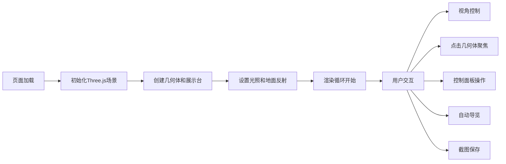

## 1. 产品概述

基于Three.js的交互式3D几何体博物馆，展示多种3D几何体并提供丰富的交互体验。
- 主要用途：教育展示、3D可视化学习、几何体参数参考
- 目标用户：学生、设计师、3D爱好者
- 价值：沉浸式学习3D几何体特性，直观理解几何参数

## 2. 核心功能

### 2.1 功能模块

1. **3D场景展示**：六类几何体（立方体、球体、圆柱体、圆锥体、环面体、十二面体）独立展示台
2. **交互控制**：OrbitControls相机控制、点击聚焦几何体
3. **光照效果**：聚光灯追光、环境光、镜面反射地面
4. **材质系统**：金属质感、塑料质感、线框模式
5. **背景切换**：纯黑、深蓝、展览厅风格
6. **信息面板**：几何体面数、顶点数、体积公式
7. **工具功能**：一键截图、自动导览、帧率监控
8. **自定义设置**：展示台颜色、旋转速度调节

### 2.2 页面详情

| 页面名称 | 模块名称 | 功能描述 |
|----------|----------|----------|
| 主页面 | 3D场景 | 六几何体环形排列，各自转，独立展示台 |
| 主页面 | 控制面板 | 材质切换、背景切换、颜色滑块、速度滑块 |
| 主页面 | 信息面板 | 点击几何体弹出详细参数面板 |
| 主页面 | 工具栏 | 截图按钮、自动导览按钮、帧率显示 |

## 3. 核心流程

用户打开页面 → 3D场景加载完成 → 几何体自动旋转展示 → 用户可：
- 拖拽旋转视角/滚轮缩放
- 点击几何体聚焦查看详情
- 使用控制面板切换效果
- 开启自动导览模式
- 截图保存当前视角

## 4. 用户界面设计

### 4.1 设计风格
- **主色调**：深蓝色科技感主题 (#0a1628)
- **强调色**：青色高光 (#00d4ff)
- **字体**：现代无衬线字体，标题使用 Orbitron，正文使用 Roboto
- **布局**：全屏3D场景 + 右侧悬浮控制面板 + 底部信息栏
- **风格**：未来科技博物馆风格，玻璃拟态控制面板

### 4.2 页面设计概述

| 页面名称 | 模块名称 | UI元素 |
|----------|----------|--------|
| 主页面 | 3D场景 | 环形布局展示台、聚光灯效果、镜面地面、铭牌文字 |
| 主页面 | 控制面板 | 玻璃拟态卡片、滑块控件、切换按钮、下拉选择器 |
| 主页面 | 信息面板 | 弹窗动画、参数表格、公式展示 |
| 主页面 | 工具栏 | 图标按钮、帧率计数器、状态指示器 |

### 4.3 响应式设计
- 桌面端优先，全屏3D体验
- 平板端：控制面板调整宽度
- 移动端：简化控制面板，优化触摸交互

### 4.4 3D场景指导

- **环境**：展览厅风格，渐变背景或纯色背景
- **光照**：每个几何体上方聚光灯 + 环境光补光
- **相机**：PerspectiveCamera，初始位置俯瞰全局
- **动画**：几何体Y轴自转，相机平滑过渡动画
- **后处理**：抗锯齿、轻微辉光效果
- **性能**：几何体使用BufferGeometry，合理控制多边形数量
