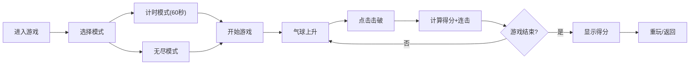

## 1. 产品概述

射击气球游戏是一款休闲娱乐类网页小游戏，玩家通过鼠标或触摸设备瞄准并击破上升的气球来获取分数。

- 主要目的：提供轻松有趣的游戏体验，锻炼玩家的反应能力
- 目标用户：各年龄段的休闲游戏玩家
- 产品价值：无需安装、即开即玩的轻量级娱乐体验

## 2. 核心功能

### 2.1 用户角色

| 角色 | 注册方式 | 核心权限 |
|------|----------|----------|
| 玩家 | 无需注册 | 进行游戏、调整设置、查看最高分 |

### 2.2 功能模块

1. **游戏主界面**：游戏画布、分数显示、连击数、计时器
2. **开始/暂停菜单**：模式选择、游戏控制
3. **设置面板**：音效开关、背景切换
4. **结束界面**：最终得分、最高分展示

### 2.3 页面详情

| 页面名称 | 模块名称 | 功能描述 |
|---------|----------|----------|
| 游戏主界面 | 游戏画布 | 气球上升、瞄准器、点击击破、粒子特效 |
| 游戏主界面 | HUD显示 | 分数、连击数、剩余时间、模式指示 |
| 开始菜单 | 模式选择 | 计时模式（60秒）/无尽模式 |
| 设置面板 | 音效控制 | 音效开关切换 |
| 设置面板 | 背景切换 | 天空/黄昏/夜晚三种场景 |
| 结束界面 | 得分展示 | 最终得分、最高分、重玩按钮 |

## 3. 核心流程

玩家进入游戏 → 选择游戏模式 → 点击开始 → 气球从底部上升 → 玩家点击击破气球得分 → 时间结束或手动暂停 → 显示最终得分 → 可选择重玩或返回菜单

## 4. 用户界面设计

### 4.1 设计风格

- **主色调**：天空蓝 (#4FC3F7)、黄昏橙 (#FF7043)、夜空紫 (#3949AB)
- **辅助色**：气球颜色（红#EF5350、蓝#42A5F5、金#FFD54F、黑#212121）
- **字体**：使用 Google Fonts 的 'Fredoka One'（标题）和 'Noto Sans SC'（正文）
- **按钮风格**：圆角、渐变、悬停放大效果
- **布局**：全屏画布游戏，HUD元素分布在四角
- **图标**：使用 emoji 风格图标，保持轻松活泼

### 4.2 页面设计概述

| 页面名称 | 模块名称 | UI元素 |
|---------|----------|--------|
| 游戏主界面 | 游戏画布 | 渐变背景、上升气球、十字瞄准器、粒子爆炸特效、得分浮动文字 |
| 游戏主界面 | HUD | 左上角分数、右上角时间、左下角连击数、右下角设置按钮 |
| 开始菜单 | 中央面板 | 游戏标题、模式选择按钮、开始按钮、设置按钮 |
| 设置面板 | 侧边抽屉 | 音效开关、背景选择、返回按钮 |
| 结束界面 | 中央弹窗 | 游戏结束标题、得分展示、最高分、重玩按钮、返回菜单 |

### 4.3 响应式设计

- **桌面优先**，使用Canvas自适应屏幕尺寸
- **移动端优化**：触摸事件支持、更大的点击区域
- **全屏显示**：游戏画布占满整个视口

### 4.4 视觉特效

- **粒子爆炸**：击破气球时彩色粒子四散
- **得分浮动**：+10/+20/+50文字向上浮动消失
- **里程碑闪烁**：每得100分屏幕白闪效果
- **连击动画**：连击数增加时缩放跳动
- **背景渐变**：三种场景平滑过渡
