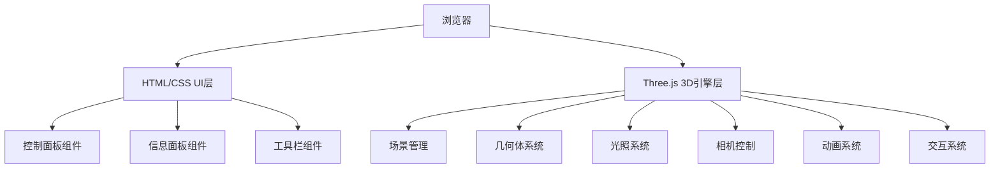

## 1. 架构设计



## 2. 技术描述

- **前端框架**: 原生HTML/CSS/JavaScript + Three.js
- **3D引擎**: Three.js (最新版)
- **控制器**: OrbitControls
- **后处理**: EffectComposer, RenderPass, ShaderPass
- **字体**: Google Fonts (Orbitron, Roboto)
- **构建工具**: 无需构建，直接运行静态文件

## 3. 文件结构

| 文件路径 | 用途 |
|----------|------|
| /index.html | 主页面HTML结构 |
| /css/style.css | 样式文件 |
| /js/app.js | 主应用逻辑 |
| /js/geometries.js | 几何体定义和数据 |
| /js/utils.js | 工具函数（截图等） |

## 4. 核心模块设计

### 4.1 几何体数据结构

```javascript
const GEOMETRIES = [
  {
    name: '立方体',
    nameEn: 'Cube',
    faces: 6,
    vertices: 8,
    volumeFormula: 'V = a³',
    create: () => new THREE.BoxGeometry(1, 1, 1)
  },
  // ... 其他几何体
];
```

### 4.2 场景配置

```javascript
const CONFIG = {
  rotationSpeed: 0.005,
  autoTourDuration: 3000,
  pedestalColor: 0x4a5568,
  materialType: 'metal', // metal, plastic, wireframe
  backgroundType: 'exhibition' // black, darkblue, exhibition
};
```

## 5. 性能优化

- 使用 BufferGeometry 替代 Geometry
- 合理设置几何体分段数
- 聚光灯阴影优化
- 帧率监控避免过度渲染
- 镜面反射使用 RenderTarget 实现

## 6. 交互实现

- Raycaster 实现几何体点击检测
- Tween.js 或自定义 lerp 实现相机动画
- CSS 过渡实现面板动画
- Canvas 截图使用 toDataURL
