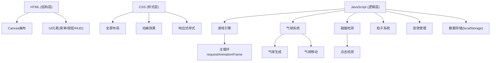

## 1. 架构设计



## 2. 技术描述

- **前端技术栈**：原生 HTML5 + CSS3 + JavaScript (ES6+)
- **核心技术**：
  - HTML5 Canvas 2D 用于游戏渲染
  - Web Audio API 用于音效生成
  - localStorage 用于最高分存储
  - requestAnimationFrame 用于游戏主循环
- **无外部依赖**：纯原生实现，无需安装任何库

## 3. 文件结构

| 文件路径 | 用途 |
|---------|------|
| /index.html | 游戏主页面，包含Canvas和UI元素 |
| /style.css | 游戏样式，包含布局、动画、响应式 |
| /game.js | 游戏主逻辑，包含所有游戏系统 |

## 4. 核心数据结构

### 4.1 气球对象

```javascript
{
  x: number,           // X坐标
  y: number,           // Y坐标
  radius: number,      // 半径
  type: 'red'|'blue'|'gold'|'bomb',  // 类型
  speed: number,       // 上升速度
  color: string,       // 颜色
  points: number,      // 分值
  wobble: number,      // 摆动幅度
  wobbleSpeed: number  // 摆动速度
}
```

### 4.2 粒子对象

```javascript
{
  x: number,
  y: number,
  vx: number,  // X速度
  vy: number,  // Y速度
  color: string,
  life: number,  // 生命值
  maxLife: number,
  size: number
}
```

### 4.3 游戏状态

```javascript
{
  score: number,
  combo: number,
  maxCombo: number,
  timeLeft: number,
  gameMode: 'timed'|'endless',
  isPlaying: boolean,
  isPaused: boolean,
  soundEnabled: boolean,
  background: 'sky'|'sunset'|'night',
  highScore: number,
  lastMilestone: number,
  gameTime: number  // 游戏进行时间(无尽模式用)
}
```

## 5. 游戏系统设计

### 5.1 气球生成系统
- 随机位置生成（底部）
- 随机类型（红色60%、蓝色25%、金色10%、炸弹5%）
- 随机速度（金色最快，炸弹中等）

### 5.2 碰撞检测
- 点击位置与气球圆心距离检测
- 触摸事件坐标转换

### 5.3 连击系统
- 连续击破时 combo++
- 未击中或点击炸弹时 combo 重置为 0
- 得分加成：基础分 * (1 + combo * 0.1)

### 5.4 音效系统
- 使用 Web Audio API 生成音效
- 击破音效：频率上升的正弦波
- 炸弹音效：频率下降的方波
- 游戏结束：下降音阶

### 5.5 背景系统
- 天空：天蓝 → 浅蓝渐变
- 黄昏：橙 → 紫红渐变
- 夜晚：深蓝 → 紫色渐变 + 星星

## 6. API 定义（内置函数）

| 函数名 | 参数 | 返回值 | 功能 |
|--------|------|--------|------|
| initGame() | 无 | void | 初始化游戏状态 |
| startGame(mode) | mode: 'timed'|'endless' | void | 开始游戏 |
| pauseGame() | 无 | void | 暂停游戏 |
| resumeGame() | 无 | void | 继续游戏 |
| resetGame() | 无 | void | 重置游戏 |
| spawnBalloon() | 无 | Balloon | 生成新气球 |
| checkCollision(x, y) | x, y: 点击坐标 | Balloon|null | 检测碰撞 |
| popBalloon(balloon) | balloon: Balloon | void | 击破气球 |
| createParticles(x, y, color) | x, y, color | void | 创建粒子效果 |
| playSound(type) | type: 'pop'|'bomb'|'end' | void | 播放音效 |
| saveHighScore() | 无 | void | 保存最高分 |
| loadHighScore() | 无 | number | 加载最高分 |
