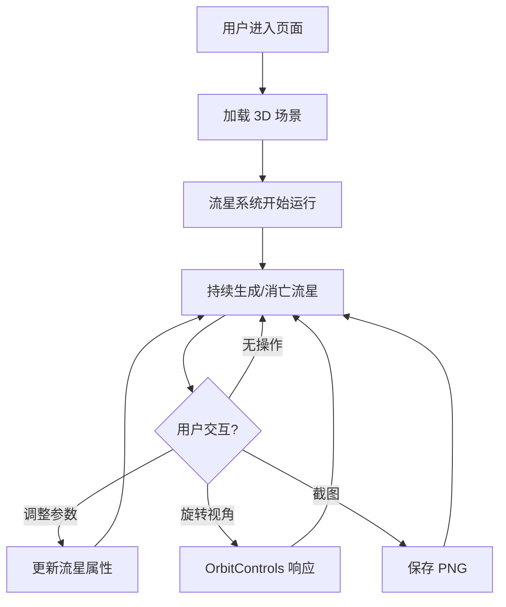

## 1. 产品概述

基于 Three.js 的 3D 流星雨沉浸式体验网页，模拟真实夜空中的流星雨场景。用户可通过交互控制面板调整流星参数、切换背景和颜色，享受身临其境的星空体验。

- 目标用户：天文爱好者、视觉体验追求者、放松减压用户
- 核心价值：提供高品质的 3D 流星雨视觉沉浸体验，兼具观赏性与交互性

## 2. 核心功能

### 2.1 功能模块

1. **3D 流星雨场景页**：夜空场景、流星系统、粒子拖尾、地面剪影、控制面板

### 2.2 页面详情

| 页面名称 | 模块名称 | 功能描述 |
|----------|----------|----------|
| 3D 流星雨场景 | 流星系统 | 大量流星从随机位置出现，沿斜向轨迹划落，带拖尾粒子，飞行后渐隐消失，持续生成新流星 |
| 3D 流星雨场景 | 相机控制 | OrbitControls 支持旋转视角，可开启自动缓慢旋转模式 |
| 3D 流星雨场景 | 流星密度控制 | 滑块控制同时出现的流星数量 |
| 3D 流星雨场景 | 流星速度控制 | 滑块控制流星飞行速度 |
| 3D 流星雨场景 | 拖尾长度控制 | 滑块控制流星尾巴粒子长度 |
| 3D 流星雨场景 | 背景切换 | 深蓝色夜空、紫色夜空、星空图片三种背景 |
| 3D 流星雨场景 | 截图功能 | 一键截图保存当前画面为 PNG 图片 |
| 3D 流星雨场景 | 闪光效果 | 开关控制火流星（特别明亮的流星）随机出现 |
| 3D 流星雨场景 | 背景音乐 | 开关控制舒缓背景音乐播放 |
| 3D 流星雨场景 | 流星数量统计 | 实时显示当前场景中的流星数量 |
| 3D 流星雨场景 | 流星颜色切换 | 白色、淡黄色、淡蓝色三种颜色 |
| 3D 流星雨场景 | 地面元素 | 场景底部地平线/山体剪影，增强纵深感 |
| 3D 流星雨场景 | 流星音效 | 开关控制流星划过时播放微弱音效 |

## 3. 核心流程

用户进入页面后立即看到流星雨场景，可通过左侧/底部控制面板调整参数。相机默认可通过鼠标旋转，也可开启自动旋转。流星持续从天空随机位置出现并划落，形成不间断的流星雨效果。

## 4. 用户界面设计

### 4.1 设计风格

- 主色调：深蓝/深紫夜空色，流星为亮色点缀
- 控制面板：半透明毛玻璃效果，浮于 3D 场景之上
- 字体：纤细优雅的无衬线字体，与夜空主题协调
- 布局：全屏 3D 场景 + 右侧浮动控制面板
- 图标：线性简洁风格，与整体优雅氛围一致

### 4.2 页面设计概览

| 页面名称 | 模块名称 | UI 元素 |
|----------|----------|---------|
| 3D 流星雨场景 | 3D 画布 | 全屏 Three.js 渲染，深色夜空背景，流星粒子系统，山体剪影 |
| 3D 流星雨场景 | 控制面板 | 毛玻璃面板，含滑块（密度/速度/拖尾）、开关（闪光/音乐/音效/自动旋转）、颜色选择、背景切换、截图按钮、流星计数 |

### 4.3 响应式

- 桌面端优先，3D 场景全屏展示
- 移动端控制面板可折叠，支持触摸旋转

### 4.4 3D 场景指引

- 环境：夜空氛围，深色背景带微弱星点
- 光照：微弱环境光，流星自带发光效果
- 相机：透视相机，默认俯视略偏，OrbitControls 可旋转
- 构图：流星从画面上方斜向划落，底部山体剪影提供纵深参考
- 交互：OrbitControls 旋转 + 自动旋转模式
- 后处理：流星辉光（Bloom）效果
- 性能预算：60fps，同时最多约 50 颗流星
