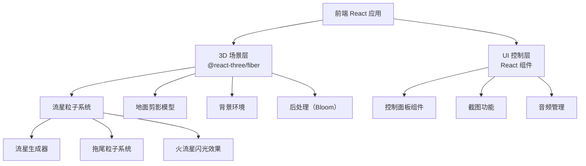

## 1. 架构设计



## 2. 技术说明

- 前端：React@18 + TypeScript + Tailwind CSS + Vite
- 3D 渲染：three + @react-three/fiber + @react-three/drei + @react-three/postprocessing
- 状态管理：Zustand
- 初始化工具：vite-init
- 后端：无
- 数据库：无

## 3. 路由定义

| 路由 | 用途 |
|------|------|
| / | 3D 流星雨主场景页面 |

## 4. API 定义

无后端 API，纯前端应用。

## 5. 核心模块设计

### 5.1 流星系统

- 使用自定义粒子系统实现流星和拖尾
- 每颗流星由头部亮点 + 尾部拖尾粒子组成
- 流星属性：位置、速度方向、生命周期、颜色、亮度
- 火流星：特殊类型，更亮、更大、带闪光效果
- 使用 BufferGeometry + Points 实现高性能粒子渲染

### 5.2 场景管理

- 背景切换：通过修改场景背景色/贴图实现
- 地面剪影：使用 Shape + ExtrudeGeometry 创建山体轮廓
- 后处理：Bloom 效果增强流星发光感

### 5.3 音频管理

- 背景音乐：HTML5 Audio 元素播放循环音乐
- 流星音效：Web Audio API 生成合成音效，无需外部音频文件

### 5.4 截图功能

- 使用 renderer.domElement.toDataURL() 获取画面
- 创建下载链接保存为 PNG

## 6. 文件结构

```
src/
  components/
    MeteorScene.tsx       # 3D 场景主组件
    MeteorSystem.tsx      # 流星粒子系统
    GroundSilhouette.tsx  # 地面山体剪影
    ControlPanel.tsx      # 控制面板 UI
    MeteorCounter.tsx     # 流星数量统计
  store/
    useMeteorStore.ts     # Zustand 状态管理
  utils/
    audioManager.ts       # 音频管理工具
  App.tsx
  main.tsx
```
