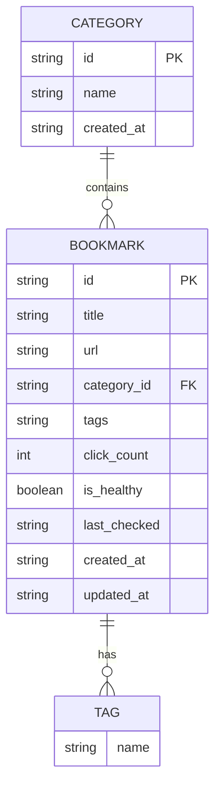

## 1. 架构设计

```mermaid
flowchart TB
    "浏览器客户端" --> "Flask路由层"
    "Flask路由层" --> "业务逻辑层"
    "业务逻辑层" --> "数据存储层"
    "数据存储层" --> "JSON文件"
    "业务逻辑层" --> "健康检测模块"
    "健康检测模块" --> "外部网站HEAD请求"
    "业务逻辑层" --> "导入导出模块"
    "导入导出模块" --> "HTML/加密JSON文件"
    "业务逻辑层" --> "分享生成模块"
    "分享生成模块" --> "独立HTML页面"
```

## 2. 技术说明
- **后端**：Flask (Python 3.10+)
- **前端**：Jinja2模板 + 原生CSS + 原生JavaScript
- **数据存储**：JSON文件 (bookmarks.json)
- **加密**：cryptography库 (Fernet对称加密)
- **HTTP请求**：requests库 (健康检测HEAD请求)
- **无数据库**：纯文件存储，轻量部署

## 3. 路由定义

| 路由 | 方法 | 用途 |
|------|------|------|
| `/` | GET | 首页，书签列表 |
| `/bookmarks` | GET | 书签列表（支持查询参数：search, category, tag, sort） |
| `/bookmarks` | POST | 添加书签 |
| `/bookmarks/<id>` | PUT | 编辑书签 |
| `/bookmarks/<id>` | DELETE | 删除书签 |
| `/bookmarks/<id>/click` | POST | 记录书签点击 |
| `/categories` | GET | 分类列表 |
| `/categories` | POST | 添加分类 |
| `/categories/<id>` | PUT | 编辑分类 |
| `/categories/<id>` | DELETE | 删除分类（含迁移选项） |
| `/tags` | GET | 获取所有标签 |
| `/health-check` | POST | 触发健康检测 |
| `/health-check/status` | GET | 获取检测状态 |
| `/import/html` | POST | 导入HTML书签文件 |
| `/import/browser` | POST | 导入浏览器书签文件 |
| `/export/html` | GET | 导出HTML书签 |
| `/export/backup` | GET | 导出加密备份 |
| `/import/backup` | POST | 导入加密备份恢复 |
| `/share/<category_id>` | GET | 生成分类分享页面 |
| `/theme` | POST | 切换主题偏好 |

## 4. API定义

### 4.1 书签数据结构
```typescript
interface Bookmark {
  id: string
  title: string
  url: string
  category_id: string
  tags: string[]
  click_count: number
  is_healthy: boolean
  last_checked: string | null
  created_at: string
  updated_at: string
}
```

### 4.2 分类数据结构
```typescript
interface Category {
  id: string
  name: string
  created_at: string
}
```

### 4.3 存储结构
```typescript
interface Store {
  bookmarks: Bookmark[]
  categories: Category[]
  settings: {
    theme: "light" | "dark"
    last_health_check: string | null
  }
}
```

## 5. 服务器架构

```mermaid
flowchart LR
    "Controller路由层" --> "Service业务层"
    "Service业务层" --> "Repository存储层"
    "Repository存储层" --> "JSON文件读写"
    "Service业务层" --> "HealthChecker"
    "Service业务层" --> "ImportExport"
    "Service业务层" --> "ShareGenerator"
    "Service业务层" --> "BackupManager"
```

### 5.1 模块划分
- **routes/bookmarks.py**：书签相关路由
- **routes/categories.py**：分类相关路由
- **routes/import_export.py**：导入导出相关路由
- **services/bookmark_service.py**：书签业务逻辑
- **services/category_service.py**：分类业务逻辑
- **services/health_service.py**：健康检测逻辑
- **services/import_export_service.py**：导入导出逻辑
- **services/share_service.py**：分享页面生成
- **services/storage.py**：JSON文件读写
- **templates/**：Jinja2模板
- **static/**：CSS、JS静态资源

## 6. 数据模型

### 6.1 ER图



### 6.2 JSON文件结构
```json
{
  "categories": [
    {"id": "cat_1", "name": "技术", "created_at": "2026-01-01T00:00:00"}
  ],
  "bookmarks": [
    {
      "id": "bm_1",
      "title": "Flask文档",
      "url": "https://flask.palletsprojects.com/",
      "category_id": "cat_1",
      "tags": ["python", "web", "framework"],
      "click_count": 5,
      "is_healthy": true,
      "last_checked": "2026-01-15T10:00:00",
      "created_at": "2026-01-01T00:00:00",
      "updated_at": "2026-01-01T00:00:00"
    }
  ],
  "settings": {
    "theme": "light",
    "last_health_check": null
  }
}
```
