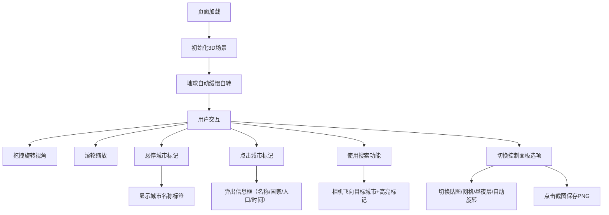

## 1. 产品概述
3D互动地球仪网页，基于Three.js实现沉浸式全球探索体验。用户可以自由旋转、缩放地球，查看全球主要城市信息，体验真实昼夜变化和丰富的视觉效果。

- 核心目标：提供直观、美观、交互性强的3D地球可视化工具
- 目标用户：地理爱好者、教育工作者、数据可视化从业者
- 市场价值：将复杂的地理信息以直观的3D形式呈现，兼具教育性和观赏性

## 2. 核心 Features

### 2.1 Feature Module
1. **3D地球核心模块**：高分辨率贴图地球、自转、鼠标交互控制
2. **城市标注模块**：10个主要城市标记、悬浮小球、文本标签、信息弹窗
3. **高级视觉效果模块**：大气层光晕、云层、星空背景、昼夜分界线、经纬度网格
4. **交互控制模块**：搜索定位、贴图切换、自动旋转开关、经纬度显示、截图保存
5. **性能监控模块**：帧率实时显示

### 2.2 Page Details
| 页面名称 | 模块名称 | 功能描述 |
|---------|---------|---------|
| 主页 | 3D地球场景 | 高分辨率贴图地球，支持拖拽旋转、滚轮缩放 |
| 主页 | 城市标注系统 | 10个主要城市悬浮标记，悬停显示名称，点击弹出详细信息（名称、国家、人口、当地时间） |
| 主页 | 视觉效果层 | 大气层光晕、半透明云层（独立自转）、星空粒子背景、昼夜分界线（实时UTC计算）、经纬度网格线 |
| 主页 | 控制面板 | 城市搜索（相机飞行动画+高亮）、贴图切换（卫星/地形/政区）、自动旋转开关、帧率显示、截图保存PNG |
| 主页 | 状态显示 | 实时显示相机指向的经纬度坐标 |

## 3. 核心流程

用户打开页面 → 地球自动缓慢自转 → 用户鼠标拖拽旋转视角/滚轮缩放 → 悬停城市标记查看名称 → 点击标记弹出详情框 → 使用搜索框定位城市 → 切换贴图风格/开启网格线 → 点击截图保存当前视角

## 4. User Interface Design

### 4.1 Design Style
- 主色调：深邃太空蓝 (#0a0e1a) 作为背景，配合地球真实色彩
- 辅助色：科技蓝 (#4da6ff) 用于大气层光晕、高亮标记、UI边框
- 强调色：暖橙色 (#ff9500) 用于城市标记点、交互反馈
- 字体：展示字体使用 'Orbitron'（科技感），正文字体使用 'Noto Sans SC'（清晰易读）
- 按钮风格：半透明玻璃态 (backdrop-filter: blur)，细边框，圆角8px，悬停时有轻微发光效果
- 整体风格：科技感、沉浸式、深空探索氛围

### 4.2 Page Design Overview
| 页面名称 | 模块名称 | UI Elements |
|---------|---------|------------|
| 主页 | 3D场景 | 全屏Canvas，地球居中，星空背景，深度感强烈 |
| 主页 | 顶部搜索栏 | 左上角，半透明搜索框，带搜索图标，输入城市名自动匹配 |
| 主页 | 控制面板 | 右上角，折叠式面板，包含所有功能开关和选项按钮 |
| 主页 | 状态显示 | 左下角，实时显示当前经纬度和FPS帧率 |
| 主页 | 信息弹窗 | 城市标记点击后弹出，居中偏右，卡片式设计，包含城市图标、信息列表 |
| 主页 | 城市标签 | 标记点附近悬浮，半透明背景，白色文字 |

### 4.3 响应性
- Desktop-first 设计，全屏沉浸式体验
- 适配 1024px 及以上屏幕
- 移动端简化控制，保留核心查看功能
- 触摸操作支持：单指拖拽旋转，双指缩放

### 4.4 3D Scene Guidance
- **环境与氛围**：深空黑色背景，配合5000+粒子星空系统，营造宇宙探索感
- **光照设置**：主光源模拟太阳光，根据当前UTC时间动态计算位置，实现真实昼夜分界线；环境光提供基础照明，保证暗部可见度
- **相机设置**：PerspectiveCamera，fov=45，初始距离3.5，最小距离1.8，最大距离8；OrbitControls控制，阻尼效果使交互更平滑
- **构图与焦点**：地球始终位于画面中心，城市标记使用发光材质突出显示，信息弹窗采用分层设计避免遮挡地球
- **交互与动画**：地球自转速度0.001 rad/帧，云层自转速度0.0015 rad/帧；搜索定位使用gsap动画，2秒内平滑过渡到目标城市；城市标记有呼吸灯效果（缩放+透明度变化）
- **后处理效果**：Bloom泛光效果增强大气层光晕和城市标记发光；轻微的Vignette暗角效果增强沉浸感
- **资源来源**：地球贴图使用公开的NASA Blue Marble系列；云层使用透明云层贴图；城市数据为模拟数据（人口约数）

## 5. 城市数据配置
10个主要城市坐标（经纬度）及模拟数据：
| 城市 | 国家 | 纬度 | 经度 | 人口估算 | 时区 |
|-----|------|------|------|---------|------|
| 北京 | 中国 | 39.9042°N | 116.4074°E | 2154万 | UTC+8 |
| 纽约 | 美国 | 40.7128°N | 74.0060°W | 833万 | UTC-5 |
| 伦敦 | 英国 | 51.5074°N | 0.1278°W | 942万 | UTC+0 |
| 东京 | 日本 | 35.6762°N | 139.6503°E | 1396万 | UTC+9 |
| 悉尼 | 澳大利亚 | -33.8688°S | 151.2093°E | 531万 | UTC+11 |
| 巴黎 | 法国 | 48.8566°N | 2.3522°E | 214万 | UTC+1 |
| 开罗 | 埃及 | 30.0444°N | 31.2357°E | 2076万 | UTC+2 |
| 里约热内卢 | 巴西 | -22.9068°S | 43.1729°W | 674万 | UTC-3 |
| 莫斯科 | 俄罗斯 | 55.7558°N | 37.6176°E | 1250万 | UTC+3 |
| 孟买 | 印度 | 19.0760°N | 72.8777°E | 1244万 | UTC+5:30 |
