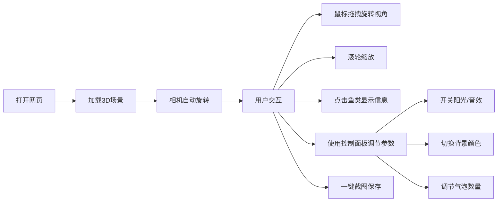

## 1. 产品概述

3D海底世界是一个基于Three.js的沉浸式海底体验网页，用户可以在虚拟海底环境中探索、观察海洋生物。
- 主要目的：提供可视化的海底世界游览体验，展示3D技术在Web端的应用
- 目标用户：对海洋生物、3D可视化感兴趣的普通用户，教育场景中的学习者

## 2. 核心功能

### 2.1 用户角色
| 角色 | 注册方式 | 核心权限 |
|------|---------|---------|
| 访客用户 | 无需注册 | 自由浏览3D海底场景，使用所有交互功能 |

### 2.2 功能模块
1. **主场景页面**：3D海底世界渲染、相机控制、鱼群展示
2. **控制面板**：灯光开关、背景切换、音效控制、气泡调节
3. **信息展示**：鱼类信息弹窗、鱼群统计、截图功能

### 2.3 页面详情
| 页面名称 | 模块名称 | 功能描述 |
|---------|---------|---------|
| 主场景页面 | 3D海底场景 | 海底地面、摇摆水草、游动鱼群、上升气泡、潜水员模型、浮游粒子 |
| 主场景页面 | 相机控制 | OrbitControls旋转缩放、自动旋转模式切换 |
| 主场景页面 | 交互功能 | 点击鱼类显示信息、一键截图保存 |
| 控制面板 | 环境设置 | 阳光光柱开关、背景颜色切换、音效开关 |
| 控制面板 | 参数调节 | 气泡数量滑块、自动旋转速度调节 |
| 控制面板 | 信息展示 | 实时鱼群数量统计 |

## 3. 核心流程

用户打开网页后，自动加载3D海底场景，可通过鼠标拖拽旋转视角，滚轮缩放。点击鱼查看详情，通过侧边控制面板调节各项参数，支持一键截图保存场景。

## 4. 用户界面设计

### 4.1 设计风格
- **主色调**：深海蓝色系 (#0a1628, #1a4a6e, #2d7a9e)
- **辅助色**：珊瑚橙 (#ff7f50)、水草绿 (#3cb371)、金色 (#ffd700)
- **按钮风格**：半透明毛玻璃效果，圆角设计，hover时有轻微发光
- **字体**：主标题使用 Oswald，正文使用 Roboto，营造现代科技感
- **布局风格**：3D场景全屏展示，控制面板采用右侧悬浮抽屉式设计
- **图标风格**：使用海洋主题emoji和线性图标结合

### 4.2 页面设计概述
| 页面名称 | 模块名称 | UI元素 |
|---------|---------|-------|
| 主场景页面 | 3D场景 | 全屏Canvas、深度雾效、渐变海底背景、动态光影 |
| 主场景页面 | 顶部标题 | 发光文字效果、渐变动画、居中展示 |
| 主场景页面 | 鱼类信息弹窗 | 圆角卡片、毛玻璃背景、出现动画、关闭按钮 |
| 控制面板 | 侧边抽屉 | 滑入滑出动画、分组控件、滑块组件、开关按钮 |
| 控制面板 | 统计信息 | 数字跳动动画、彩色标签、图标点缀 |

### 4.3 响应式
- **桌面优先**：优化1920x1080及以上分辨率显示
- **平板适配**：控制面板改为底部悬浮栏
- **移动端**：简化控件，保留核心功能，优化触摸交互

### 4.4 3D场景指引
- **环境**：深海蓝色雾效，海底地面带纹理，阳光透过水面形成光柱
- **灯光设置**：环境光 + 方向光模拟阳光 + 点光源模拟生物发光
- **相机设置**：初始位置在场景中心上方，PerspectiveCamera 75度视场
- **动画效果**：水草正弦摇摆、鱼群路径游动、气泡随机上升、浮游粒子漂浮
- **交互**：射线检测点击鱼类，高亮选中效果，信息弹窗展示
- **后期处理**：Bloom发光效果、轻微色差、雾效增强沉浸感
- **性能优化**：几何体复用、实例化渲染、合理的LOD设置
