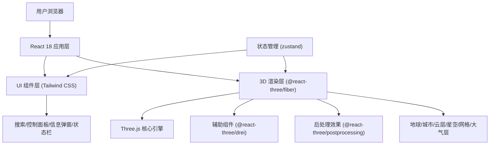

## 1. 架构设计


## 2. 技术栈
- 前端框架：React@18 + TypeScript@5
- 构建工具：Vite@5
- 样式方案：Tailwind CSS@3
- 3D引擎：three@0.160
- React 3D绑定：@react-three/fiber@8, @react-three/drei@9, @react-three/postprocessing@2
- 状态管理：zustand@4
- 动画库：gsap@3
- 图标库：lucide-react@0.294
- 性能监控：stats.js@0.17

## 3. 目录结构
```
src/
├── components/
│   ├── Earth/
│   │   ├── Globe.tsx          # 地球核心球体
│   │   ├── Atmosphere.tsx     # 大气层光晕
│   │   ├── Clouds.tsx         # 云层效果
│   │   ├── CityMarkers.tsx    # 城市标记组
│   │   ├── CityMarker.tsx     # 单个城市标记
│   │   ├── GridLines.tsx      # 经纬度网格
│   │   ├── DayNightShade.tsx  # 昼夜分界线
│   │   └── StarField.tsx      # 星空背景
│   ├── UI/
│   │   ├── SearchBar.tsx      # 搜索框
│   │   ├── ControlPanel.tsx   # 控制面板
│   │   ├── CityInfoModal.tsx  # 城市信息弹窗
│   │   ├── StatusBar.tsx      # 状态栏(经纬度/FPS)
│   │   └── StatsDisplay.tsx   # 帧率显示
│   └── Scene.tsx              # 3D场景容器
├── hooks/
│   ├── useEarthControls.ts    # 地球控制逻辑
│   ├── useCitySearch.ts       # 城市搜索逻辑
│   ├── useScreenCapture.ts    # 截图功能
│   └── useStats.ts            # 帧率监控
├── store/
│   └── useEarthStore.ts       # 全局状态
├── data/
│   └── cities.ts              # 城市数据
├── utils/
│   ├── coordinates.ts         # 坐标转换工具
│   └── timezones.ts           # 时区计算工具
├── types/
│   └── index.ts               # 类型定义
├── App.tsx
├── main.tsx
└── index.css
```

## 4. 核心数据模型
```typescript
// 城市数据类型
interface City {
  id: string;
  name: string;
  country: string;
  lat: number;      // 纬度 (-90 ~ 90)
  lng: number;      // 经度 (-180 ~ 180)
  population: string;
  timezone: string; // IANA 时区标识
  utcOffset: number;
}

// 地球全局状态
interface EarthState {
  autoRotate: boolean;
  mapStyle: 'satellite' | 'terrain' | 'political';
  showGrid: boolean;
  showDayNight: boolean;
  showAtmosphere: boolean;
  showClouds: boolean;
  showStars: boolean;
  showLabels: boolean;
  selectedCity: City | null;
  highlightedCity: string | null;
  cameraLat: number;
  cameraLng: number;
  fps: number;
  // actions
  setAutoRotate: (v: boolean) => void;
  setMapStyle: (s: MapStyle) => void;
  toggleGrid: () => void;
  toggleDayNight: () => void;
  toggleAtmosphere: () => void;
  toggleClouds: () => void;
  toggleStars: () => void;
  toggleLabels: () => void;
  selectCity: (c: City | null) => void;
  highlightCity: (id: string | null) => void;
  setCameraCoords: (lat: number, lng: number) => void;
  setFps: (fps: number) => void;
  flyToCity: (city: City) => void;
  captureScreenshot: () => void;
}
```

## 5. 技术实现要点

### 5.1 经纬度坐标转换
```
// 经纬度转Three.js 3D坐标
function latLngToVector3(lat: number, lng: number, radius: number): THREE.Vector3 {
  const phi = (90 - lat) * (Math.PI / 180);
  const theta = (lng + 180) * (Math.PI / 180);
  return new THREE.Vector3(
    -radius * Math.sin(phi) * Math.cos(theta),
     radius * Math.cos(phi),
     radius * Math.sin(phi) * Math.sin(theta)
  );
}
```

### 5.2 昼夜分界线实现
- 根据当前UTC时间计算太阳位置：太阳经度 = (UTC小时 * 15) - 180
- 使用自定义ShaderMaterial，在片元着色器中计算每个像素的日照角度
- 法线与光照方向点积 < 0 则为夜晚，添加过渡带实现柔和的明暗交界

### 5.3 大气层光晕效果
- 使用BackSide材质，略大于地球半径（1.05倍）
- 自定义Shader实现菲涅尔效果：边缘透明度高，中心透明度低
- 配合Bloom后处理增强发光感

### 5.4 云层效果
- 独立于地球的球体，半径1.01倍
- 使用半透明透明云层贴图，alpha通道控制透明度
- 自转速度略快于地球（约1.5倍）

### 5.5 截图功能
- 使用gl.readPixels读取framebuffer
- 转换为ImageData后通过Canvas导出PNG
- 支持下载当前Canvas内容

### 5.6 相机飞行
- 使用gsap缓动动画平滑修改相机position和controls.target
- 动画时长2秒，ease: power2.inOut
- 飞行期间禁用用户控制

### 5.7 贴图资源
使用以下公共CDN资源：
- 卫星图: `https://unpkg.com/three-globe@2.24.13/example/img/earth-blue-marble.jpg`
- 地形图: `https://unpkg.com/three-globe@2.24.13/example/img/earth-topology.png`
- 政区图: `https://unpkg.com/three-globe@2.24.13/example/img/earth-water.png`
- 云层: `https://unpkg.com/three-globe@2.24.13/example/img/earth-clouds.png`
- 凹凸贴图: `https://unpkg.com/three-globe@2.24.13/example/img/earth-water.png`
