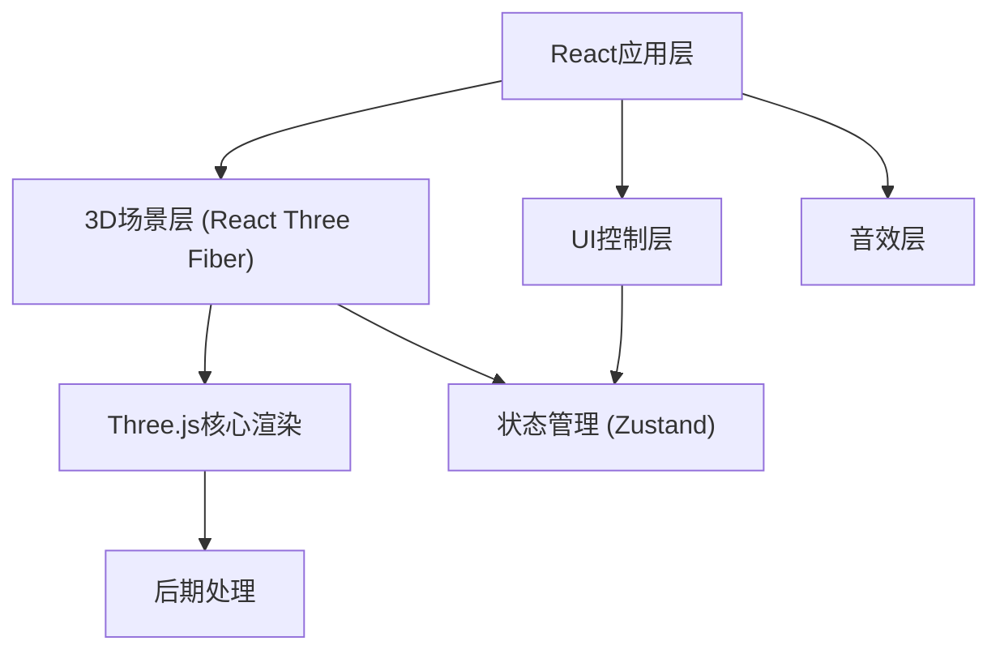

## 1. 架构设计



## 2. 技术描述

- **前端框架**：React@18 + TypeScript + Vite
- **3D引擎**：Three.js + @react-three/fiber + @react-three/drei
- **后期处理**：@react-three/postprocessing
- **样式方案**：TailwindCSS 3
- **状态管理**：Zustand
- **音效处理**：Web Audio API
- **构建工具**：Vite 5

## 3. 目录结构

```
src/
├── components/
│   ├── OceanWorld/
│   │   ├── OceanWorld.tsx      # 主3D场景容器
│   │   ├── Seabed.tsx          # 海底地面
│   │   ├── Seaweed.tsx         # 水草组件
│   │   ├── Fish.tsx            # 单条鱼组件
│   │   ├── FishSchool.tsx      # 鱼群组件
│   │   ├── Bubbles.tsx         # 气泡粒子
│   │   ├── Plankton.tsx        # 浮游生物粒子
│   │   ├── Diver.tsx           # 潜水员模型
│   │   ├── LightRays.tsx       # 阳光光柱
│   │   └── WaterSurface.tsx    # 水面效果
│   ├── UI/
│   │   ├── ControlPanel.tsx    # 控制面板
│   │   ├── FishInfo.tsx        # 鱼类信息弹窗
│   │   ├── StatsBar.tsx        # 统计信息栏
│   │   └── ToggleButton.tsx    # 开关按钮组件
│   └── hooks/
│       ├── useFishAnimation.ts # 鱼游动动画hook
│       └── useAudio.ts         # 音效hook
├── store/
│   └── useOceanStore.ts        # 全局状态管理
├── types/
│   └── index.ts                # 类型定义
├── data/
│   └── fishData.ts             # 鱼类数据
├── App.tsx
├── main.tsx
└── index.css
```

## 4. 路由定义

| 路由 | 用途 |
|------|------|
| / | 海底世界主场景页面 |

## 5. 状态管理

### 5.1 全局状态定义

```typescript
interface OceanState {
  // 环境设置
  backgroundType: 'deep' | 'shallow' | 'night';
  sunRaysEnabled: boolean;
  audioEnabled: boolean;
  
  // 气泡设置
  bubbleCount: number;
  bubbleDensity: number;
  
  // 相机设置
  autoRotate: boolean;
  autoRotateSpeed: number;
  
  // 交互状态
  selectedFish: FishData | null;
  fishCount: number;
  
  // Actions
  setBackgroundType: (type: 'deep' | 'shallow' | 'night') => void;
  toggleSunRays: () => void;
  toggleAudio: () => void;
  setBubbleCount: (count: number) => void;
  toggleAutoRotate: () => void;
  setSelectedFish: (fish: FishData | null) => void;
  takeScreenshot: () => void;
}
```

### 5.2 鱼类数据结构

```typescript
interface FishData {
  id: string;
  type: 'clownfish' | 'angelfish' | 'butterflyfish';
  name: string;
  description: string;
  color: string;
  size: number;
  speed: number;
  pathPoints: Vector3[];
}
```

## 6. 核心组件说明

### 6.1 3D场景组件
- **OceanWorld**: 主场景容器，管理相机、灯光、雾效
- **FishSchool**: 使用实例化渲染优化鱼群性能
- **Bubbles**: 使用Points实现气泡粒子系统
- **Seaweed**: 顶点着色器实现水草摇摆动画

### 6.2 UI组件
- **ControlPanel**: 右侧抽屉式控制面板，包含所有设置项
- **FishInfo**: 点击鱼类时显示的信息卡片
- **StatsBar**: 顶部统计栏，显示鱼群数量

### 6.3 性能优化策略
- 使用InstancedMesh渲染大量重复物体（鱼群）
- 使用Points渲染粒子系统（气泡、浮游生物）
- 合理设置相机远裁剪面和雾效减少绘制物体
- 使用useMemo缓存几何体和材质
