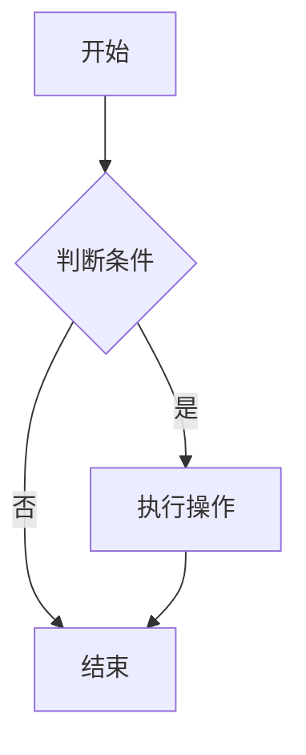

# 欢迎使用 Markdown 文档管理系统

这是一个功能丰富的 Markdown 文档管理系统，基于 Flask 开发。

## ✨ 主要功能

### 📝 文档管理
- 创建、编辑、删除文档
- 每个文档保存为独立的 `.md` 文件
- 支持文件夹组织文档

### 🔍 搜索与标签
- 全文搜索功能
- 文档标签系统
- 按标签筛选文档

### 📜 历史版本
- 每次编辑自动备份
- 查看历史版本
- 恢复到任意历史版本

### 🔗 分享功能
- 生成只读分享链接
- 可随时撤销分享
- 分享访问统计

### 📤 导入导出
- 导出为 PDF、HTML、Markdown
- 导出整个文档库为 ZIP
- 导入单个 .md 文件或 ZIP 压缩包

### 🎨 界面特性
- 暗色/亮色主题切换
- 自定义 CSS 主题
- 响应式设计

## 📖 Markdown 扩展语法

### 表格支持

| 功能 | 描述 | 状态 |
|------|------|------|
| 表格 | 支持 Markdown 表格 | ✅ |
| 任务列表 | 支持待办事项 | ✅ |
| LaTeX | 支持数学公式 | ✅ |
| Mermaid | 支持流程图 | ✅ |

### 任务列表

- [x] 已完成的任务
- [ ] 待完成的任务
- [ ] 另一个待办事项
  - [ ] 嵌套任务

### LaTeX 数学公式

行内公式：$E = mc^2$

块级公式：

$$
\sum_{i=1}^{n} x_i = x_1 + x_2 + \cdots + x_n
$$

### Mermaid 流程图



### 代码高亮

```python
def hello_world():
    """示例Python函数"""
    print("Hello, World!")
    return True
```

```javascript
function greet(name) {
    console.log(`Hello, ${name}!`);
}
```

## 📊 使用统计

本文档的查看和编辑次数会自动记录。

---

开始创建您的第一个文档吧！点击右上角的"新建"按钮开始。
