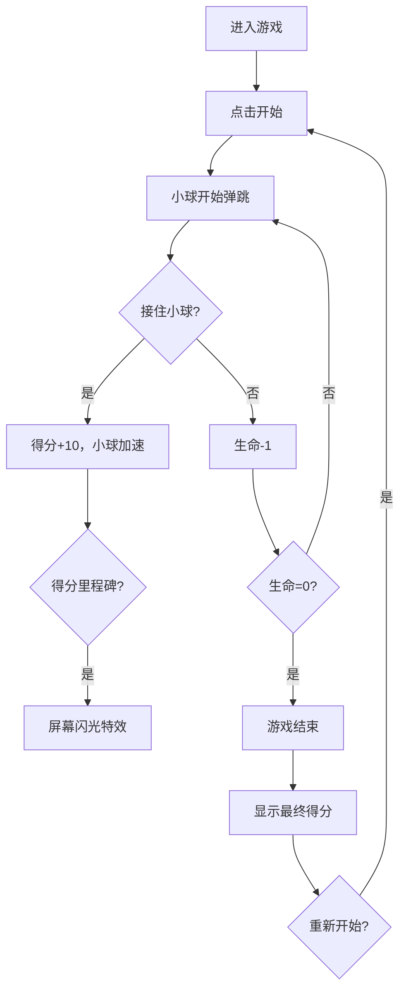

## 1. 产品概述

一款基于HTML5 Canvas的弹球接住休闲游戏，玩家通过控制底部托盘接住弹跳的小球获得分数，支持多种小球类型、道具系统和难度渐进机制。

- 主要目的：提供轻松有趣的休闲游戏体验，锻炼玩家反应能力
- 目标用户：各年龄段休闲游戏玩家，支持PC端和移动端

## 2. 核心功能

### 2.1 用户角色
无需用户登录，所有数据本地存储

| 角色 | 说明 |
|------|------|
| 玩家 | 游戏参与者，所有功能对玩家开放 |

### 2.2 功能模块

1. **游戏主界面**：游戏画布、分数显示、生命显示、最高分显示
2. **游戏控制系统**：键盘控制、鼠标控制、触摸滑动控制
3. **小球系统**：普通球、闪电球、加分球三种类型
4. **道具系统**：托盘变大、托盘变小、多球模式
5. **音效系统**：接球音效、失球音效、游戏结束音效
6. **设置系统**：音效开关、托盘皮肤切换
7. **游戏状态管理**：开始、暂停、重置、游戏结束

### 2.3 页面详情

| 页面名称 | 模块名称 | 功能描述 |
|----------|----------|----------|
| 游戏主页面 | 游戏画布 | Canvas渲染游戏场景，小球弹跳、托盘移动、道具掉落 |
| 游戏主页面 | 信息面板 | 显示当前得分、剩余命数、最高分 |
| 游戏主页面 | 控制面板 | 开始/暂停按钮、重置按钮、音效开关、皮肤选择 |
| 游戏主页面 | 游戏结束弹窗 | 显示最终得分，提供重新开始选项 |

## 3. 核心流程

玩家进入游戏 → 点击开始按钮 → 控制托盘移动接住小球 → 获得分数/触发道具 → 小球加速、难度提升 → 失去3条命 → 游戏结束 → 显示最终得分 → 可重新开始

## 4. 用户界面设计

### 4.1 设计风格
- **主色调**：深蓝色渐变背景（#1a1a2e → #16213e），营造科技感
- **强调色**：霓虹青色（#00fff5）用于托盘和特效，霓虹粉色（#ff006e）用于小球
- **辅助色**：金色（#ffd700）用于加分球，紫色（#9d4edd）用于闪电球
- **按钮样式**：圆角矩形，带有光晕效果，悬停时有缩放动画
- **字体**：使用 'Press Start 2P' 像素风格字体，营造复古游戏氛围
- **布局风格**：居中游戏画布，顶部信息栏，底部控制栏
- **图标风格**：像素风格图标，使用emoji增强表现力

### 4.2 页面设计概述

| 页面名称 | 模块名称 | UI元素 |
|----------|----------|--------|
| 游戏主页面 | 游戏画布 | 深色渐变背景、霓虹色小球和托盘、粒子拖尾效果 |
| 游戏主页面 | 信息面板 | 半透明玻璃态面板，像素字体显示分数、生命、最高分 |
| 游戏主页面 | 控制面板 | 图标按钮，悬停发光效果，皮肤选择下拉框 |
| 游戏主页面 | 游戏结束弹窗 | 毛玻璃效果弹窗，居中显示，按钮带有脉冲动画 |

### 4.3 响应式

- 桌面端：键盘（左右方向键）和鼠标控制，完整功能按钮
- 移动端：触摸滑动控制托盘，简化按钮布局，自适应屏幕尺寸
- 画布按比例缩放，保持游戏体验一致性

### 4.4 动效设计

- 小球拖尾效果：使用粒子系统实现运动轨迹
- 得分里程碑：屏幕闪烁白光，文字放大动画
- 接住小球：托盘轻微震动，得分数字上浮消失
- 道具出现：闪烁发光效果，下落时有旋转动画
- 按钮交互：悬停缩放，点击反馈

## 5. 音效设计

- 接住小球：清脆的"叮"声
- 失去生命：低沉的"嗡"声
- 游戏结束：短促的失败音效
- 音效开关：一键控制所有音效
