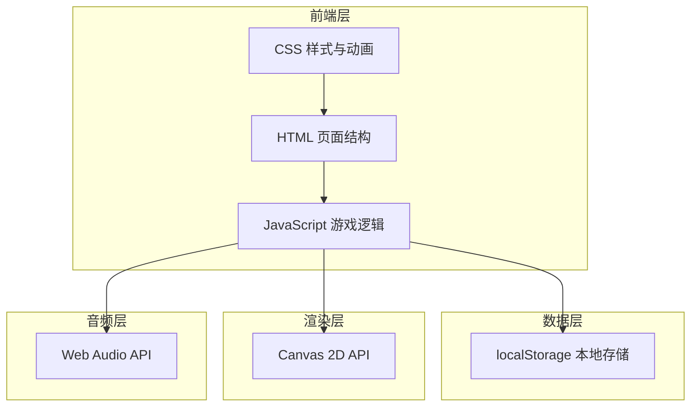

## 1. 架构设计



## 2. 技术说明

- **前端技术栈**：原生 HTML5 + CSS3 + JavaScript (ES6+)
- **渲染引擎**：Canvas 2D API
- **音频处理**：Web Audio API（使用OscillatorNode生成音效）
- **数据存储**：localStorage（存储最高分）
- **构建工具**：无，纯静态文件
- **兼容浏览器**：Chrome、Firefox、Safari、Edge 现代浏览器

## 3. 文件结构

| 文件路径 | 用途 |
|---------|------|
| `/index.html` | 游戏主页面结构 |
| `/css/style.css` | 样式文件，包含UI和动画 |
| `/js/game.js` | 游戏核心逻辑 |

## 4. 核心模块设计

### 4.1 游戏状态管理

```javascript
const GameState = {
    IDLE: 'idle',
    PLAYING: 'playing',
    PAUSED: 'paused',
    GAME_OVER: 'gameOver'
};
```

### 4.2 小球类型

```javascript
const BallType = {
    NORMAL: { name: 'normal', color: '#ff006e', speed: 1, score: 10 },
    LIGHTNING: { name: 'lightning', color: '#9d4edd', speed: 1.5, score: 10 },
    BONUS: { name: 'bonus', color: '#ffd700', speed: 1, score: 20 }
};
```

### 4.3 道具类型

```javascript
const PowerUpType = {
    PADDLE_BIG: { name: 'paddleBig', color: '#00ff88', duration: 10000 },
    PADDLE_SMALL: { name: 'paddleSmall', color: '#ff4444', duration: 8000 },
    MULTI_BALL: { name: 'multiBall', color: '#00aaff', duration: 0 }
};
```

### 4.4 托盘皮肤

```javascript
const PaddleSkin = {
    WOOD: { name: 'wood', colors: ['#8B4513', '#A0522D', '#654321'] },
    METAL: { name: 'metal', colors: ['#708090', '#A9A9A9', '#4a5568'] },
    COLORFUL: { name: 'colorful', colors: ['#ff6b6b', '#4ecdc4', '#45b7d1'] }
};
```

## 5. 核心类设计

### 5.1 Game 类
- 游戏主控制器，管理游戏循环和状态
- 属性：state, score, lives, highScore, canvas, ctx
- 方法：init(), start(), pause(), reset(), gameLoop(), update(), render()

### 5.2 Ball 类
- 小球对象
- 属性：x, y, dx, dy, radius, type, trail
- 方法：update(), draw(), bounceX(), bounceY(), increaseSpeed()

### 5.3 Paddle 类
- 托盘对象
- 属性：x, y, width, height, skin, targetX
- 方法：update(), draw(), moveTo(), resize()

### 5.4 PowerUp 类
- 道具对象
- 属性：x, y, type, active
- 方法：update(), draw(), activate()

### 5.5 AudioManager 类
- 音效管理器
- 属性：enabled, audioContext
- 方法：playCatch(), playMiss(), playGameOver(), toggle()

### 5.6 ParticleSystem 类
- 粒子系统，实现拖尾效果
- 属性：particles
- 方法：emit(), update(), draw()

## 6. 事件处理

- `keydown`：左右方向键控制托盘
- `mousemove`：鼠标控制托盘位置
- `touchstart/touchmove`：移动端触摸控制
- `click`：按钮点击事件
- `resize`：窗口大小变化适配

## 7. 性能优化

- 使用 requestAnimationFrame 实现流畅动画
- 对象池管理小球和粒子，避免频繁创建销毁
- 合理设置粒子数量，平衡视觉效果和性能
- 离屏Canvas绘制静态元素（可选）
