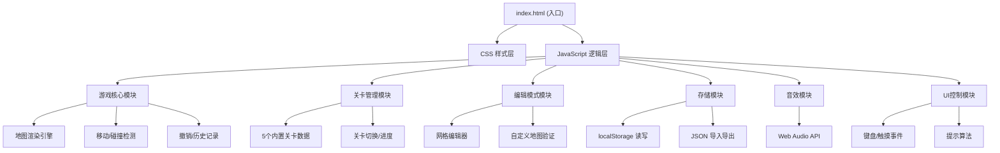

## 1. 架构设计
本项目为纯前端单页应用，采用模块化原生JavaScript架构，无需后端服务。所有数据存储于浏览器localStorage，通过File API实现JSON文件的导入导出。



## 2. 技术描述
- **前端技术栈**: HTML5 + CSS3 + 原生JavaScript (ES6+)
- **无需构建工具**: 直接在浏览器运行，无需Vite/Webpack
- **数据存储**: localStorage 持久化游戏进度和自定义关卡
- **音效**: Web Audio API 生成音效，无需外部音频文件
- **图标**: CSS绘制 + Unicode emoji，零外部依赖
- **字体**: Google Fonts (ZCOOL KuaiLe, Noto Sans SC)

## 3. 文件结构
| 文件路径 | 作用 |
|----------|------|
| `/index.html` | 应用入口，包含游戏布局结构 |
| `/css/style.css` | 所有样式定义，包含动画和响应式 |
| `/js/game.js` | 游戏核心逻辑：渲染、移动、碰撞检测 |
| `/js/levels.js` | 内置关卡数据和关卡管理 |
| `/js/editor.js` | 关卡编辑模式逻辑 |
| `/js/storage.js` | 本地存储、导入导出 |
| `/js/sound.js` | 音效生成与播放控制 |
| `/js/utils.js` | 提示算法、辅助工具函数 |

## 4. 数据模型

### 4.1 地图元素编码
| 值 | 元素 | 说明 |
|----|------|------|
| 0 | 空地/地板 | 可通行区域 |
| 1 | 墙壁 | 不可通行 |
| 2 | 目标点 | 箱子需要推到的位置 |
| 3 | 箱子 | 可推动的物体 |
| 4 | 玩家 | 玩家角色 |
| 5 | 箱子在目标点上 | 已完成的箱子 |
| 6 | 玩家在目标点上 | 玩家站在目标点 |

### 4.2 关卡数据结构
```javascript
interface Level {
  id: number;
  name: string;
  map: number[][];      // 二维数组地图
  bestSteps?: number;   // 最少步数记录
}

interface GameState {
  currentLevel: number; // 当前关卡索引
  steps: number;        // 当前步数
  history: HistoryItem[]; // 历史记录（最多10步）
  playerPos: { x: number; y: number };
  map: number[][];      // 当前地图状态
  soundEnabled: boolean;
  skinIndex: number;    // 当前皮肤索引
  customLevels: Level[]; // 用户自定义关卡
}

interface HistoryItem {
  map: number[][];
  playerPos: { x: number; y: number };
  steps: number;
}
```

## 5. 核心算法

### 5.1 移动与碰撞检测
1. 计算目标位置 `(nx, ny)`
2. 检查目标位置是否为墙壁，是则取消移动
3. 检查目标位置是否为箱子：
   - 计算箱子被推后的位置 `(bx, by)`
   - 检查 `(bx, by)` 是否为墙壁或另一个箱子，是则取消
   - 否则移动箱子和玩家
4. 更新地图状态，记录历史

### 5.2 过关检测
遍历地图所有格子，检查是否所有目标点上都有箱子（即值为5的格子数量等于目标点总数）。

### 5.3 提示算法（简化版BFS）
1. 从当前玩家位置进行广度优先搜索
2. 探索所有可推动箱子的方向
3. 优先选择能使箱子更接近未完成目标点的移动
4. 返回推荐方向，高亮显示

### 5.4 关卡验证（编辑模式）
1. 检查地图有且仅有一个玩家
2. 检查箱子数量等于目标点数量
3. 检查地图边界为墙壁（可选）
4. 确保没有孤立元素

## 6. 存储键名
- `sokoban_state`: 当前游戏状态
- `sokoban_best_steps`: 各关卡最少步数字典
- `sokoban_custom_levels`: 用户自定义关卡数组
- `sokoban_settings`: 音效、皮肤等设置
