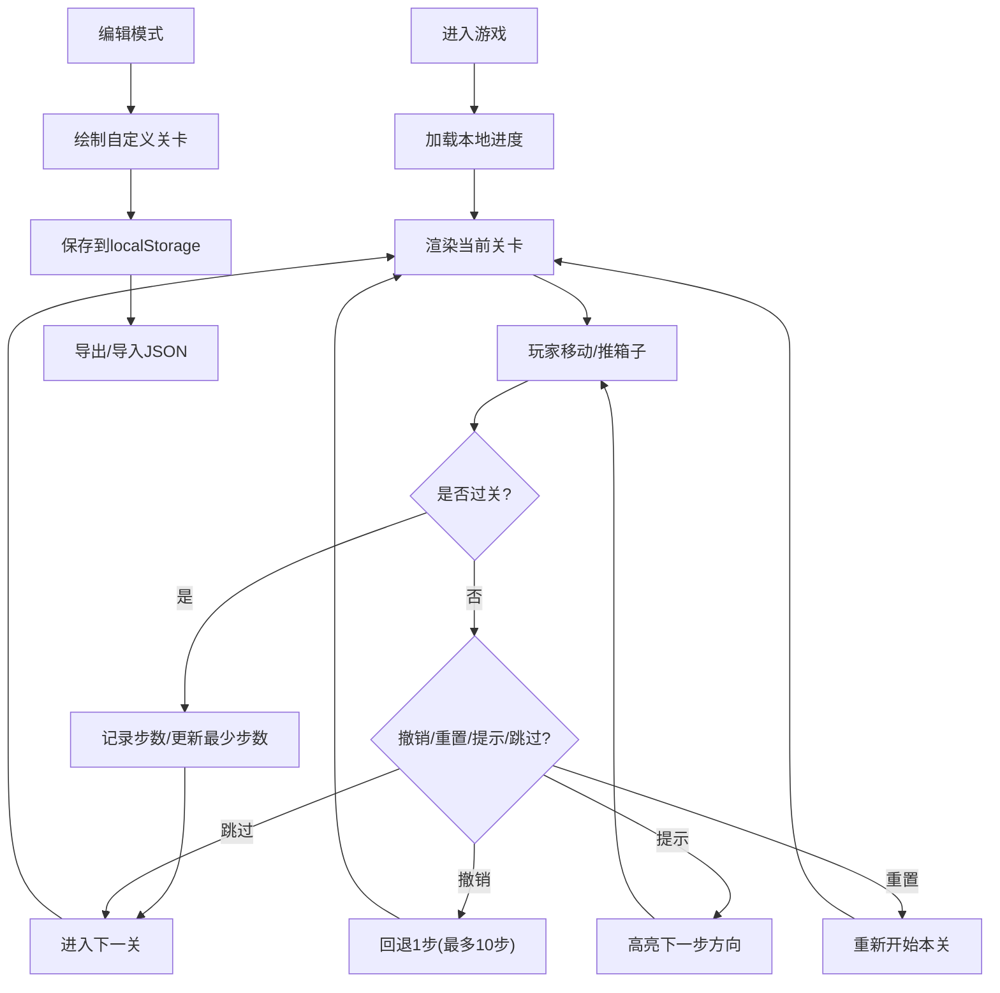

## 1. 产品概述
推箱子是一款经典益智游戏，玩家控制角色将箱子推到指定目标点。本产品基于纯前端技术（HTML/CSS/原生JavaScript）实现，无需后端服务，支持多平台访问，为玩家提供从简单到困难的关卡挑战，同时支持自定义关卡编辑与分享。

## 2. 核心功能

### 2.1 用户角色
| 角色 | 注册方式 | 核心权限 |
|------|----------|----------|
| 普通玩家 | 无需注册 | 游戏游玩、关卡编辑、数据导入导出 |

### 2.2 功能模块
1. **游戏主界面**: 游戏地图渲染、角色控制、状态显示
2. **关卡系统**: 5个内置关卡、关卡切换、最少步数记录
3. **编辑模式**: 自定义地图布局、保存到本地存储
4. **辅助功能**: 撤销、重置、提示、音效开关
5. **个性化设置**: 角色皮肤切换、进度保存
6. **数据管理**: 关卡导入导出JSON、跳过关卡

### 2.3 页面详情
| 页面名称 | 模块名称 | 功能描述 |
|----------|----------|----------|
| 游戏主页面 | 地图区域 | 渲染墙壁、地板、玩家、箱子、目标点 |
| 游戏主页面 | 控制面板 | 方向键控制、功能按钮、状态显示 |
| 游戏主页面 | 信息栏 | 关卡数、步数、最少步数、音效开关 |
| 编辑模式 | 编辑面板 | 选择地图元素、绘制地图、保存/测试 |
| 设置面板 | 皮肤选择 | 多种角色样式切换 |
| 关卡管理 | 导入导出 | JSON文件上传下载 |

## 3. 核心流程
玩家进入游戏后加载保存的进度，通过方向键或触摸滑动控制角色移动，推动箱子到目标点。所有箱子到位后自动进入下一关。可随时撤销、重置或查看提示，卡住时可跳过当前关卡。支持编辑模式创建自定义关卡并分享。

## 4. 用户界面设计

### 4.1 设计风格
- **主色调**: 深青色 (#0f766e) 作为主色，琥珀色 (#f59e0b) 作为强调色
- **按钮风格**: 圆角矩形按钮，带悬停阴影和点击缩放效果
- **字体**: 标题使用 'ZCOOL KuaiLe' 显示字体，正文使用 'Noto Sans SC' 无衬线字体
- **布局风格**: 居中卡片式布局，游戏区域使用CSS Grid渲染
- **图标**: 使用emoji和CSS绘制的几何图形，避免外部依赖

### 4.2 页面设计概述
| 页面名称 | 模块名称 | UI元素 |
|----------|----------|--------|
| 游戏主页面 | 地图区域 | 3D立体方块、渐变填充、阴影效果、完成动画 |
| 游戏主页面 | 控制面板 | 方向按钮(十字布局)、功能按钮组(水平排列) |
| 游戏主页面 | 信息栏 | 徽章式状态显示、切换开关 |
| 编辑模式 | 工具栏 | 元素选择器、操作按钮、网格画布 |
| 设置面板 | 皮肤预览 | 圆形头像列表、选中高亮边框 |
| 过关弹窗 | 动画效果 | 粒子效果、渐入动画、按钮交互 |

### 4.3 响应式
采用桌面优先设计，通过CSS媒体查询适配移动端。移动端支持触摸滑动控制，按钮尺寸自动放大便于触控。游戏地图使用相对单位，自动适应屏幕尺寸。

### 4.4 视觉动效
- 角色移动：平滑过渡动画，0.15秒缓动
- 箱子推动：轻微弹跳效果
- 过关庆祝：粒子爆炸动画 + 色彩渐变
- 按钮交互：悬停上浮 + 点击缩放
- 提示高亮：呼吸灯闪烁效果
