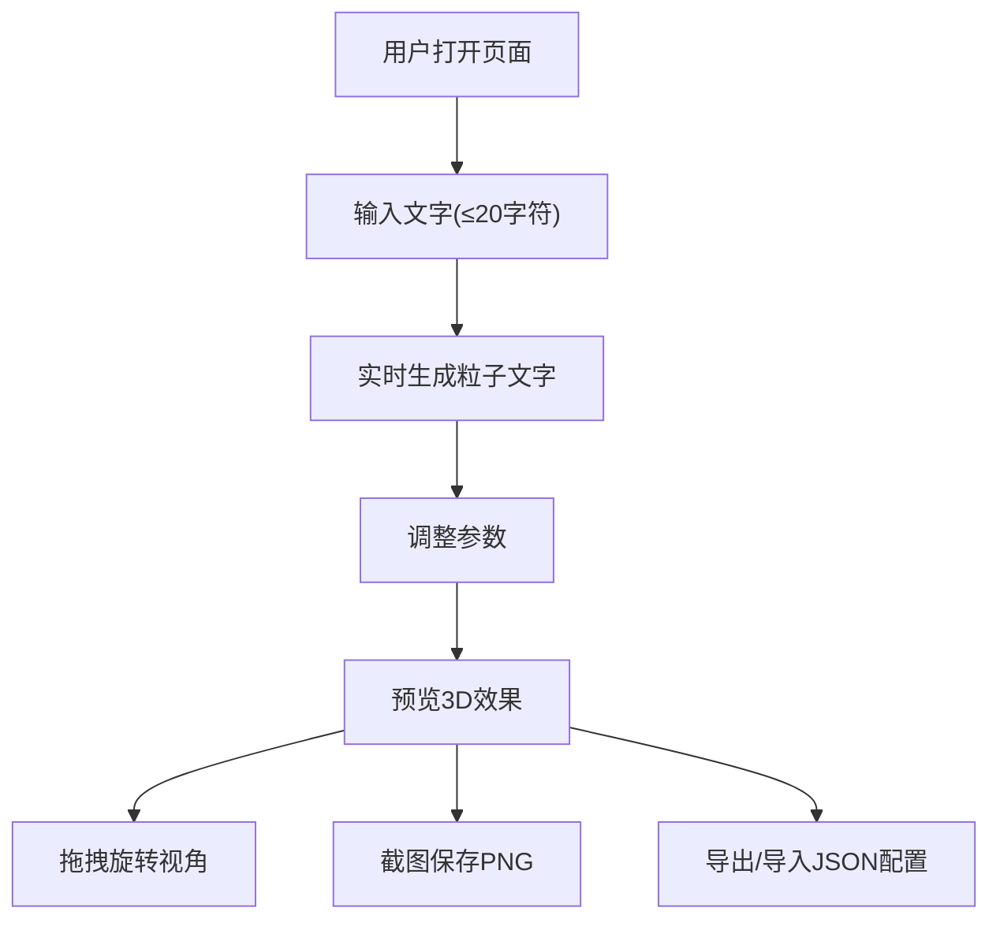

## 1. 产品概述

本产品是一个基于Three.js的3D粒子文字特效网页应用，用户可以输入文字并生成由数千个彩色粒子组成的3D文字效果，支持丰富的自定义参数和交互功能。

- 核心价值：为用户提供可视化的粒子文字创作工具，支持实时预览和多种效果调整
- 目标用户：设计师、艺术创作者、前端开发者及普通用户
- 产品定位：轻量级、交互性强的在线3D粒子文字生成器

## 2. 核心功能

### 2.1 用户角色
| 角色 | 注册方式 | 核心权限 |
|------|----------|----------|
| 普通用户 | 无需注册 | 使用全部功能，导出创作成果 |

### 2.2 功能模块
1. **主页面**：3D粒子文字场景展示、控制面板、状态栏
2. **3D场景模块**：Three.js渲染、粒子系统、相机控制
3. **控制面板模块**：文字输入、参数调节、功能按钮
4. **导出模块**：截图保存、JSON配置导入导出

### 2.3 页面详情
| 页面名称 | 模块名称 | 功能描述 |
|---------|----------|----------|
| 主页面 | 3D场景区域 | 展示粒子文字效果，支持鼠标拖拽旋转视角 |
| 主页面 | 文字输入区 | 输入框（最多20字符），实时生成粒子文字 |
| 主页面 | 参数调节区 | 粒子大小滑块、厚度滑块、颜色渐变、字体切换、粒子形状切换 |
| 主页面 | 运动控制区 | 运动模式切换（静止/飘浮/旋转）、相机自动旋转开关 |
| 主页面 | 特效控制区 | 背景星云开关、淡入淡出动画按钮 |
| 主页面 | 导出区 | 截图保存、导出JSON、导入JSON |
| 主页面 | 状态栏 | 显示粒子总数、帧率监控 |

## 3. 核心流程

用户打开网页 → 输入文字 → 实时生成3D粒子文字 → 调整各项参数 → 预览效果 → 截图保存或导出配置

## 4. 用户界面设计

### 4.1 设计风格
- **主色调**：深空黑(#0a0a0f)作为背景，霓虹渐变色彩作为粒子颜色
- **辅助色**：紫色(#8b5cf6)、青色(#06b6d4)、粉色(#ec4899)渐变
- **按钮风格**：半透明玻璃拟态，圆角设计，悬停发光效果
- **字体**：主标题使用Orbitron科技感字体，控制面板使用Inter
- **布局风格**：左侧控制面板（固定宽度）+ 右侧全屏3D场景
- **整体氛围**：科技感、未来感、赛博朋克风格

### 4.2 页面设计概述
| 页面名称 | 模块名称 | UI元素 |
|---------|----------|--------|
| 主页面 | 3D场景 | 全屏Canvas，粒子文字，可选星云背景，鼠标拖拽交互 |
| 主页面 | 控制面板 | 半透明侧边栏，分组滑块、下拉选择、开关按钮 |
| 主页面 | 状态栏 | 底部浮动显示，粒子计数、FPS数值 |

### 4.3 响应式
- 桌面端优先设计
- 移动端：控制面板转为底部抽屉式布局
- 触摸设备支持手势旋转和缩放

### 4.4 3D场景设计
- **环境**：纯黑背景，可选星云粒子背景
- **光照**：环境光 + 点光源，突出粒子立体感
- **相机**：PerspectiveCamera，距离适中，支持OrbitControls
- **构图**：文字居中，粒子环绕分布
- **动画**：粒子独立运动轨迹，整体流动效果
- **后处理**：轻微辉光效果增强视觉冲击力
- **性能**：粒子数控制在合理范围，确保60fps
