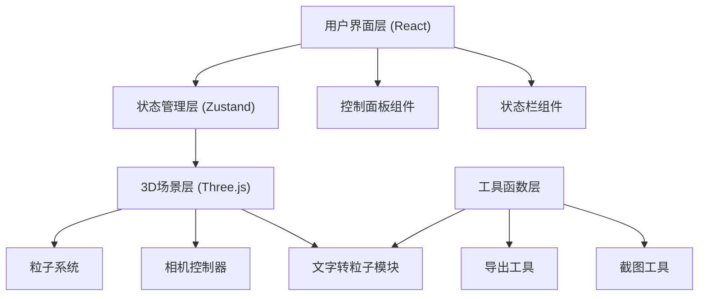

## 1. 架构设计



## 2. 技术描述

- **前端框架**：React@18 + TypeScript
- **构建工具**：Vite@5
- **样式方案**：TailwindCSS@3
- **状态管理**：Zustand
- **3D引擎**：Three.js@0.160
- **3D辅助库**：@react-three/fiber@8、@react-three/drei@9、@react-three/postprocessing@2
- **图标库**：lucide-react

## 3. 目录结构

```
src/
├── components/
│   ├── ControlPanel/       # 控制面板组件
│   │   ├── TextInput.tsx   # 文字输入
│   │   ├── Sliders.tsx     # 滑块控件
│   │   ├── Selectors.tsx   # 选择器
│   │   └── ActionButtons.tsx # 操作按钮
│   ├── Scene3D.tsx         # 3D场景主组件
│   ├── ParticleText.tsx    # 粒子文字组件
│   ├── NebulaBackground.tsx # 星云背景
│   └── StatusBar.tsx       # 状态栏
├── hooks/
│   ├── useParticleSystem.ts # 粒子系统Hook
│   ├── useFPSMonitor.ts    # 帧率监控Hook
│   └── useTextToParticles.ts # 文字转粒子Hook
├── store/
│   └── useParticleStore.ts # Zustand状态管理
├── utils/
│   ├── particleUtils.ts    # 粒子工具函数
│   ├── textUtils.ts        # 文字处理工具
│   ├── exportUtils.ts      # 导出工具
│   └── screenshot.ts       # 截图工具
├── types/
│   └── index.ts            # 类型定义
├── App.tsx
├── main.tsx
└── index.css
```

## 4. 核心数据类型定义

```typescript
// 粒子配置
interface ParticleConfig {
  text: string;
  particleSize: number;
  particleShape: 'circle' | 'square' | 'star';
  motionMode: 'static' | 'float' | 'rotate';
  font: 'default' | 'artistic';
  thickness: number;
  colorGradient: string[];
  showNebula: boolean;
  autoRotateCamera: boolean;
  opacity: number;
}

// 粒子数据
interface ParticleData {
  position: THREE.Vector3;
  targetPosition: THREE.Vector3;
  velocity: THREE.Vector3;
  color: THREE.Color;
  size: number;
  phase: number;
}

// 粒子系统状态
interface ParticleState extends ParticleConfig {
  particles: ParticleData[];
  particleCount: number;
  fps: number;
  setConfig: (config: Partial<ParticleConfig>) => void;
  updateParticles: () => void;
  resetCamera: () => void;
  exportConfig: () => string;
  importConfig: (json: string) => void;
  captureScreenshot: () => void;
}
```

## 5. 路由定义

| 路由 | 用途 |
|------|------|
| / | 主页面，包含3D场景和控制面板 |

## 6. 核心模块说明

### 6.1 文字转粒子模块
- 使用HTML5 Canvas绘制文字
- 提取文字像素点作为粒子位置
- 支持多层平面实现厚度效果
- 从左到右应用颜色渐变

### 6.2 粒子系统模块
- 使用THREE.Points实现高性能粒子渲染
- 支持多种粒子形状（通过Shader实现）
- 独立的粒子运动物理模拟
- 淡入淡出动画支持

### 6.3 相机控制模块
- OrbitControls实现拖拽旋转
- 支持自动旋转模式
- 自动适配文字大小调整相机距离

### 6.4 导出模块
- 截图功能：renderer.domElement.toDataURL()
- JSON配置导入导出：序列化/反序列化ParticleConfig
