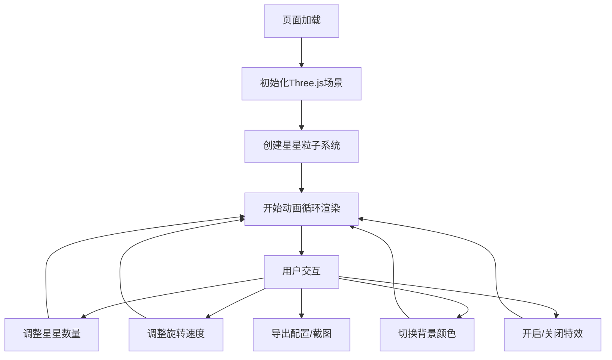

## 1. 产品概述

一个基于Three.js的沉浸式3D星空旋转星轨可视化网页，用户可以通过交互式控制面板调整星空参数，体验动态变化的宇宙星轨效果。

- 核心功能：3D粒子系统模拟星空旋转、星轨拖尾效果、多种视觉特效切换
- 目标用户：天文爱好者、设计师、艺术创作者、需要背景动效的开发者
- 产品价值：提供可定制的高质量3D星空动效，支持配置导出复用

## 2. 核心功能

### 2.1 功能模块

1. **3D星空场景**：星星粒子系统、星轨拖尾效果、银河光带、流星效果
2. **交互控制面板**：参数调节滑块、功能开关、快捷操作按钮
3. **配置管理**：配置导出为JSON、从JSON加载配置
4. **辅助功能**：帧率监控、一键截图、视角控制

### 2.2 页面详情

| 页面名称 | 模块名称 | 功能描述 |
|-----------|-------------|---------------------|
| 主页面 | 3D画布区域 | 全屏Three.js渲染场景，支持鼠标拖拽旋转视角 |
| 主页面 | 控制面板 | 折叠式侧边栏，包含所有参数调节控件 |
| 主页面 | 帧率显示 | 右上角实时FPS监控 |

## 3. 核心流程

用户打开页面 → 自动加载默认星空配置 → 3D场景开始渲染 → 用户通过控制面板调整参数 → 实时预览效果变化 → 可选择导出配置或截图保存

## 4. 用户界面设计

### 4.1 设计风格
- **主色调**：深空黑 (#0a0a0f)、星空紫 (#1a0a2e)、星云蓝 (#0a1628)
- **强调色**：星白 (#ffffff)、银河蓝 (#4da6ff)、星尘金 (#ffd700)
- **整体风格**：极简科幻风，深色主题，玻璃态控制面板，沉浸式体验
- **字体**：使用现代无衬线字体，标题使用具有科技感的字体

### 4.2 页面设计概述

| 页面名称 | 模块名称 | UI Elements |
|-----------|-------------|-------------|
| 主页面 | 3D画布 | 全屏渲染，鼠标拖拽有反馈，平滑过渡动画 |
| 主页面 | 控制面板 | 左侧玻璃态侧边栏，可折叠，滑块带数值显示，开关有过渡动画 |
| 主页面 | FPS显示 | 右上角小尺寸数字，半透明背景 |

### 4.3 响应性
- 桌面端优先设计
- 控制面板在移动端转为底部抽屉式
- 触控设备支持手势旋转视角

### 4.4 3D场景指导
- **环境**：深空背景，可选纯黑或深紫色渐变
- **光照**：主要依靠粒子自发光，添加环境光增强层次感
- **相机设置**：PerspectiveCamera，初始位置看向场景中心，支持OrbitControls
- **动画**：星星围绕中心点做圆周/椭圆运动，拖尾效果使用历史位置缓冲
- **后处理**：光晕效果、泛光增强(Bloom)
- **性能优化**：使用BufferGeometry，实例化渲染，合理的粒子数量上限
