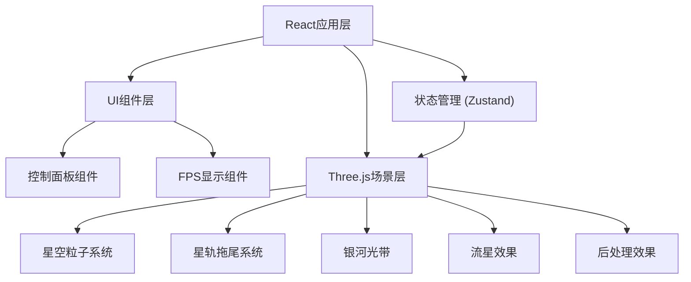

## 1. 架构设计



## 2. 技术描述

- **前端框架**: React@18 + TypeScript + Vite
- **3D引擎**: Three.js + @react-three/fiber + @react-three/drei + @react-three/postprocessing
- **状态管理**: Zustand
- **样式方案**: TailwindCSS 3
- **无后端，纯前端应用**

## 3. 核心依赖

| 库名 | 用途 |
|-------|---------|
| three | 3D渲染核心库 |
| @react-three/fiber | React Three.js 渲染器 |
| @react-three/drei | Three.js 常用组件工具库 |
| @react-three/postprocessing | 后处理效果库 |
| zustand | 轻量级状态管理 |
| lucide-react | 图标库 |

## 4. 状态管理设计

### 4.1 星空配置状态

```typescript
interface StarConfig {
  starCount: number;           // 星星数量: 1000-8000
  rotationSpeed: number;       // 旋转速度: 0.1-5
  trailLength: number;         // 拖尾长度: 10-200
  backgroundColor: 'black' | 'purple';
  showGalaxy: boolean;         // 银河光带
  autoRotate: boolean;         // 自动旋转
  showGlow: boolean;           // 光晕效果
  orbitShape: 'circle' | 'ellipse';  // 轨道形状
  showFPS: boolean;            // 显示帧率
  enableMeteors: boolean;      // 流星效果
}
```

## 5. 组件结构

```
src/
├── components/
│   ├── ControlPanel/
│   │   ├── SliderControl.tsx
│   │   ├── ToggleControl.tsx
│   │   ├── ButtonGroup.tsx
│   │   └── index.tsx
│   ├── Scene3D/
│   │   ├── Stars.tsx
│   │   ├── StarTrails.tsx
│   │   ├── GalaxyBand.tsx
│   │   ├── Meteors.tsx
│   │   └── index.tsx
│   ├── FPSMonitor.tsx
│   └── FileControls.tsx
├── store/
│   └── useStarConfig.ts
├── utils/
│   ├── exportConfig.ts
│   └── screenshot.ts
├── App.tsx
└── main.tsx
```

## 6. 关键技术实现

### 6.1 星星粒子系统
- 使用 `THREE.BufferGeometry` 和 `THREE.Points` 实现高性能粒子渲染
- 每个星星存储: 位置、颜色、亮度、大小、轨道参数、角度

### 6.2 星轨拖尾效果
- 维护每个星星的历史位置缓冲区
- 使用 `THREE.Line` 或自定义Shader绘制拖尾
- 拖尾透明度渐变，头部清晰尾部淡化

### 6.3 银河光带
- 使用带状几何体 (`THREE.PlaneGeometry`)
- 应用渐变透明纹理和噪波Shader
- 横跨场景中心，带有轻微扭曲

### 6.4 流星效果
- 对象池管理流星实例
- 随机生成流星起始位置、方向、速度
- 带有拖尾发光效果

### 6.5 光晕效果
- 使用 `UnrealBloomPass` 后处理
- 较亮的星星触发光晕
- 可调节光晕强度和阈值

## 7. 性能优化策略

1. 使用 BufferGeometry 而非 Geometry
2. 合理设置粒子数量上限 (8000)
3. 拖尾历史缓冲区大小动态调整
4. 流星对象池复用，避免频繁创建销毁
5. 后处理效果可开关，低配设备可关闭
