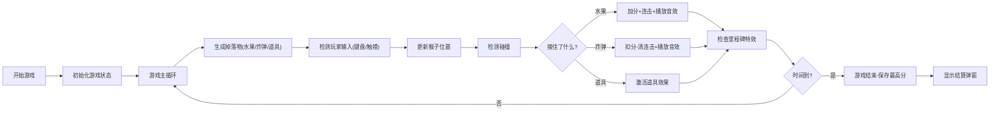

## 1. 产品概述
猴子接香蕉是一款休闲益智小游戏，玩家控制猴子左右移动接住掉落的水果，躲避炸弹，获取高分。
- 面向各年龄段休闲游戏玩家，提供轻松有趣的游戏体验
- 具有丰富的道具系统和连击机制，增加游戏可玩性和重玩价值

## 2. 核心功能

### 2.1 功能模块
1. **游戏主界面**：游戏画布、得分显示、状态栏、控制按钮
2. **水果系统**：香蕉、苹果、橘子、西瓜四种水果随机掉落
3. **道具系统**：双倍得分、减慢速度、扩大范围三种道具
4. **计分系统**：基础分、连击加分、最高分记录
5. **设置系统**：音效开关、背景切换
6. **游戏控制**：开始、暂停、重置功能

### 2.2 页面详情
| 页面名称 | 模块名称 | 功能描述 |
|---------|---------|----------|
| 游戏主界面 | 游戏画布 | 显示猴子、水果、炸弹、道具的游戏区域 |
| 游戏主界面 | 状态栏 | 显示当前得分、最高分、剩余时间、连击数 |
| 游戏主界面 | 控制面板 | 开始/暂停、重置、音效、背景切换按钮 |
| 游戏主界面 | 游戏结束弹窗 | 显示最终得分，提供重新开始选项 |

## 3. 核心流程

## 4. 用户界面设计
### 4.1 设计风格
- **主色调**：绿色系（丛林主题），可切换海滩蓝、城市灰
- **按钮风格**：圆角、渐变、悬浮动画效果
- **字体**：活泼可爱的游戏风格字体，大号数字显示得分
- **布局**：居中游戏画布，顶部状态栏，底部控制区
- **图标**：使用emoji风格的图标，保持可爱有趣的视觉效果

### 4.2 页面设计概述
| 页面名称 | 模块名称 | UI元素 |
|---------|---------|--------|
| 游戏主界面 | 游戏画布 | Canvas画布，动态背景，猴子角色、水果、炸弹精灵 |
| 游戏主界面 | 状态栏 | 卡片式布局，彩色数字，实时更新动画 |
| 游戏主界面 | 控制面板 | 图标按钮，悬停效果，状态切换动画 |
| 游戏主界面 | 游戏结束弹窗 | 半透明遮罩，居中卡片，庆祝动画 |

### 4.3 响应式
- 桌面端：键盘方向键控制，完整UI显示
- 移动端：触摸滑动控制，自适应画布大小，优化按钮尺寸

### 4.4 动画与特效
- 水果掉落动画
- 得分弹跳动画
- 里程碑闪烁特效
- 道具激活光效
- 连击数字放大效果
