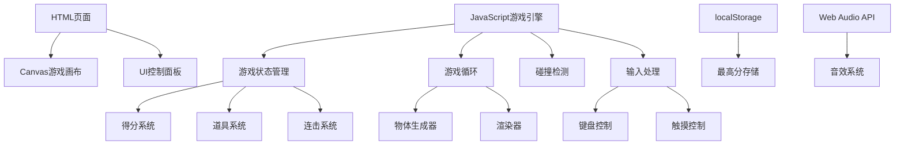

## 1. 架构设计


## 2. 技术说明
- **前端技术栈**：原生HTML5 + CSS3 + JavaScript (ES6+)
- **游戏渲染**：HTML5 Canvas 2D API
- **音效系统**：Web Audio API (无外部音频文件依赖)
- **数据存储**：浏览器localStorage
- **响应式设计**：CSS Media Queries + 动态Canvas尺寸调整

## 3. 文件结构
```
项目根目录/
├── index.html          # 游戏主页面
├── style.css           # 样式文件
├── game.js             # 游戏主逻辑
└── .trae/documents/
    ├── PRD.md          # 产品需求文档
    └── Technical-Architecture.md  # 技术架构文档
```

## 4. 核心数据结构

### 4.1 游戏状态对象
```javascript
const gameState = {
  score: 0,           // 当前得分
  highScore: 0,       // 最高分
  combo: 0,           // 连击数
  timeLeft: 60,       // 剩余时间
  isPlaying: false,   // 游戏进行中
  isPaused: false,    // 暂停状态
  soundEnabled: true, // 音效开关
  speedMultiplier: 1, // 速度倍率
  monkeyWidth: 80,    // 猴子宽度
  doubleScore: false, // 双倍得分状态
  slowMode: false     // 减速模式状态
};
```

### 4.2 掉落物类型
```javascript
const FALLING_ITEMS = {
  FRUITS: ['banana', 'apple', 'orange', 'watermelon'],
  BOMB: 'bomb',
  POWERUPS: ['doubleScore', 'slowDown', 'wideCatch']
};
```

## 5. 核心函数模块

| 函数名 | 功能描述 |
|-------|---------|
| initGame() | 初始化游戏状态和画布 |
| startGame() | 开始游戏，启动计时器和游戏循环 |
| pauseGame() | 暂停/继续游戏 |
| resetGame() | 重置游戏到初始状态 |
| gameLoop() | 主游戏循环，更新和渲染 |
| spawnItem() | 随机生成掉落物 |
| updateItems() | 更新掉落物位置 |
| checkCollision() | 碰撞检测 |
| handleCatch() | 处理接住物品的逻辑 |
| playSound() | 播放音效 |
| saveHighScore() | 保存最高分到localStorage |
| toggleBackground() | 切换背景主题 |

## 6. 背景主题配置

| 主题 | 背景色 | 装饰元素 |
|------|--------|----------|
| 丛林 | 绿色渐变 | 树木、藤蔓、叶子 |
| 海滩 | 蓝色渐变 | 海浪、沙滩、太阳 |
| 城市 | 灰色渐变 | 建筑轮廓、天空 |
